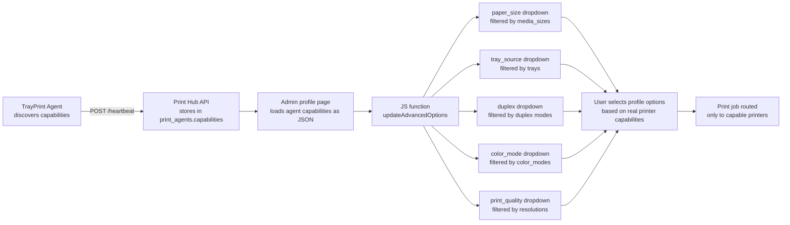

# Capabilities-Driven Dynamic Options Enhancement Plan

## Problem

Currently, the Print Hub admin UI shows **hardcoded dropdown options** for printer settings like paper size, duplex, color mode, print quality, and media type. These options are the same for every profile regardless of what the target agent's printers actually support.

Meanwhile, TrayPrint already **discovers and reports** the actual capabilities of each printer (trays, media sizes, resolutions, color modes, duplex). This data is stored in `print_agents.capabilities` as a JSON column.

## Goal

Make all printer option dropdowns in the admin UI **dynamic** — they should show only the values that the selected agent's printers actually support, with graceful fallback to common defaults when capabilities aren't available.

---

## Capabilities Data Model

Each TrayPrint agent reports capabilities in this JSON structure:

```json
{
  "printers": {
    "HP LaserJet M404": {
      "trays": ["AutoSelect", "Tray1", "Tray2", "ManualFeed"],
      "media_sizes": ["A4", "A5", "Letter", "Legal"],
      "resolutions": ["300x300dpi", "600x600dpi", "1200x1200dpi"],
      "color_modes": ["Color", "Gray"],
      "duplex": ["None", "TwoSidedLong", "TwoSidedShort"]
    }
  }
}
```

---

## Fields to Enhance

### 1. 🖨️ Paper Size (`paper_size`)
**Current:** Static list of ~50 sizes (A0–A10, Letter, Legal, custom, etc.)
**Target:** Show only sizes present in `media_sizes` across all printers of the selected agent
**Fallback:** All common sizes (current behavior)

### 2. 📐 Duplex (`duplex`)
**Current:** `none` / `short_edge` / `long_edge` (hardcoded)
**Target:** Map actual duplex values from capabilities:
- `None` → no duplex
- `TwoSidedLong` / `TwoSidedShort` → short_edge / long_edge
- Show only what printers support
**Fallback:** All 3 options

### 3. 🎨 Color Mode (`color_mode`)
**Current:** `color` / `monochrome` (always both shown)
**Target:** 
- If only `Color` in capabilities → show Color only
- If only `Gray` → show Monochrome only
- If both → show both
**Fallback:** Both options

### 4. ⚡ Print Quality (`print_quality`)
**Current:** `draft` (300dpi) / `normal` (600dpi) / `high` (1200dpi) (hardcoded)
**Target:** Show actual resolution values from capabilities mapped to labels:
- `300x300dpi` → "Draft (300 DPI)"
- `600x600dpi` → "Normal (600 DPI)"
- `1200x1200dpi` → "High (1200 DPI)"
- Also support `600x600` (no dpi suffix) and other variations
**Fallback:** All 3 quality levels

### 5. 📄 Media Type (`media_type`)
**Current:** `plain` / `glossy` / `envelope` / `label` / `continuous_feed` (hardcoded)
**Target:** 
- Capabilities currently don't include media types on most platforms
- Keep current behavior but filter by what's available if data exists
- Add a note: "Media types are printer-specific; capabilities data may be limited"
**Fallback:** All current options (already done)

---

## Implementation Plan

### Phase 1: JS Enhancement (profiles.blade.php + edit_profile.blade.php)

Modify the `updateAdvancedOptions()` function in both views:

#### 1.1 Paper Size Dynamic Filtering

```javascript
// Collect all media_sizes from agent's printers
const allPaperSizes = new Set();
Object.values(caps.printers).forEach(p => {
    (p.media_sizes || []).forEach(s => allPaperSizes.add(s));
});

// Build paper_size options from actual data
if (allPaperSizes.size > 0) {
    const sizeOptions = [{ value: '', label: 'Default' }];
    // Known paper size mapping (abbreviation -> display name)
    const paperLabels = { 'A4': 'A4 (210×297mm)', 'A3': 'A3 (297×420mm)', 'Letter': 'Letter (216×279mm)', ... };
    allPaperSizes.forEach(s => {
        const label = paperLabels[s] || s;
        sizeOptions.push({ value: s, label: label });
    });
    // Always add Custom option
    sizeOptions.push({ value: 'CUSTOM', label: 'Custom Size...' });
    resetSelectOptions('paper_size', sizeOptions);
}
```

#### 1.2 Duplex Dynamic Filtering

```javascript
const duplexMap = {
    'None': { value: 'none', label: 'No Duplex' },
    'TwoSidedLong': { value: 'short_edge', label: 'Flip on Long Edge' },
    'TwoSidedShort': { value: 'long_edge', label: 'Flip on Short Edge' },
};
const duplexOptions = [{ value: '', label: 'Default' }];
const allDuplex = new Set();
Object.values(caps.printers).forEach(p => {
    (p.duplex || []).forEach(d => allDuplex.add(d));
});
allDuplex.forEach(d => {
    if (duplexMap[d]) duplexOptions.push(duplexMap[d]);
});
// Fallback to common options if nothing discovered
if (duplexOptions.length <= 1) {
    duplexOptions.push({ value: 'none', label: 'No Duplex' },
                        { value: 'short_edge', label: 'Flip on Long Edge' },
                        { value: 'long_edge', label: 'Flip on Short Edge' });
}
resetSelectOptions('duplex', duplexOptions);
```

#### 1.3 Color Mode Dynamic Filtering

```javascript
const colorOptions = [];
const allColorModes = new Set();
Object.values(caps.printers).forEach(p => {
    (p.color_modes || []).forEach(c => allColorModes.add(c.toLowerCase()));
});
if (allColorModes.has('color')) colorOptions.push({ value: 'color', label: 'Color' });
if (allColorModes.has('gray') || allColorModes.has('monochrome')) 
    colorOptions.push({ value: 'monochrome', label: 'Monochrome (B&W)' });
if (colorOptions.length === 0) {
    colorOptions.push({ value: 'color', label: 'Color' }, { value: 'monochrome', label: 'Monochrome (B&W)' });
}
resetSelectOptions('color_mode', colorOptions);
```

#### 1.4 Print Quality from Resolutions

```javascript
const qualityOptions = [];
const allResolutions = new Set();
Object.values(caps.printers).forEach(p => {
    (p.resolutions || []).forEach(r => allResolutions.add(r));
});
// Map discovered resolutions to quality levels
if (allResolutions.size > 0) {
    allResolutions.forEach(r => {
        const dpi = parseInt(r.split('x')[0] || r);
        if (dpi <= 300) qualityOptions.push({ value: 'draft', label: `Draft (${dpi} DPI)` });
        else if (dpi <= 600) qualityOptions.push({ value: 'normal', label: `Normal (${dpi} DPI)` });
        else qualityOptions.push({ value: 'high', label: `High (${dpi} DPI)` });
    });
} else {
    qualityOptions.push(
        { value: 'draft', label: 'Draft (300 DPI)' },
        { value: 'normal', label: 'Normal (600 DPI)' },
        { value: 'high', label: 'High (1200 DPI)' }
    );
}
resetSelectOptions('print_quality', qualityOptions);
```

### Phase 2: Validation Update (ProfileController.php)

Update validation rules to accept any string for fields that become dynamic:
- `paper_size` — already accepts any string ✅
- `duplex` — already accepts any string ✅
- `color_mode` — already `in:color,monochrome` — keep as-is
- `print_quality` — already `in:draft,normal,high` — keep as-is
- `media_type` — already `in:plain,glossy,...` — keep as-is

### Phase 3: TrayPrint Enhancement

- Add `media_types` to the capabilities discovery for CUPS (Linux/macOS) — parse from `lpoptions -l`
- Improve Windows `DeviceCapabilities` call to detect supported media types via `DC_MEDIATYPENAMES`

### Phase 4: Summary Display

Update the capability summary line shown below the agent selector to show more detail:
```
✓ 2 printer(s) · 🔁 Duplex · 🎨 Color + B&W · 📦 3 trays · 📄 5 paper sizes · ⚡ 3 resolutions
```

---

## Files to Modify

| File | Changes |
|------|---------|
| [`resources/views/admin/profiles.blade.php`](/resources/views/admin/profiles.blade.php) | JS `updateAdvancedOptions()` — add paper_size, duplex, color_mode, print_quality filtering |
| [`resources/views/admin/edit_profile.blade.php`](/resources/views/admin/edit_profile.blade.php) | Same JS changes as profiles.blade.php |
| [`app/Http/Controllers/Admin/ProfileController.php`](/app/Http/Controllers/Admin/ProfileController.php) | Relax validation for dynamic fields if needed |
| [`/home/yudi/dev/trayprint/capabilities.py`](/home/yudi/dev/trayprint/capabilities.py) | Add media_types discovery for CUPS |

---

## Data Flow Diagram



---

## Acceptance Criteria

1. When an agent is selected in the profile form, the paper size dropdown shows only sizes that agent's printers support
2. The duplex dropdown hides "Flip on Short Edge" if no printer supports it
3. The color mode dropdown shows only Color/Monochrome/Both based on actual capability
4. The print quality dropdown shows actual resolution values from the printer
5. When no capabilities data is available (agent offline, never reported), all options fall back to the current defaults
6. The capability summary text updates to show paper count and resolution info
