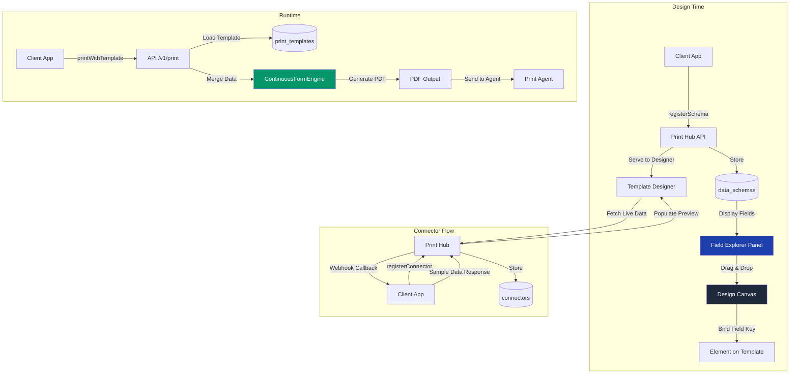
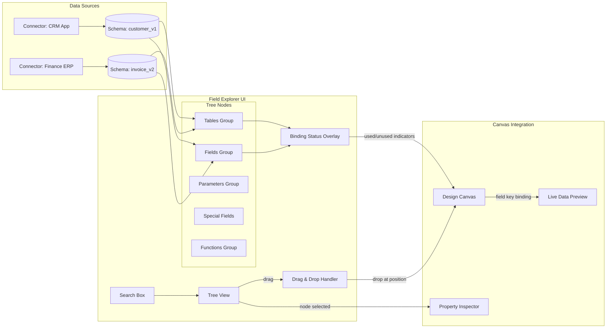

# Connector & Data Binding Improvement Plan
## Making Template Design as Easy as Crystal Reports

---

## Current Architecture Summary

### How it works today:
1. **Client App** registers a data schema via SDK (`POST /api/v1/schema`)
2. **Schema** is stored in `data_schemas` table with `fields` (key→type/meta) and `tables` (key→columns)
3. **Template Designer** loads available schemas in a dropdown, shows field badges in the Data tab
4. **User** clicks a field badge → field element is added at position (20,20) on the canvas
5. **User** manually moves/resizes each field on the canvas
6. **Print Flow**: Client app sends data with matching keys → PDF is rendered

### The Gap (vs Crystal Reports):
In Crystal Reports, you don't manually type field keys. You:
- Connect to a data source (Database Expert)
- See a **Field Explorer** panel with all available fields, grouped by table
- **Drag fields** directly from the panel onto the report at the exact position you want
- Use a **Formula Editor** with function list, field picker, syntax checker
- Define **Parameters** that prompt at runtime
- Set up **Grouping/Sorting/Filtering** visually

---

## Proposed Improvements (Phased)

### Phase 0: Quick Wins (Low Effort, High Impact)

These are small changes that dramatically improve the current UX without major architecture changes.

#### 0.1 — Drag & Drop from Schema Panel to Canvas

**Current:** Click badge → field appears at (20,20). Must then drag to correct position.

**Proposed:** Make schema field badges draggable directly onto the canvas. When dropped, the field is placed exactly where the user drops it.

**Changes:**
- [`designer.blade.php`](../resources/views/admin/templates/designer.blade.php) — Add HTML5 drag/drop handlers to schema field badges in `loadSelectedSchema()` function
- Canvas drop handler reads the dropped field key/type and creates the element at drop coordinates
- During drag, show a ghost preview of the element

#### 0.2 — Field Autocomplete on Key Input

**Current:** User types field key manually in the property inspector. No validation until render.

**Proposed:** When a schema is selected, the field key input in the property inspector becomes a combobox with autocomplete from schema fields.

**Changes:**
- [`designer.blade.php`](../resources/views/admin/templates/designer.blade.php) — Replace text input with a datalist or custom combobox in `updateInspector()`
- Show field type + format next to each suggestion
- Auto-validate on blur (show green checkmark or red warning)

#### 0.3 — Schema Field Badges: Visual Indicators on Canvas

**Current:** Fields are visually identical on canvas regardless of schema binding status.

**Proposed:** 
- Schema-bound fields show a small green dot + field type icon in top-right corner
- Unbound fields (no schema or key not in schema) show a yellow warning icon
- Hover tooltip shows full field metadata (type, format, required, description)

**Changes:**
- [`designer.blade.php`](../resources/views/admin/templates/designer.blade.php) — In `renderElements()`, overlay status badges on field elements
- Use field type styling (string=gray, number=blue, date=purple, currency=green) — already exists in CSS

#### 0.4 — Quick Field Preview on Hover

**Current:** To see what data a field might contain, user must enable Live Data mode.

**Proposed:** When a schema has sample data, hover over a field badge in the Data tab to see a tooltip with the sample value.

**Changes:**
- [`designer.blade.php`](../resources/views/admin/templates/designer.blade.php) — Add `title` attribute to field badges with formatted sample data value
- Show sample value preview in the tooltip

---

### Phase 1: Field Explorer Panel (Like Crystal Reports)

A dedicated panel that replaces the simple field badges list with a full field explorer.

#### 1.1 — Hierarchical Field Explorer

**Proposed:** Replace the current flat field badges in the Data tab with a tree-based Field Explorer:

```
📁 Fields
  ├── 📄 customer_name        [string]  ← field with type badge
  ├── 📄 invoice_date         [date]    ← field with format hint
  ├── 💰 total_amount         [currency]
  └── 📄 status               [string]
📁 Tables
  └── 📁 items
        ├── 📄 item_name       [string]
        ├── 🔢 quantity        [number]
        ├── 💰 price           [currency]
        └── 💰 subtotal        [currency] ← computed column
📁 Parameters
  └── 📄 start_date           [date, required]
📁 Special Fields
  ├── 📄 Page Number
  ├── 📄 Total Pages
  ├── 📄 Print Date
  └── 📄 Record Number
📁 Functions
  ├── 📁 Text
  ├── 📁 Math
  ├── 📁 Date/Time
  └── 📁 Aggregate (Sum, Count, Avg, Min, Max)
```

**Interaction:**
- Drag any field/parameter/special-field directly onto canvas
- Double-click to add at default position
- Right-click context menu: "Add to Design", "View Properties", "Copy Key"
- Search/filter box to find fields quickly
- Collapse/expand groups

**Changes:**
- [`designer.blade.php`](../resources/views/admin/templates/designer.blade.php) — Major rework of the Data tab panel (~200 lines of new HTML/JS)
- New CSS for tree/explorer styling

#### 1.2 — Visual Field Binding Status

**Proposed:** In the Field Explorer, show visual indicators:
- ✓ Green checkmark = field is used on the canvas
- Gray = field is available but not used
- ⚠ Orange = field is used but in a different section or missing
- Clicking an unused field could highlight all elements that use it

**Changes:**
- [`designer.blade.php`](../resources/views/admin/templates/designer.blade.php) — Field explorer render logic with status mapping

#### 1.3 — Schema Sync Detection

**Proposed:** When client app registers a new schema version:
- Show a notification banner: "Schema [name] updated to v[N]. Click to review changes."
- Show diff: fields added/removed/changed (green/red/yellow highlighting)
- Highlight template fields that no longer match any schema field
- Offer "Quick Fix" buttons: "Remove orphaned fields", "Update field labels from schema"

**Changes:**
- [`designer.blade.php`](../resources/views/admin/templates/designer.blade.php) — Schema diff UI in Data tab
- [`TemplateController.php`](../app/Http/Controllers/Admin/TemplateController.php) — Endpoint to get schema diff
- Schema outdated banner already exists (`schema-outdated-banner`), but needs enhancement

---

### Phase 2: Connector System (The "Crystal Reports Database Expert" Equivalent)

This is the core feature the user asked about — a system that manages how client apps connect their data to templates.

#### 2.1 — Connector Registry

**Proposed:** Add a `connectors` system where client apps can define "data sources" that templates can connect to:

```
connectors/
├── id: UUID
├── client_app_id: FK
├── name: string (e.g., "SDP Finance ERP")
├── type: enum (api, webhook, odoo, custom)
├── config: JSON (endpoint URL, auth type, headers)
├── icon: string (emoji or URL for visual identification)
└── is_active: boolean
```

**SDK Method:**
```php
$client->registerConnector('SDP Finance ERP', [
    'type' => 'api',
    'config' => [
        'base_url' => 'https://erp.example.com',
        'auth_type' => 'api_key',   // or 'oauth2', 'basic', 'none'
    ],
    'icon' => '🏭',
]);
```

**In Designer UI:**
- Connector drop-down appears at the top of the Data tab (below the schema selector)
- When a connector is selected, it shows the connector's branding/icon
- Templates can filter available schemas by connector

**New Files:**
- [`app/Models/Connector.php`](../app/Models/Connector.php) — New model
- [`database/migrations/xxxx_create_connectors_table.php`](../database/migrations/) — Migration
- API endpoints in [`ClientAppController.php`](../app/Http/Controllers/Api/ClientAppController.php) — `POST/GET /api/v1/connectors`
- SDK updates in [`PrintHubClient.php`](../public/sdk/PrintHubClient.php) and [`PrintHubClient.mjs`](../public/sdk/PrintHubClient.mjs)

#### 2.2 — Live Data Preview (Design-Time)

**Proposed:** When a schema has sample data AND a connector is configured, allow the designer to fetch live preview data from the client app via the connector:

```
[Connector: SDP Finance ERP] [Schema: invoice_v2] 
[📡 Fetch Live Data]  [Last fetched: 2 min ago]
```

**How it works:**
1. Template designer clicks "Fetch Live Data"
2. Print Hub sends a webhook/callback to the client app's connector URL
3. Client app responds with sample data matching the schema
4. Sample data is cached for N minutes and used for live preview

**Backend Changes:**
- [`ClientAppController.php`](../app/Http/Controllers/Api/ClientAppController.php) — New endpoint `POST /api/v1/connectors/{id}/fetch-preview`
- Webhook service enhancement in [`WebhookService.php`](../app/Services/WebhookService.php)
- [`ContinuousFormEngine.php`](../app/Services/ContinuousFormEngine.php) — Use live data for preview rendering

**SDK Changes:**
- New SDK method: `handlePreviewRequest(callback)` — client app registers a handler that Print Hub can call

#### 2.3 — Multi-Client App Awareness

**Proposed:** A template could potentially pull data from multiple client apps (e.g., customer data from CRM, financial data from Accounting). Show which client app owns which schema:

```
Template: "Customer Statement"
├── 📁 Customer Data (from CRM App)
│   ├── customer_name
│   ├── address
│   └── phone
├── 📁 Transactions (from Finance App)  
│   ├── invoice_number
│   ├── amount
│   └── due_date
└── 📁 Company Info (from Print Hub)
    ├── company_name
    └── logo_url
```

**Changes:**
- [`designer.blade.php`](../resources/views/admin/templates/designer.blade.php) — Group schema fields by client app in the Field Explorer
- [`PrintTemplate.php`](../app/Models/PrintTemplate.php) — Support multiple `data_schema_id` references
- Migration — `print_templates` pivot table for template↔schema (many-to-many)

---

### Phase 3: Advanced Data Binding & Expression System

#### 3.1 — Visual Formula/Expression Builder

**Proposed:** Replace raw text input for computed columns/expressions with a visual editor:

```
[ Σ ] Running Total Builder
┌─────────────────────────────────────┐
│ Field: [total_amount      ▼]        │
│ Operation: [Sum            ▼]       │
│ Evaluate: [On Change       ▼]       │
│ Reset:  [Never             ▼]       │
│ Group:  [department        ▼]       │
└─────────────────────────────────────┘

[ fx ] Formula Editor
┌─────────────────────────────────────┐
│ IF {total_amount} > 1000000         │
│   THEN "High Value"                 │
│   ELSE "Standard"                   │
├─────────────────────────────────────┤
│ ✓ Valid syntax     [Insert Field▼]  │
└─────────────────────────────────────┘
```

**Changes:**
- [`designer.blade.php`](../resources/views/admin/templates/designer.blade.php) — Formula editor component using CodeMirror or Monaco for syntax highlighting
- [`ContinuousFormEngine.php`](../app/Services/ContinuousFormEngine.php) — Enhanced expression evaluation with more built-in functions
- New file: [`app/Services/FormulaEditorService.php`](../app/Services/FormulaEditorService.php) — Validation & autocomplete logic

#### 3.2 — Conditional Formatting Visual Editor

**Current:** Conditional formats are raw JSON in element properties.

**Proposed:** Visual "Conditional Formatting Rules" panel:

```
[+] Add Condition
┌──────────────────────────────────────────┐
│ # │ Condition              │ Style       │
├──────────────────────────────────────────┤
│ 1 │ {total} > 1000000      │ Red bold    │
│ 2 │ {status} = "PAID"       │ Green bg    │
│ 3 │ {due_date} < today()   │ Yellow bg   │
└──────────────────────────────────────────┘
```

Clicking a row opens a detailed editor with field picker, operator dropdown, value input, and style preview.

**Changes:**
- [`designer.blade.php`](../resources/views/admin/templates/designer.blade.php) — Conditional formatting section in property inspector
- [`ContinuousFormEngine.php`](../app/Services/ContinuousFormEngine.php) — Already supports conditional formatting, needs UI

#### 3.3 — Runtime Parameters

**Proposed:** Define parameters at design time that prompt at preview/print time:

```
Template Parameters:
┌─────────────────────────────────────┐
│ Name       │ Type     │ Value       │
├─────────────────────────────────────┤
│ Start Date  │ date     │ 01/04/2026  │
│ End Date    │ date     │ 30/04/2026  │
│ Department  │ dropdown │ [All ▼]     │
│ Include Logo│ boolean  │ ☑           │
└─────────────────────────────────────┘
```

Parameters can be used in:
- Filter expressions: `{invoice_date} >= {Start Date} AND {invoice_date} <= {End Date}`
- Element visibility: `Show logo only if {Include Logo} = true`
- Watermark text: `"DRAFT - Printed for {Department}"`
- Labels: `"Report for period {Start Date} to {End Date}"`

**Changes:**
- [`PrintTemplate.php`](../app/Models/PrintTemplate.php) — Add `parameters` JSON column
- [`designer.blade.php`](../resources/views/admin/templates/designer.blade.php) — Parameter definition editor in Data tab
- [`TemplateController.php`](../app/Http/Controllers/Admin/TemplateController.php) — Parameter input dialog in preview/test-print
- [`ClientAppController.php`](../app/Http/Controllers/Api/ClientAppController.php) — Accept parameters in print request
- SDK — Add `parameters` field in `printWithTemplate()`

---

### Phase 4: Schema Lifecycle & Governance

#### 4.1 — Schema Version Comparison UI

**Proposed:** In the template designer, when a schema has a newer version available:

```
⚠ Schema "invoice_v2" has been updated to v3
┌────────────────────────────────────────────┐
│ v3 Changes:                                │
│ ✅ Added:   discount_percent (number)      │
│ ✅ Added:   tax_id (string)                │
│ 🔄 Changed: total_amount → decimal(15,2)   │
│ ❌ Removed: old_field                      │
├────────────────────────────────────────────┤
│ [Update Schema] [Ignore] [Review Later]    │
└────────────────────────────────────────────┘
```

**Changes:**
- [`designer.blade.php`](../resources/views/admin/templates/designer.blade.php) — Enhanced schema-outdated banner with diff view
- [`TemplateController.php`](../app/Http/Controllers/Admin/TemplateController.php) — Schema diff endpoint

#### 4.2 — Template Testing with Mock Data

**Proposed:** Allow designers to save multiple "test scenarios" with different sample data:

```
Test Scenarios:
┌─────────────────────────────────────┐
│ Scenario Name          │ Actions    │
├─────────────────────────────────────┤
│ 🟢 Normal Invoice      │ Load │ Del │
│ 🟡 Empty Items List    │ Load │ Del │
│ 🔴 Very Long Name      │ Load │ Del │
│ 🟣 Currency Conversion │ Load │ Del │
└─────────────────────────────────────┘
[+ Add Current as Scenario]
```

**Changes:**
- The existing `sample_data` field already supports this on the template model
- [`designer.blade.php`](../resources/views/admin/templates/designer.blade.php) — Scenario management UI
- New endpoint: `POST /templates/{id}/scenarios` and `GET /templates/{id}/scenarios`

#### 4.3 — Schema Validation API

**Proposed:** Client apps can validate data against a template's schema before submitting:

```php
// SDK
$errors = $client->validateData('invoice_sewa', $data);
if (!empty($errors)) {
    // handle validation errors
}
```

Already exists in the PHP SDK's `validateData()` method. Needs to be exposed as a REST API endpoint too:
```
POST /api/v1/templates/{name}/validate
Body: { "data": { ... } }
Response: { "valid": true/false, "errors": [...] }
```

---

## Implementation Roadmap

```
Phase 0: Quick Wins (1-2 weeks)
├── 0.1 Drag & Drop from Schema Panel
├── 0.2 Field Autocomplete
├── 0.3 Visual Status Indicators on Canvas
└── 0.4 Field Preview on Hover

Phase 1: Field Explorer (2-3 weeks)
├── 1.1 Hierarchical Field Explorer Panel
├── 1.2 Visual Field Binding Status
└── 1.3 Schema Sync Detection & Quick Fix

Phase 2: Connector System (3-4 weeks)
├── 2.1 Connector Registry (DB + API + SDK)
├── 2.2 Live Data Preview via Connector
└── 2.3 Multi-Client App Awareness

Phase 3: Advanced Data Binding (3-4 weeks)
├── 3.1 Visual Formula/Expression Builder
├── 3.2 Conditional Formatting Visual Editor
└── 3.3 Runtime Parameters

Phase 4: Schema Lifecycle (1-2 weeks)
├── 4.1 Schema Version Comparison UI
├── 4.2 Template Testing with Mock Data
└── 4.3 Schema Validation API
```

---

## Mermaid Diagram: Data Flow with Connector



---

## Mermaid Diagram: Field Explorer Component Architecture



---

## Files to Modify / Create

### Phase 0
| File | Change |
|------|--------|
| [`resources/views/admin/templates/designer.blade.php`](../resources/views/admin/templates/designer.blade.php) | HTML5 drag/drop, autocomplete, visual indicators, hover previews |

### Phase 1
| File | Change |
|------|--------|
| [`resources/views/admin/templates/designer.blade.php`](../resources/views/admin/templates/designer.blade.php) | Field Explorer tree UI (~300 lines new JS) |
| [`app/Http/Controllers/Admin/TemplateController.php`](../app/Http/Controllers/Admin/TemplateController.php) | Schema diff endpoint |

### Phase 2
| File | Change |
|------|--------|
| [`database/migrations/xxxx_create_connectors_table.php`](../database/migrations/) | **New** migration |
| [`app/Models/Connector.php`](../app/Models/Connector.php) | **New** model |
| [`app/Http/Controllers/Api/ClientAppController.php`](../app/Http/Controllers/Api/ClientAppController.php) | Connector CRUD + fetch-preview endpoints |
| [`public/sdk/PrintHubClient.php`](../public/sdk/PrintHubClient.php) | `registerConnector()` method |
| [`public/sdk/PrintHubClient.mjs`](../public/sdk/PrintHubClient.mjs) | `registerConnector()` method |
| [`resources/views/admin/templates/designer.blade.php`](../resources/views/admin/templates/designer.blade.php) | Connector selector UI, "Fetch Live Data" button |
| [`app/Services/WebhookService.php`](../app/Services/WebhookService.php) | Webhook callback for live data fetching |
| [`public/sdk/openapi.yaml`](../public/sdk/openapi.yaml) | Add connector endpoints |
| [`print_templates` migration](../database/migrations/) | Pivot table for template↔schema (many-to-many) |

### Phase 3
| File | Change |
|------|--------|
| [`resources/views/admin/templates/designer.blade.php`](../resources/views/admin/templates/designer.blade.php) | Formula editor component, conditional formatting UI, parameter editor |
| [`app/Models/PrintTemplate.php`](../app/Models/PrintTemplate.php) | Add `parameters` JSON column |
| [`app/Services/ContinuousFormEngine.php`](../app/Services/ContinuousFormEngine.php) | Parameter substitution in expressions |
| [`app/Http/Controllers/Admin/TemplateController.php`](../app/Http/Controllers/Admin/TemplateController.php) | Parameter dialog rendering |
| [`app/Http/Controllers/Api/ClientAppController.php`](../app/Http/Controllers/Api/ClientAppController.php) | Accept `parameters` in print request |

### Phase 4
| File | Change |
|------|--------|
| [`resources/views/admin/templates/designer.blade.php`](../resources/views/admin/templates/designer.blade.php) | Schema diff UI, test scenario manager |
| [`app/Http/Controllers/Admin/TemplateController.php`](../app/Http/Controllers/Admin/TemplateController.php) | Scenario CRUD endpoints |
| [`public/sdk/PrintHubClient.php`](../public/sdk/PrintHubClient.php) | Expose validation as REST API |
| [`public/sdk/PrintHubClient.mjs`](../public/sdk/PrintHubClient.mjs) | Expose validation as REST API |
