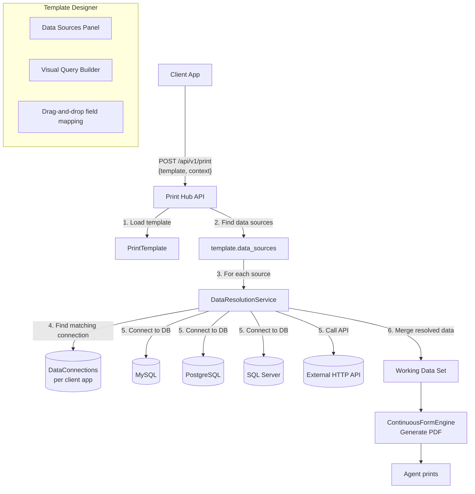

# Data Connector System — Implementation Plan

## Architecture Recommendation: Hybrid Connection Pool

For a setup with **many client apps** using multiple database types (SQL Server, MySQL, PostgreSQL), I recommend a **Hybrid Connection Pool** architecture:

```
                         ┌────────────────────────────────────────────┐
                         │            Print Hub Server               │
                         │                                            │
                         │  ┌─────────────────────────────────┐      │
                         │  │     Data Connector Engine       │      │
                         │  │                                 │      │
                         │  │  ┌───────────┐ ┌───────────┐  │      │
              ┌──────────┼──┼──┤ SQL       │ │ HTTP API  │  │      │
              │          │  │  │ Connector │ │ Connector │  │      │
              ▼          │  │  └─────┬─────┘ └─────┬─────┘  │      │
┌────────────────────┐  │  │        │             │        │      │
│ Client App Registry│  │  │        ▼             ▼        │      │
│                    │  │  │  ┌──────────┐ ┌──────────┐   │      │
│ App: ERP-System   │──┼──┼──┤ MySQL DB │ │ REST API │   │      │
│  ├─ Connector:    │  │  │  │ (on-prem)│ │ (cloud)  │   │      │
│  │  orders_db     │  │  │  └──────────┘ └──────────┘   │      │
│  │  (MySQL)       │  │  │                               │      │
│  └─               │  │  └─────────────────────────────────┘      │
│                   │  │                                            │
│ App: CRM-Cloud    │──┼──► HTTP Connector → crm.example.com/api    │
│  └─ Connector:    │  │                                            │
│     customers_api │  │  ┌──────────────────────────────────┐     │
│     (HTTP)        │  │  │       PDF Engine                 │     │
│                   │  │  │  ContinuousFormEngine            │     │
│ App: Warehouse    │──┼──┤  resolves data from connectors   │     │
│  └─ Connector:    │  │  │  before rendering                │     │
│     inventory_db  │  │  └──────────────────────────────────┘     │
│     (SQL Server)  │  │                                            │
└────────────────────┘  └────────────────────────────────────────────┘
```

### Why Hybrid?

| Approach | Pro | Con | Best For |
|----------|-----|-----|----------|
| **Direct SQL** | Fast, no middleware, Crystal-like | DB credentials in Print Hub, network access needed | On-premise clients, same network |
| **HTTP API** | Secure, no direct DB access, works over internet | Client must build API, extra latency | Cloud/SaaS clients, external networks |
| **Hybrid** | Flexible, each client chooses | Two code paths to maintain | Multiple clients with different setups |

### Core Principle: Templates are Portable

Templates should **not** hardcode database connections. Instead:
- Client apps own their **Connection Configurations**
- Templates define **Data Source Requirements** (what data they need)
- At render time, the server maps requirements → connections → fetches data

This way:
- The same template can work for Client A (using MySQL) and Client B (using SQL Server)
- Each client just configures its own database credentials
- The template designer works with logical data sources, not physical connections

---

## Part 1: Connection Configuration

### New Model: `DataConnection` (per Client App)

```php
// database/migrations/xxxx_xx_xx_create_data_connections_table.php
Schema::create('data_connections', function (Blueprint $table) {
    $table->id();
    $table->foreignId('client_app_id')->constrained()->cascadeOnDelete();
    $table->string('name');                    // e.g. "orders_db", "customers_api"
    $table->string('type');                    // mysql | pgsql | sqlsrv | http
    $table->text('config')->nullable();        // encrypted JSON connection params
    $table->boolean('is_active')->default(true);
    $table->timestamps();
    
    $table->unique(['client_app_id', 'name']);
});
```

### Connection Config Examples

**MySQL Connection**:
```json
{
  "host": "192.168.1.100",
  "port": 3306,
  "database": "erp_production",
  "username": "printhub_reader",
  "password": "encrypted_password",
  "charset": "utf8mb4"
}
```

**SQL Server Connection**:
```json
{
  "host": "10.0.0.50",
  "port": 1433,
  "database": "warehouse_db",
  "username": "report_user",
  "password": "encrypted_password",
  "trust_server_certificate": true
}
```

**PostgreSQL Connection**:
```json
{
  "host": "db.internal.example.com",
  "port": 5432,
  "database": "crm_data",
  "username": "printhub_reader",
  "password": "encrypted_password",
  "sslmode": "require"
}
```

**HTTP API Connection**:
```json
{
  "base_url": "https://crm.example.com/api/v2",
  "auth_type": "bearer_token",
  "auth_credentials": "encrypted_token",
  "timeout_seconds": 30,
  "rate_limit_per_minute": 60
}
```

### Security

- All passwords/tokens encrypted at rest using Laravel's encryption
- `username` and `password` are NEVER returned in API responses
- Connections can be tested from the admin UI before saving
- Each connection has a read-only role — no write access

---

## Part 2: Template Data Sources

### New Template Field: `data_sources`

```json
// Stored in print_templates.data_sources (JSON)
[
  {
    "alias": "orders",              // How template references this data
    "connection_type": "mysql",     // mysql | pgsql | sqlsrv — matched at runtime
    "query": "SELECT * FROM orders WHERE id = :order_id",
    "parameters": [
      { "name": "order_id", "source": "context", "required": true }
    ],
    "tables": {
      "items": "SELECT * FROM order_items WHERE order_id = :order_id"
    }
  },
  {
    "alias": "customer",
    "connection_type": "pgsql",
    "query": "SELECT * FROM customers WHERE id = :customer_id",
    "parameters": [
      { "name": "customer_id", "source": "field", "field": "orders.customer_id" }
    ]
  }
]
```

### Template Designer — Data Sources Panel

A new panel in the designer where the user can:

1. **Add Data Source**
   - Choose alias name (e.g., "orders", "customers")
   - Specify connection type filter (for template portability hints)
   - Write SQL query with named parameters (`:param_name`)
   - Define parameter bindings from:
     - `context` — job submission parameters (e.g., `{order_id: 123}`)
     - `field` — from another data source's result (e.g., `orders.customer_id`)
     - `literal` — hardcoded default value
   - Define sub-queries for table data

2. **Field Mapping**
   - The designer auto-detects query columns (via `DESCRIBE` / `EXPLAIN`)
   - Shows available fields in a tree view per data source
   - Designer drags fields onto the canvas, which become `{orders.field_name}` references

3. **Preview Data**
   - Run the query with sample parameter values
   - Display results in a table for visual verification

---

## Part 3: Data Resolution Pipeline

### Modified Flow in `ContinuousFormEngine::generate()`

```
Current flow:
  generate(template, data, options)
    → render template with provided data

New flow:
  generate(template, data, options, context = [], clientApp = null)
    → if context provided AND clientApp has connections:
        1. Load template.data_sources
        2. For each data source:
           a. Find matching DataConnection for this client app
              (resolve by type: if template says mysql, find client's mysql connection)
           b. Resolve parameters from context + already-fetched data
           c. Execute query against the connection
           d. Store results in working data set as {alias.field_name}
        3. Merge resolved data with provided data (provided data wins)
    → render template with merged data
```

### New Service: `DataResolutionService`

```php
class DataResolutionService
{
    public function resolve(
        PrintTemplate $template,
        array $context,          // from job submission
        array $providedData,     // directly provided data (legacy)
        ClientApp $clientApp
    ): array
    {
        $dataSources = $template->data_sources ?? [];
        $resolved = [];
        
        foreach ($dataSources as $source) {
            $connection = $this->findConnection($clientApp, $source['connection_type']);
            if (!$connection) continue;
            
            $params = $this->resolveParameters($source['parameters'], $context, $resolved);
            $result = $this->executeQuery($connection, $source['query'], $params);
            $resolved[$source['alias']] = $result;
            
            // Resolve sub-queries (tables)
            foreach ($source['tables'] ?? [] as $tableAlias => $tableQuery) {
                $tableResult = $this->executeQuery($connection, $tableQuery, $params);
                $resolved[$source['alias']][$tableAlias] = $tableResult;
            }
        }
        
        // Merge: context-resolved data first, then provided data overrides
        return array_merge($resolved, $providedData);
    }
    
    private function findConnection(ClientApp $app, string $type): ?DataConnection
    {
        return DataConnection::where('client_app_id', $app->id)
            ->where('type', $type)
            ->where('is_active', true)
            ->first();
    }
    
    private function executeQuery(DataConnection $connection, string $query, array $params): mixed
    {
        return match ($connection->type) {
            'mysql'  => DB::connection('mysql::' . $connection->id)
                        ->select($query, $params),
            'pgsql'  => DB::connection('pgsql::' . $connection->id)
                        ->select($query, $params),
            'sqlsrv' => DB::connection('sqlsrv::' . $connection->id)
                        ->select($query, $params),
            'http'   => $this->executeHttp($connection, $query, $params),
            default  => throw new \RuntimeException("Unknown connection type: {$connection->type}"),
        };
    }
}
```

### Dynamic Database Connections

Use Laravel's `Config::set` to dynamically register connections at runtime:

```php
Config::set("database.connections.{$key}", [
    'driver'   => $connection->type,     // mysql, pgsql, sqlsrv
    'host'     => $config['host'],
    'port'     => $config['port'],
    'database' => $config['database'],
    'username' => $config['username'],
    'password' => decrypt($config['password']),
    'charset'  => 'utf8mb4',
    'options'  => [
        // Read-only mode
        PDO::MYSQL_ATTR_INIT_COMMAND => 'SET SESSION TRANSACTION READ ONLY',
    ],
]);
```

---

## Part 4: API Changes

### New Endpoints

| Method | Endpoint | Purpose |
|--------|----------|---------|
| `POST` | `/api/v1/connections` | Create a data connection |
| `GET` | `/api/v1/connections` | List connections for this client app |
| `PUT` | `/api/v1/connections/{id}` | Update connection |
| `DELETE` | `/api/v1/connections/{id}` | Delete connection |
| `POST` | `/api/v1/connections/{id}/test` | Test connection |
| `GET` | `/api/v1/connections/{id}/schema` | Fetch tables/columns from connected DB |

### Modified Print Endpoint

The existing `POST /api/v1/print` gets a new optional `context` field:

```json
{
  "template": "invoice",
  "context": {
    "order_id": "ORD-12345",
    "include_logo": true
  },
  "data": {                    // Optional — still supported for backward compat
    "manual_field": "value"
  }
}
```

### Admin UI: Connection Manager

New admin page at `/admin/connections` where:
- Client App admins can manage their database connections
- Test connection button
- View connection status (last tested, errors)
- Encrypted field display (show/hide password toggle)

---

## Part 5: Template Designer — Data Source UI

### New Panel: "Data Sources"

A new panel alongside the existing Layers, Properties, and Schema panels:

```
┌──────────────────────────────────────┐
│  Data Sources                        │
├──────────────────────────────────────┤
│  ┌──────────────────────────────┐   │
│  │ [+] Add Data Source          │   │
│  └──────────────────────────────┘   │
│                                      │
│  ┌─ orders (MySQL) ──────────────┐  │
│  │ Query: SELECT * FROM orders   │  │
│  │ WHERE id = :order_id          │  │
│  │                                │  │
│  │ Parameters:                    │  │
│  │  ☐ order_id ← context         │  │
│  │                                │  │
│  │ Sub-tables:                    │  │
│  │  items: SELECT * FROM items   │  │
│  │  WHERE order_id = :order_id   │  │
│  │                                │  │
│  │ [Test Query] [Edit] [Remove]   │  │
│  └────────────────────────────────┘  │
│                                      │
│  ┌─ customer (PostgreSQL) ───────┐  │
│  │ Query: SELECT * FROM customers│  │
│  │ WHERE id = :customer_id       │  │
│  │                                │  │
│  │ Parameters:                    │  │
│  │  ☐ customer_id ← field:       │  │
│  │      orders.customer_id       │  │
│  │                                │  │
│  │ [Test Query] [Edit] [Remove]   │  │
│  └────────────────────────────────┘  │
└──────────────────────────────────────┘
```

### Query Builder (Advanced)

A visual query builder for non-SQL users:

```
┌──────────────────────────────────────┐
│  Query Builder                    │
├──────────────────────────────────────┤
│                                      │
│  Tables:  [customers] [orders]       │
│           [order_items]              │
│                                      │
│  Joins:                              │
│    orders.customer_id = customers.id │
│    order_items.order_id = orders.id  │
│                                      │
│  Fields:                             │
│  ☑ customers.name                    │
│  ☑ orders.order_date                 │
│  ☑ SUM(order_items.total)            │
│                                      │
│  Where:  orders.status = :status     │
│                                      │
│  Order:  order_date DESC             │
│                                      │
│  [Preview SQL] [Run]                 │
└──────────────────────────────────────┘
```

---

## Part 6: Implementation Phases

### Phase 1: Foundation (2-3 weeks)

| Task | Files | Description |
|------|-------|-------------|
| 1.1 | Migration + Model | Create `data_connections` table and `DataConnection` model |
| 1.2 | Admin CRUD UI | `/admin/connections` page for managing connections |
| 1.3 | API CRUD | `/api/v1/connections` endpoints for client apps |
| 1.4 | Connection encryption | Encrypt credentials at rest, decrypt at runtime |
| 1.5 | Connection testing | "Test connection" button + API endpoint |

### Phase 2: SQL Connector Engine (2-3 weeks)

| Task | Files | Description |
|------|-------|-------------|
| 2.1 | `DataResolutionService` | New service class |
| 2.2 | Dynamic DB connections | Register Laravel connections at runtime from encrypted configs |
| 2.3 | Parameter binding | Named parameter resolution (`:param_name` → bound value) |
| 2.4 | Read-only enforcement | `SET SESSION TRANSACTION READ ONLY` for safety |
| 2.5 | Error handling | Connection timeout, query timeout, syntax error reporting |

### Phase 3: Template Integration (3-4 weeks)

| Task | Files | Description |
|------|-------|-------------|
| 3.1 | `data_sources` field | Add JSON column to `print_templates` |
| 3.2 | Designer panel | Data Sources management UI in template designer |
| 3.3 | Field mapping | Auto-detect columns, drag-to-canvas field binding |
| 3.4 | Query preview | Run test queries from designer with sample params |
| 3.5 | Pipeline integration | Call `DataResolutionService` before `ContinuousFormEngine::generate()` |
| 3.6 | Context parameter in API | Add `context` field to `POST /api/v1/print` |

### Phase 4: HTTP Connector + Advanced (2-3 weeks)

| Task | Files | Description |
|------|-------|-------------|
| 4.1 | HTTP connector | Execute API calls with auth headers, response parsing |
| 4.2 | Response mapping | Map JSONPath responses to field structure |
| 4.3 | Connector chaining | Use output of one connector as input to another |
| 4.4 | Caching | Optional TTL-based caching for expensive queries |
| 4.5 | Visual query builder | Drag-and-drop query builder UI |

---

## Part 7: Migration Path

### For Existing Client Apps

1. Add a database connection in the admin UI
2. Update existing templates to add `data_sources` configuration
3. Start sending `context` instead of `data` in print requests
4. Old `data` field continues working — no breaking changes

### For New Client Apps

1. Register as a client app (existing flow)
2. Configure database connection(s)
3. Design templates with data sources
4. Submit print jobs with just `context`

---

## Part 8: Architecture Diagram



---

## Security Considerations

| Concern | Mitigation |
|---------|-----------|
| **Credential theft** | All passwords encrypted at rest with Laravel's `Crypt::encrypt()` |
| **Write access** | DB users should be read-only; enforced via `READ ONLY` session mode |
| **SQL injection** | All queries use prepared statements with bound parameters |
| **Long queries** | Configurable query timeout (default 30s) |
| **Connection limits** | Max concurrent connections per client app |
| **Audit trail** | All query executions logged with duration, source template, user |
| **HTTP secrets** | Tokens encrypted, never exposed in API responses |
