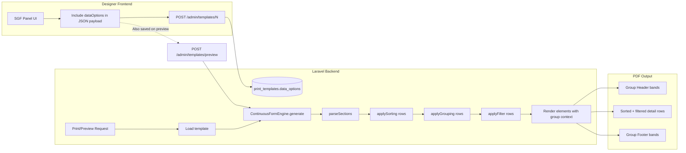

# Template Designer — Phase 1 Feature Plan

## Current State Assessment

After auditing the codebase against the [`plans/designer-improvement.md`](plans/designer-improvement.md) plan, here's what's already implemented vs. what remains:

### ✅ Already Implemented (from earlier work)
| Feature | Status |
|---------|--------|
| Section-Based Layout (backend + frontend bands UI) | ✅ Done |
| Visual Formula/Expression Editor | ✅ Done |
| Conditional Formatting Visual Editor | ✅ Done |
| Runtime Parameters | ✅ Done |
| Template Version History + Diff Viewer | ✅ Done |
| Barcode & QR Code Elements | ✅ Done |
| Custom Font Management | ✅ Done |
| Sample Data / Test Scenarios | ✅ Done |
| Multiple Data Sources (pivot schemas) | ✅ Done |
| Running Total Fields | ✅ Done |
| Alignment & Distribution Tools | ✅ Done |
| Schema Version Diff | ✅ Done |

### ❌ Not Yet Implemented (from designer-improvement.md)
| # | Feature | Priority | Effort |
|---|---------|----------|--------|
| 2.1 | **Sorting, Grouping & Filtering (SGF) Panel** | P1 | Large |
| 4.1 | **Charting Engine** | P2 | Large |
| 7.1 | **Multi-Page Preview with Navigation** | P2 | Medium |
| 5.5 | **Advanced Element Properties** (rotation, opacity, border, padding, can grow, suppress if duplicate, tooltip, print when, keep together) | P2 | Medium |
| 4.3 | **Hyperlinks & Drill-Down** | P3 | Small |
| 6.3 | **Rich Text Formatting** | P3 | Medium |
| 5.1 | **Cross-Tab / Pivot Table** | P2 | Large |
| 2.3 | **Subreports / Master-Detail** | P2 | Large |
| 1.2 | **Multi-Column Report Layout** | P2 | Medium |
| 6.1 | **Upgrade from FPDF to mPDF** | P3 | Very Large |
| 10.1 | **Multiple Export Formats** (Excel, CSV, HTML) | P4 | Large |

---

## Phase 1 — High-Impact Features

### Feature A: Sorting, Grouping & Filtering (SGF) Panel
**Reference:** [`designer-improvement.md:87-136`](plans/designer-improvement.md#21-sorting-grouping--filtering-sgf-panel)

**What:** A dedicated panel (like Crystal Reports' "Group Expert") that lets users define sort order, grouping, and record filtering without writing code.

**Implementation Scope:**

1. **Migration** — Add `data_options` JSON column to `print_templates`:
   ```json
   {
     "sortFields": [
       { "field": "department", "direction": "asc" },
       { "field": "employee.name", "direction": "asc" }
     ],
     "groupFields": [
       { "field": "department", "sortDirection": "asc", "keepTogether": true, "repeatHeader": true, "newPageBefore": false }
     ],
     "filterExpression": "totalAmount > 1000 AND status != 'cancelled'"
   }
   ```

2. **Backend – [`PrintTemplate.php`](app/Models/PrintTemplate.php)** — Add `$casts = ['data_options' => 'array']` and `$fillable` entry.

3. **Backend – [`ContinuousFormEngine.php`](app/Services/ContinuousFormEngine.php)** — Add methods:
   - `applySorting(array $rows, array $sortFields): array` — Multi-level sort using `usort`
   - `applyGrouping(array $rows, array $groupFields): array` — Return grouped structure `[[groupKey, groupData, rows], ...]`
   - `applyFilter(array $rows, string $expression): array` — Evaluate filter expression via Symfony ExpressionLanguage
   - Wire these into `generate()` before rendering

4. **Frontend – [`designer.blade.php`](resources/views/admin/templates/designer.blade.php)** — Add SGF panel:
   - New tab "SGF" in the left panel (next to Explorer/Data)
   - Sort Fields section: add/remove sort rows with field picker + direction toggle
   - Group Fields section: add/remove group rows with field picker + options (keep together, repeat header, new page)
   - Filter Expression: textarea with field autocomplete + syntax validation
   - Store in `dataOptions` JSON, included in save payload

5. **Save/load** — Include `dataOptions` in template save payload and restore on load.

---

### Feature B: Multi-Page Preview with Navigation
**Reference:** [`designer-improvement.md:506-519`](plans/designer-improvement.md#71-multi-page-preview-with-navigation)

**What:** Replace the current "download PDF" preview with an in-browser paginated viewer using PDF.js.

**Implementation Scope:**

1. **Backend – [`TemplateController::preview()`](app/Http/Controllers/Admin/TemplateController.php)** — Modify to generate PDF and return as base64 data URI (instead of forcing download). Accept `page` parameter for future use.

2. **Frontend – [`designer.blade.php`](resources/views/admin/templates/designer.blade.php)** — Add preview modal/dialog:
   - **Preview Dialog** — Full-screen overlay triggered by "Preview" button
   - **PDF.js Canvas** — Render PDF pages using pdf.js
   - **Navigation Controls** — Previous/Next page buttons, page number input (`Page 3 of 47`), jump to page
   - **Thumbnail Strip** — Vertical strip of page thumbnails on the left side
   - **Zoom Controls** — Fit width, fit page, percentage slider (50%-200%)
   - **Toolbar** — "Print to PDF" (download), "Generate PDF" (backend render), close button
   - **Loading State** — Spinner with "Rendering page X of Y..." during PDF generation

3. **Key Functions:**
   - `openPreview()` — Show modal, call preview API, load PDF with pdf.js
   - `renderPreviewPage(pageNum)` — Render specific page to canvas
   - `navigatePreview(delta)` / `jumpToPage(num)` — Page navigation
   - `updatePreviewZoom(level)` — Zoom canvas rendering

---

### Feature C: Advanced Element Properties
**Reference:** [`designer-improvement.md:395-408`](plans/designer-improvement.md#55-advanced-element-properties)

**What:** Add more element properties in the inspector for richer layout control.

**Implementation Scope:**

1. **Frontend – Property Inspector** — Extend the `updateInspector()` function in [`designer.blade.php`](resources/views/admin/templates/designer.blade.php) to include:

   | Property | Element Types | UI Control |
   |----------|--------------|------------|
   | **Rotation** | All (except table) | Dropdown: 0°, 90°, 180°, 270° + custom number input |
   | **Opacity** | All | Range slider 0-100% + number input |
   | **Border** | label, field | Color picker + width input + style dropdown (solid/dashed/dotted) |
   | **Padding** | label, field | Number input (mm) for inner padding |
   | **Can Grow** | label, field | Checkbox — auto-expand to fit content |
   | **Suppress if Duplicate** | field | Checkbox — hide when value repeats |
   | **Tooltip** | All | Text input (for interactive preview) |
   | **Print When** | All | Expression textarea — conditionally show/hide per row |
   | **Keep Together** | All | Checkbox — prevent page break within element |

2. **Backend – [`ContinuousFormEngine.php`](app/Services/ContinuousFormEngine.php)** — Add rendering support:
   - `renderWithRotation()` — Handle rotation using FPDF's `Transform()` or image rotation
   - `applyOpacity()` — Set alpha for element rendering
   - `renderBorder()` — Draw border around element
   - `checkSuppressDuplicate()` — Track last value, skip if same
   - `evaluatePrintWhen()` — Skip element if condition false
   - `applyCanGrow()` — Measure text height, adjust element height

3. **Backend – Save/Load** — Properties are already stored as element JSON, so no migration needed. Just add rendering logic.

---

### Feature D: Hyperlinks & Drill-Down
**Reference:** [`designer-improvement.md:313-333`](plans/designer-improvement.md#43-hyperlinks--drill-down)

**What:** Add clickable hyperlinks to elements in the generated PDF.

**Implementation Scope:**

1. **Frontend – Property Inspector** — Add "Link" section to element properties:
   - Link type dropdown: None / URL / Email / Page
   - URL input (supports `@{{field_name}}` placeholders)
   - Link style: underline, color (default blue)

2. **Backend – [`ContinuousFormEngine.php`](app/Services/ContinuousFormEngine.php)** — Add:
   - `applyLink()` — Use FPDF's `SetLink()`, `AddLink()`, or `write()` with URL
   - FPDF supports `Cell()` with link parameter and `Write()` with URL
   - Resolve `@{{field_name}}` placeholders in link URLs

3. **Storage** — Element JSON already supports custom properties, so `link`, `linkType`, `linkStyle` can be stored without migration.

---

## Summary & Prioritization

```
Phase 1A (SGF Panel) ──── Largest effort, highest impact ──── P1
Phase 1B (Multi-Page Preview) ── Medium effort, high UX impact ── P2
Phase 1C (Advanced Properties) ── Medium effort, medium impact ── P2
Phase 1D (Hyperlinks) ──── Small effort, medium impact ──── P3
```

### Recommended Execution Order
1. **Feature A: SGF Panel** — Core data manipulation, highest Crystal Reports gap
2. **Feature C: Advanced Element Properties** — Quick wins, broad applicability
3. **Feature D: Hyperlinks** — Small, self-contained
4. **Feature B: Multi-Page Preview** — Richer UX, depends on PDF generation working

### Files to Modify

| File | Features | Change Scope |
|------|----------|-------------|
| [`resources/views/admin/templates/designer.blade.php`](resources/views/admin/templates/designer.blade.php) | A, B, C, D | Major — new panels, preview dialog, inspector extensions |
| [`app/Services/ContinuousFormEngine.php`](app/Services/ContinuousFormEngine.php) | A, C, D | Medium — SGF rendering, advanced properties, links |
| [`app/Models/PrintTemplate.php`](app/Models/PrintTemplate.php) | A | Small — add `data_options` cast |
| [`app/Http/Controllers/Admin/TemplateController.php`](app/Http/Controllers/Admin/TemplateController.php) | B | Small — modify preview response for inline viewing |
| New migration | A | Small — add `data_options` column |

---

## Mermaid Diagram — SGF Data Flow


