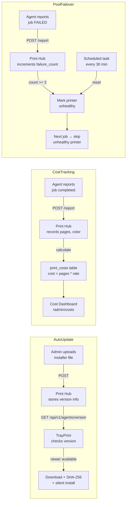

# Future Improvements Plan — Auto-Update, Cost Tracking & Pool Failover

## Feature 1: Auto-Update from Hub with Installer Management UI

### Current State
- [`updater.py`](/home/yudi/dev/trayprint/updater.py) — Fully implemented on TrayPrint side (version check, download, SHA-256 verify, silent install)
- Missing: Print Hub endpoint and admin UI to upload/manage installer files

### What to Build

#### 1.1 Database & Settings
Create a `agent_releases` table or use existing `settings` table:
```json
{
  "agent_latest_version": "3.1.0",
  "agent_download_url_linux": "https://hub.example.com/storage/agents/trayprint-linux-v3.1.0",
  "agent_download_url_windows": "https://hub.example.com/storage/agents/trayprint-win-v3.1.0.exe",
  "agent_download_url_macos": "https://hub.example.com/storage/agents/trayprint-mac-v3.1.0.dmg",
  "agent_release_notes": "Bug fixes and improvements",
  "agent_sha256_linux": "abc123...",
  "agent_sha256_windows": "def456...",
  "agent_sha256_macos": "ghi789...",
  "agent_update_mandatory": false
}
```

#### 1.2 Admin Upload UI
New page at `/admin/agent-updates` with:
- Upload form: select platform (Linux/Windows/macOS), upload file, enter version, release notes
- List of previous releases with download counts
- "Mark as latest" button

**Files:** New `resources/views/admin/agent-updates/index.blade.php`, [`Admin/ReleaseController.php`] (new)

#### 1.3 API Endpoint
```
GET /api/v1/agents/version  →  {
  "latest_version": "3.1.0",
  "download_url": "https://...",
  "sha256": "abc...",
  "release_notes": "...",
  "mandatory": false
}
```

This endpoint is called by [`updater.py:_check_version()`](/home/yudi/dev/trayprint/updater.py)

**Files:** [`Api/AgentVersionController.php`] (new), [`routes/api.php`](/routes/api.php)

#### 1.4 TrayPrint Integration
- `updater.py` already calls this endpoint and compares versions
- Add "Channel" selection in settings: stable/beta

---

## Feature 2: Cost Tracking Dashboard

### Current State
Nothing. Approval rules have a `cost` type but no actual cost tracking.

### What to Build

#### 2.1 Database Migration
```php
Schema::create('print_costs', function (Blueprint $table) {
    $table->id();
    $table->foreignId('print_job_id')->constrained()->cascadeOnDelete();
    $table->foreignId('branch_id')->nullable()->constrained();
    $table->integer('pages_printed');
    $table->boolean('is_color')->default(false);
    $table->decimal('cost_per_page', 8, 4);       // e.g. 0.0500 for B&W, 0.2500 for color
    $table->decimal('total_cost', 10, 2);          // pages * cost_per_page
    $table->string('currency', 3)->default('IDR');
    $table->timestamps();
});
```

Also add per-branch/company settings:
```php
Schema::table('branches', function (Blueprint $table) {
    $table->decimal('bw_cost_per_page', 8, 4)->default(0.05)->after('active');
    $table->decimal('color_cost_per_page', 8, 4)->default(0.25)->after('bw_cost_per_page');
    $table->string('currency', 3)->default('IDR')->after('color_cost_per_page');
});
```

#### 2.2 Cost Recording
When a job completes, record costs in [`PrintHubController::reportJob()`](/app/Http/Controllers/Api/PrintHubController.php):
- Agent reports `pages_printed` and `is_color`
- Calculate cost from branch settings
- Store in `print_costs` table

#### 2.3 Dashboard & Reports
New admin page at `/admin/costs` with:
- **Summary cards:** Total cost this month, cost by branch, cost by agent, avg cost per job
- **Monthly trend chart:** Bar chart showing costs over last 12 months
- **Top spenders:** Branch/agent with highest costs
- **Export to CSV:** Download filtered cost data
- **Date range filter:** From/to date picker

**Files:** New [`Admin/CostController.php`], new `resources/views/admin/costs/index.blade.php`

---

## Feature 3: Printer Pool Auto-Failover Enhancement

### Current State
Already exists:
- [`PrinterPool`](app/Models/PrinterPool.php) model with `strategy` field (round_robin, least_busy, random, **failover**)
- [`PrintJobOrchestrator::selectPrinterFromPool()`](app/Services/PrintJobOrchestrator.php) with failover strategy returns highest-priority printer
- [`PoolController`](app/Http/Controllers/Admin/PoolController.php) for managing pools
- Client app can specify `pool_id` in [`ClientAppController`](app/Http/Controllers/Api/ClientAppController.php)

Missing: **Automatic failure detection and failover** — currently just picks the first printer regardless of health.

### What to Build

#### 3.1 Track Printer Health
Add `last_healthy_at` and `failure_count` to `printer_pool_printers` pivot:
```php
Schema::table('printer_pool_printers', function (Blueprint $table) {
    $table->timestamp('last_healthy_at')->nullable();
    $table->integer('failure_count')->default(0);
    $table->boolean('is_healthy')->default(true);
    $table->timestamp('last_error_at')->nullable();
    $table->text('last_error_message')->nullable();
});
```

#### 3.2 Agent Reports Failures
When a print job fails on a specific printer, the agent reports the error. Update [`reportJob()`](/app/Http/Controllers/Api/PrintHubController.php) to:
1. If job status is `failed`, find the pool that this printer belongs to
2. Increment `failure_count` on the pivot
3. If `failure_count >= threshold` (configurable, default 3), mark `is_healthy = false`
4. Log the error

#### 3.3 Enhanced Failover Logic
Update [`selectPrinterFromPool()`](app/Services/PrintJobOrchestrator.php):
```php
case 'failover':
    // Pick the highest-priority printer that is healthy
    $healthy = $printers->first(fn($p) => $p->pivot->is_healthy ?? true);
    if (!$healthy) {
        // All printers unhealthy — reset health and try again
        PrinterPoolPrinter::where('printer_pool_id', $pool->id)
            ->update(['is_healthy' => true, 'failure_count' => 0]);
        $healthy = $printers->first();
    }
    return $healthy->printer_name;
```

#### 3.4 Admin UI for Pool Health
Update [`pools/edit.blade.php`](/resources/views/admin/pools/edit.blade.php) to show:
- Health status indicator (green/red dot) per printer
- Last healthy time
- Failure count
- "Reset Health" button

#### 3.5 Scheduled Health Reset
Create a scheduled command to automatically reset printer health after a cooldown period:
```bash
php artisan print-hub:reset-printer-health
```
Reset printers that have been marked unhealthy for > 30 minutes.

---

## Architecture Diagram



---

## Files to Create/Modify

| Feature | New Files | Modified Files |
|---------|-----------|----------------|
| **Auto-Update** | `app/Http/Controllers/Api/AgentVersionController.php`, `app/Http/Controllers/Admin/ReleaseController.php`, `resources/views/admin/agent-updates/index.blade.php` | [`routes/api.php`](/routes/api.php), [`routes/web.php`](/routes/web.php), [`app.py`](/home/yudi/dev/trayprint/app.py) |
| **Cost Tracking** | Migration for `print_costs`, `app/Models/PrintCost.php`, `app/Http/Controllers/Admin/CostController.php`, `resources/views/admin/costs/index.blade.php` | [`PrintHubController::reportJob()`](/app/Http/Controllers/Api/PrintHubController.php), [`routes/web.php`](/routes/web.php) |
| **Pool Failover** | `app/Console/Commands/ResetPrinterHealth.php` | [`PrintJobOrchestrator.php`](app/Services/PrintJobOrchestrator.php), [`PrintHubController.php`](/app/Http/Controllers/Api/PrintHubController.php), [`pools/edit.blade.php`](/resources/views/admin/pools/edit.blade.php), migration for pivot table |
