# Print Hub — Comprehensive Improvement Plan

## Overview

This document outlines actionable improvements for the Print Hub application, a centralized print management middleware for multi-branch organizations. Each section ranks improvements by **priority** (P0 = Critical, P1 = High, P2 = Medium, P3 = Low) and provides implementation guidance.

---

## 1. Testing & Quality Assurance

> **Current state:** Only 4 test files with basic coverage. No CI/CD configuration.

| # | Improvement | Priority | Description |
|---|-------------|----------|-------------|
| 1.1 | **Expand test coverage for admin controllers** | P0 | Add feature tests for all admin CRUD operations: agents, profiles, templates, clients, users, sessions, activity logs, companies, branches |
| 1.2 | **Add integration tests for full print flow** | P0 | End-to-end test: client app submits print job → PDF generated → agent polls queue → status reported → webhook fired |
| 1.3 | **Test multi-tenant data scoping** | P1 | Verify users from Branch A cannot access Branch B data across all models (agents, jobs, profiles, users) |
| 1.4 | **Test permission/role enforcement** | P1 | Each of the 5 roles (super-admin, company-admin, branch-admin, branch-operator, viewer) should have dedicated test cases for allowed/denied actions |
| 1.5 | **Add model unit tests** | P1 | Test model scopes, relationships, accessors, and custom methods (e.g., [`PrintAgent::isOnline()`](app/Models/PrintAgent.php:46), [`Branch::getDefaultProfileForTemplate()`](app/Models/Branch.php:77)) |
| 1.6 | **Test PDF engine edge cases** | P1 | Empty data, extremely long text, special characters, multi-page tables with 1000+ rows, missing images, computed column edge cases |
| 1.7 | **Add batch print failure tests** | P2 | Test transaction rollback when one job in a batch fails; test dry-run validation; test max batch size (50) enforcement |
| 1.8 | **Configure CI/CD pipeline** | P0 | Add GitHub Actions (or GitLab CI) workflow: `composer install` → `php artisan test` → `npm run build` — runs on PR and push to main |
| 1.9 | **Add PHPStan/Pint static analysis** | P1 | Run [`laravel/pint`](composer.json:21) and PHPStan at maximum level as part of CI |

---

## 2. Security

> **Current state:** SHA-256 for API key hashing, throttle middleware in place, role-based permissions exist.

| # | Improvement | Priority | Description |
|---|-------------|----------|-------------|
| 2.1 | **Upgrade API key hashing from SHA-256 to bcrypt/Argon2** | P0 | [`ClientApp::hashKey()`](app/Models/ClientApp.php:29) and [`PrintAgent::hashKey()`](app/Models/PrintAgent.php:53) use `hash('sha256', ...)`. Replace with `Hash::make()` which uses bcrypt. Note: this requires key regeneration or a migration strategy |
| 2.2 | **Implement API key scoping** | P1 | Allow client apps to have restricted scopes (e.g., `print:submit` only, `templates:read` only) instead of full API access |
| 2.3 | **Add CORS middleware for admin panel** | P1 | The [`cors-origins`](app/Http/Controllers/Api/PrintHubController.php:232) endpoint only targets agent-side CORS. The admin panel should also enforce CORS |
| 2.4 | **Rate-limit auth endpoints more aggressively** | P1 | [`/login`](routes/web.php:22) is throttled at 5/min, but password reset endpoints have no throttle. Add throttling to forgot-password and reset-password routes |
| 2.5 | **Add authentication event audit logging** | P2 | Log login attempts (success/failure), password resets, API key usage to the activity log |
| 2.6 | **Add session timeout and refresh token rotation** | P2 | Current sessions have no configurable idle timeout. Add middleware for session TTL enforcement and rotate session IDs on privilege escalation |
| 2.7 | **Sanitize template designer inputs** | P1 | Template elements are stored as JSON arrays and rendered to PDF. Ensure no XSS vectors exist if element data is ever reflected in HTML (e.g., in the designer preview) |
| 2.8 | **Add Content Security Policy headers** | P2 | Add CSP headers to admin panel responses to prevent XSS |

---

## 3. Performance & Scalability

> **Current state:** FPDF for generation, PHP-based agent selection, no caching.

| # | Improvement | Priority | Description |
|---|-------------|----------|-------------|
| 3.1 | **Replace FPDF with a modern PDF library** | P1 | FPDF lacks Unicode/UTF-8 support, is unmaintained, and has poor text-rendering. Replace with **Dompdf** (`dompdf/dompdf`), **TCPDF** (`tecnickcom/tcpdf`), or **Browsershot** (`spatie/browsershot` + headless Chrome). Dompdf is the simplest drop-in replacement with HTML+CSS support |
| 3.2 | **Add PDF output caching** | P2 | Cache generated PDFs keyed by `template_name + hash(print_data) + hash(options)`. Invalidate on template change. This can dramatically improve repeated print jobs |
| 3.3 | **Optimize agent selection query** | P2 | [`AgentSelectionService::select()`](app/Services/AgentSelectionService.php:26) loads all agents and filters in PHP. Replace with a database query: `WHERE is_active = true AND last_seen_at >= NOW() - INTERVAL 2 MINUTE` |
| 3.4 | **Add database indexes** | P1 | Review and add missing indexes: [`print_jobs.status`](database/migrations/2026_04_03_000001_create_print_tables.php), `print_jobs.print_agent_id`, `print_agents.last_seen_at`, `print_agents.is_active`, `print_profiles.branch_id`, `activity_logs.created_at` |
| 3.5 | **Implement queue worker management UI** | P2 | Add an admin page showing queue worker status, job throughput, failed job retry counts. Monitor queue length with alerts |
| 3.6 | **Add storage cleanup scheduler** | P1 | The [`CleanupOldPrintJobs`](app/Console/Commands/CleanupOldPrintJobs.php) command exists. Ensure it runs on a schedule via the Laravel scheduler, and add configurable retention period in `.env` |
| 3.7 | **Batch print optimization** | P2 | Current batch implementation ([`batchPrint()`](app/Http/Controllers/Api/ClientAppController.php:649)) creates synthetic HTTP requests. Refactor to call the orchestrator directly to avoid HTTP overhead |
| 3.8 | **Lazy-load large PDFs from queue** | P2 | [`getQueue()`](app/Http/Controllers/Api/PrintHubController.php:103) base64-encodes all PDFs in memory before sending. For large PDFs, use streaming or signed S3 URLs instead |

---

## 4. Monitoring & Observability

> **Current state:** Basic dashboard auto-refresh, minimal logging.

| # | Improvement | Priority | Description |
|---|-------------|----------|-------------|
| 4.1 | **Add WebSocket-powered real-time dashboard updates** | P1 | The dashboard has auto-refresh (polling), but Reverb is configured. Wire up [`JobStatusUpdated`](app/Events/JobStatusUpdated.php) event to push live updates to the dashboard via Laravel Echo |
| 4.2 | **Add failed job alerting** | P1 | Send email/Slack/Telegram notifications when a job fails or when an agent goes offline. Use Laravel notifications with channels |
| 4.3 | **Add structured logging middleware** | P1 | Create a middleware that logs all API requests/responses (method, path, status, duration, client app name) to a structured log |
| 4.4 | **Add health check endpoint for admin panel** | P2 | Create `/api/health` that checks database connectivity, queue worker status, storage writability, and returns a composite status |
| 4.5 | **Add Prometheus/metrics endpoint** | P3 | Expose a `/metrics` endpoint with job counts, agent status, queue depth for Prometheus scraping |
| 4.6 | **Enhance activity log filtering** | P2 | Add filters by action type, user, date range, and subject type in the activity log admin view |
| 4.7 | **Add dashboard trend charts** | P2 | Show job volume over time (hourly/daily), agent uptime percentage, template usage statistics |

---

## 5. API Design & Developer Experience

> **Current state:** Functional REST API, SDK client available, Scramble dependency included.

| # | Improvement | Priority | Description |
|---|-------------|----------|-------------|
| 5.1 | **Configure and generate OpenAPI/Swagger docs** | P1 | [`dedoc/scramble`](composer.json:10) is in composer.json but may not be configured. Set it up to auto-generate API documentation from code annotations |
| 5.2 | **Add API versioning strategy** | P2 | Add `Accept: application/vnd.print-hub.v2+json` header-based versioning alongside URL-based (`/api/v1/`). Prepare for v2 with breaking changes |
| 5.3 | **Add request/response validation middleware** | P1 | Create a middleware that validates `Content-Type` headers, enforces max payload size, and provides consistent error response structure |
| 5.4 | **Implement pagination metadata consistency** | P1 | Some endpoints return pagination meta, others don't. Standardize pagination across all list endpoints using Laravel's `apiResource` or a custom pagination wrapper |
| 5.5 | **Add webhook retry mechanism** | P2 | Current webhooks fire once and log failure ([`reportJob()`](app/Http/Controllers/Api/PrintHubController.php:167)). Add retry with exponential backoff and a webhook delivery log |
| 5.6 | **Add batch webhook status callback** | P2 | Batch prints should support a single webhook URL that receives status for all jobs in the batch |
| 5.7 | **Improve SDK client** | P2 | The downloadable [`PrintHubClient.php`](public/sdk/PrintHubClient.php) should include proper error handling, connection pooling, and be published as a Composer package |

---

## 6. Template Designer

> **Current state:** Drag-and-drop WYSIWYG with fields, labels, lines, images, tables, and computed columns.

| # | Improvement | Priority | Description |
|---|-------------|----------|-------------|
| 6.1 | **Add undo/redo support** | P1 | Implement an action history stack in the designer JavaScript for undo/redo operations |
| 6.2 | **Add auto-save with debounce** | P1 | Auto-save the template to the server after 2 seconds of inactivity. Show "saved" / "unsaved changes" indicator |
| 6.3 | **Support barcodes and QR codes** | P1 | Add element types for barcode (Code 128, Code 39) and QR code generation. Use a library like `picqer/php-barcode-generator` |
| 6.4 | **Add more element types** | P2 | Support: checkboxes, radio buttons, dynamic date/time fields, page numbers, auto-increment row numbers in tables |
| 6.5 | **Add conditional visibility** | P2 | Allow elements to be shown/hidden based on data conditions (e.g., "show discount field only if discount > 0") |
| 6.6 | **Add template version diff viewer** | P2 | Compare two versions of a template in the UI, showing which elements were added, removed, or modified |
| 6.7 | **Add element grouping/layering** | P2 | Allow grouping elements and controlling z-order (bring to front, send to back) |
| 6.8 | **Add snap-to-grid and alignment tools** | P2 | Grid snapping, multi-select alignment (left, right, top, bottom, distribute evenly) |
| 6.9 | **Support custom fonts** | P2 | Allow uploading `.ttf` font files and selecting them per-element in the designer |
| 6.10 | **Add element property panel** | P2 | When an element is selected, show a proper property panel (not inline editing) with all configuration options |

---

## 7. PDF Engine (Continuous Form Engine)

> **Current state:** FPDF-based engine with basic text, table, line, and image rendering.

| # | Improvement | Priority | Description |
|---|-------------|----------|-------------|
| 7.1 | **Replace FPDF** (see 3.1) | P1 | Unicode support, better text wrapping, HTML rendering capability |
| 7.2 | **Fix text overflow** | P1 | [`MultiCell`](app/Services/ContinuousFormEngine.php:218) doesn't properly handle overflow; long text can overlap page boundaries. Implement proper text fitting with font size reduction |
| 7.3 | **Add configurable page break handling** | P1 | Allow template designers to configure "keep with next" (prevent orphan rows), "min rows before break" for tables, and "page break before" |
| 7.4 | **Support embedded images from URLs** | P2 | Currently [`renderImage`](app/Services/ContinuousFormEngine.php:177) only supports local files. Add support for HTTP/HTTPS URLs with caching |
| 7.5 | **Add table row spanning** | P2 | Support `colspan` and `rowspan` in table columns for complex layouts |
| 7.6 | **Add PDF/A and PDF metadata support** | P3 | Generate PDF/A-1b compliant documents with metadata (title, author, subject) for archival |
| 7.7 | **Add page footer support** | P2 | Allow template designers to define a page footer that repeats on every page with page number, date, and custom content |

---

## 8. Code Quality & Maintainability

> **Current state:** Thick controllers, inline JS/CSS in Blade views, no DTOs, limited type declarations.

| # | Improvement | Priority | Description |
|---|-------------|----------|-------------|
| 8.1 | **Extract admin Blade scripts to separate JS files** | P1 | Inline `<script>` blocks in [dashboard.blade.php](resources/views/admin/dashboard.blade.php) and other views should be extracted to dedicated JS files built with Vite |
| 8.2 | **Refactor thick controllers into service classes** | P1 | [`ClientAppController`](app/Http/Controllers/Api/ClientAppController.php) (772 lines) should be split into dedicated service/action classes: `PrintService`, `TemplateService`, `SchemaService`, `BatchPrintAction` |
| 8.3 | **Add PHP 8.2 type declarations** | P2 | Add `mixed`, `array`, `string`, `int`, `bool` return types and parameter types throughout all classes |
| 8.4 | **Create Data Transfer Objects (DTOs)** | P2 | Use DTOs/spaties data-transfer-object package for structured data like `PrintRequest`, `TemplateData`, `JobStatus` instead of passing raw arrays |
| 8.5 | **Add proper exception classes** | P1 | Create domain exceptions: `AgentOfflineException`, `TemplateNotFoundException`, `JobCancellationException`, `SchemaValidationException` |
| 8.6 | **Standardize error response format** | P1 | Ensure all error responses follow the same structure as [`ApiResponse`](app/Http/Responses/ApiResponse.php). Some endpoints return raw JSON |
| 8.7 | **Extract CSS to proper stylesheets** | P1 | Extract all inline `<style>` blocks and `style=` attributes to proper CSS files |
| 8.8 | **Add Laravel IDE Helper generation** | P2 | Add `barryvdh/laravel-ide-helper` for better IDE autocompletion and type inference |

---

## 9. Multi-tenancy

> **Current state:** Company → Branch → User/Agent hierarchy with BranchScopeable trait.

| # | Improvement | Priority | Description |
|---|-------------|----------|-------------|
| 9.1 | **Add tenant resource quotas** | P2 | Allow setting max agents, max jobs/day, max storage per company/branch |
| 9.2 | **Add cross-tenant isolation tests** | P1 | Ensure data from Company A is never visible to Company B even with malicious API calls |
| 9.3 | **Add company-level theme/branding** | P2 | Allow companies to customize the admin panel with their logo, colors, and name |
| 9.4 | **Add tenant-aware caching** | P2 | Cache keys should include company/branch ID to prevent cross-tenant cache leaks |

---

## 10. DevOps & Infrastructure

> **Current state:** Docker setup with PHP 8.2 Apache, SQLite, basic multi-stage build.

| # | Improvement | Priority | Description |
|---|-------------|----------|-------------|
| 10.1 | **Add Docker Compose for development** | P1 | Currently [`docker-compose.yml`](docker-compose.yml) is production-oriented. Add a `docker-compose.dev.yml` with MySQL, Redis, Reverb, queue worker |
| 10.2 | **Add healthcheck to Dockerfile** | P1 | Add `HEALTHCHECK` instruction to the Dockerfile that pings the health endpoint |
| 10.3 | **Multi-stage Docker build optimization** | P2 | Separate PHP dependencies and Node assets more cleanly; use `--no-dev` for Composer production install; add `.dockerignore` |
| 10.4 | **Add backup/restore artisan commands** | P1 | Create `php artisan backup:run` and `php artisan backup:restore` commands for database and storage files |
| 10.5 | **Add environment validation command** | P2 | `php artisan env:check` to validate all required env vars are set with correct formats |
| 10.6 | **Add Laravel Horizon configuration** | P2 | Replace `database` queue driver with Redis + Laravel Horizon for production queue management with monitoring UI |

---

## 11. User Experience

> **Current state:** Functional admin panel with Tailwind CSS 4, basic responsive support.

| # | Improvement | Priority | Description |
|---|-------------|----------|-------------|
| 11.1 | **Add dark mode** | P2 | Implement CSS custom properties-based dark mode toggle using Tailwind CSS `dark:` variant |
| 11.2 | **Improve mobile responsiveness** | P2 | The dashboard grid collapses at 768px but many other views need mobile optimization |
| 11.3 | **Add bulk actions** | P2 | Bulk retry/delete jobs, bulk delete agents, bulk regenerate keys |
| 11.4 | **Add data export** | P2 | Export job history, agent list, activity logs to CSV/Excel |
| 11.5 | **Add job filtering** | P1 | Filter jobs by date range, status, template name, agent, branch — with query parameters in the URL for shareable links |
| 11.6 | **Add inline template preview** | P2 | Show a mini PDF preview thumbnail on the template list page |
| 11.7 | **Add notification center** | P2 | Add a notification bell in the admin header showing recent failed jobs and offline agents |
| 11.8 | **Add keyboard shortcuts** | P3 | Ctrl+S to save template, Ctrl+Z for undo, Delete key to remove selected element in designer |

---

## 12. Internationalization (i18n)

> **Current state:** Indonesian-specific formatting (Rp, Terbilang), no locale support.

| # | Improvement | Priority | Description |
|---|-------------|----------|-------------|
| 12.1 | **Add Laravel localization** | P2 | Add `en` and `id` language files for the admin panel. Detect locale from user preference or browser |
| 12.2 | **Abstract currency formatting** | P2 | The Rp prefix in [`DataSchema::applyFormat()`](app/Models/DataSchema.php:169) should be locale-aware (configurable per company/branch) |
| 12.3 | **Add locale support to date formatting** | P2 | Date format strings should respect user locale for month/day names |
| 12.4 | **Make Terbilang optional** | P2 | The "terbilang" number-to-words format is Indonesia-specific. Make it a pluggable formatter |

---

## 13. Agent ↔ Hub Communication

> **Current state:** TrayPrint is a Python 3 desktop app using PySide6 (Qt) + Flask + PyMuPDF for PDF printing on Windows. Communication is via Print Hub's REST API with Bearer token auth.

| # | Improvement | Priority | Description |
|---|-------------|----------|-------------|
| 13.1 | **Add `success` field check in agent response handling** | P0 | [`server.py`] The agent does NOT check the `success` field in Hub responses before processing `data.*`. If the Hub returns `{"success": false, "error": {...}}`, the agent silently treats it as success, resulting in empty job lists and no error logging. Add a guard: `if not response.get("success"): log.error(...); return/retry`. |
| 13.2 | **Replace blocking retry in spooler with async retry mechanism** | P0 | [`server.py:280-297`] The spooler thread uses `time.sleep(retry_delay)` inside the retry loop, blocking the entire spooler from processing subsequent jobs while retrying. A failed job blocks all pending jobs behind it. Use a thread pool executor or a separate retry queue to isolate failures. |
| 13.3 | **Scope Hub profiles to requesting agent** | P1 | The Hub's `getProfiles()` endpoint returns ALL profiles via `PrintProfile::all()`, not filtered by the requesting agent's ID. The agent receives profiles belonging to other agents. Add `->where("print_agent_id", $agent->id)` or equivalent scoping. |
| 13.4 | **Add heartbeat call to agent sync loop** | P1 | The Hub exposes `POST /api/print-hub/heartbeat` for lightweight keepalive, but the agent never calls it — relying only on the heavier status sync. Add a heartbeat call every N seconds in a separate lightweight thread or as part of the existing sync loop. |
| 13.5 | **Implement exponential backoff on agent polling** | P2 | Agent polls `/api/print-hub/queue` every 5 seconds regardless of failure rate. Implement exponential backoff (e.g., 5s → 10s → 20s → 40s → max 120s) when the Hub is down or returns errors, resetting to 5s on success. |
| 13.6 | **Unify version string across codebase** | P2 | [`server.py:447`] reports `v2.0.0` but [`app.py:98`] reports `"Trayprint v3.0"`. Pick a single canonical version (e.g., `v3.0.0`) and reference it from a shared constant or config file. |
| 13.7 | **Add config validation on agent startup** | P2 | Agent starts even if `hub_url` or `agent_key` are empty or malformed. Add startup validation that checks both values are present, `hub_url` is a valid URL, and `agent_key` matches expected format. Exit with a clear error message if invalid. |

---

## Implementation Roadmap

```mermaid
flowchart LR
    subgraph Phase1[Phase 1 -- Must Have P0]
        T1[1.1 Expand test coverage]
        T2[1.2 Integration tests]
        T3[1.8 CI/CD pipeline]
        S1[2.1 Upgrade key hashing]
        P1[3.4 Database indexes]
    end
    subgraph Phase2[Phase 2 -- Should Have P1]
        MO1[4.1 WebSocket dashboard]
        MO2[4.2 Failed job alerts]
        MO3[4.3 Logging middleware]
        API1[5.1 OpenAPI docs]
        API2[5.3 Validation middleware]
        TMPL1[6.1 Undo/redo]
        TMPL2[6.2 Auto-save]
        TMPL3[6.3 Barcodes/QR]
        ENG1[7.1 Replace FPDF]
        ENG2[7.2 Fix text overflow]
        ENG3[7.3 Configurable page breaks]
        CODE1[8.2 Refactor controllers]
        CODE2[8.5 Exception classes]
    end
    subgraph Phase3[Phase 3 -- Nice to Have P2/P3]
        REST[All remaining P2 and P3 items]
    end
    Phase1 --> Phase2 --> Phase3
```

## Quick Wins (Can be done in < 2 hours each)

1. Add database indexes ([3.4](#34-add-database-indexes))
2. Add storage cleanup scheduler configuration ([3.6](#36-add-storage-cleanup-scheduler))
3. Add pagination metadata consistency ([5.4](#54-implement-pagination-metadata-consistency))
4. Add proper exception classes ([8.5](#85-add-proper-exception-classes))
5. Standardize error response format ([8.6](#86-standardize-error-response-format))
6. Add rate limiting to password reset routes ([2.4](#24-rate-limit-auth-endpoints-more-aggressively))
7. Add healthcheck to Dockerfile ([10.2](#102-add-healthcheck-to-dockerfile))
8. Add backup/restore artisan commands ([10.4](#104-add-backuprestore-artisan-commands))
