# Print Hub — New Improvement Suggestions v2

> **Status:** This document builds on existing [`improvement-plan.md`](plans/improvement-plan.md), [`new-improvement-suggestions.md`](plans/new-improvement-suggestions.md), and [`ui-ux-analysis.md`](plans/ui-ux-analysis.md).
>
> **Key finding:** The existing plans are thorough (20+ categories). However, during codebase analysis, I discovered that **many features described as "future" or "not yet implemented" in those plans already exist** in the current codebase (scheduling, documents, approval workflow, printer pools, monitoring dashboard, webhooks with retry, finishing options, watermarking, sustainability metrics). This document focuses on **truly new areas** not covered by any existing plan.

---

## 1. 🔔 Internal Notification System

> **Current state:** No in-app notification center. Job status changes fire WebSocket events but there are no email/Slack/Telegram alerts. Admins must manually check the dashboard to see failures or offline agents.

| # | Improvement | Priority | Description |
|---|-------------|----------|-------------|
| 1.1 | **In-App Notification Center** | P1 | Add a notification bell in admin layout header. Store notifications in a `notifications` table: `user_id`, `type`, `title`, `body`, `action_url`, `is_read`, `created_at`. API endpoint + badge counter. Show recent 50 in a dropdown. Mark as read on click. Types: `job.failed`, `agent.offline`, `approval.needed`, `key.expiring`, `job.sla_breached`. |
| 1.2 | **Email Notifications** | P1 | Add Laravel mail notification channels: job failure email to admins, agent offline alert, approval requested notification to approvers, key rotation reminder. Configurable per user in their profile. Use Laravel's notification system with database + mail channels. |
| 1.3 | **Slack / Telegram / Webhook Channels** | P2 | Add notification channel drivers for Slack (incoming webhook), Telegram bot, and generic webhook. Admins configure channel endpoints in system settings. Each user can subscribe to specific event types per channel. |
| 1.4 | **Notification Preference UI** | P2 | Add `/admin/settings/notifications` page where users can subscribe/unsubscribe from each event type × channel combination. Default: all enabled for super-admin, branch events for branch-admin. |
| 1.5 | **System-Wide Announcements** | P3 | Allow super-admins to create announcements (e.g., "Scheduled maintenance tonight at 2 AM") that appear as persistent banners in the admin panel until dismissed. |

---

## 2. ⏱️ Job SLA & Timeout Management

> **Current state:** Jobs can stay in "processing" indefinitely if an agent crashes. No auto-fail mechanism, no SLA tracking, no escalation.

| # | Improvement | Priority | Description |
|---|-------------|----------|-------------|
| 2.1 | **Auto-Fail Stuck Jobs** | P1 | Add an Artisan command [`print-hub:auto-fail-stale`](app/Console/Commands) that marks jobs as `failed` with error `AGENT_TIMEOUT` if they've been in `processing` status longer than `config('app.job_timeout_minutes', 30)`. Schedule via Laravel scheduler every 5 minutes. |
| 2.2 | **Job Pickup SLA** | P2 | Track time from `created_at` to first `agent_created_at` for each job. Show SLA compliance percentage on dashboard (e.g., "95% of jobs picked up within 60 seconds"). Add SLA alerts when a job hasn't been picked up within the configured threshold. |
| 2.3 | **Completion SLA** | P2 | Track time from `agent_created_at` to `agent_completed_at`. Show by agent, printer, template. Identify slow printers/agents. |
| 2.4 | **SLA Dashboard Widget** | P2 | Add a dashboard widget showing: average pickup time, average completion time, SLA breach count (today), worst-performing agent by pick-up time. |
| 2.5 | **Auto-Escalation for Unpicked Jobs** | P2 | If a job is `pending` for > N minutes (configurable per queue/profile), re-assign it to an alternative agent from the same branch or pool. Log the escalation in activity log. |

---

## 3. ✅ Approval Workflow Enhancements

> **Current state:** Approval rules (`PrintApprovalRule` model) exist with user/role/page_count/cost rule types. Jobs can be approved/rejected via the admin panel. No admin UI for rule management, no escalation, no notifications.

| # | Improvement | Priority | Description |
|---|-------------|----------|-------------|
| 3.1 | **Approval Rules Admin UI** | **P0** | Add an admin page at `/admin/settings/approval-rules` to create/edit/delete/reorder approval rules. No more code-only management. Fields: name, type (user/role/page_count/cost/printer/template/agent), value, requires_approval toggle, approver_id, branch scope, active toggle. |
| 3.2 | **Approval Rule Scoping** | P1 | Add `branch_id`, `template_name`, `printer_name`, `agent_id` nullable FK columns to [`PrintApprovalRule`](app/Models/PrintApprovalRule.php). Rules apply only when the job matches ALL non-null scopes. E.g., "require approval for color prints on Branch A using template 'invoice'". |
| 3.3 | **Approval Notifications** | P1 | When a job enters `approval_status: pending`, send in-app notification + email to the configured approver(s). Include "Approve" / "Reject" links in the email. |
| 3.4 | **Approval Escalation** | P2 | If an approver doesn't act within N hours (configurable per rule), escalate to the next-level approver (company-admin → super-admin). Configurable `escalation_hours` field on `PrintApprovalRule`. Track escalation in activity log. |
| 3.5 | **Batch Approval** | P2 | Add checkboxes in the approvals admin view for selecting multiple pending jobs. "Approve Selected" / "Reject Selected" buttons with confirmation dialog. |
| 3.6 | **Approval History** | P2 | Show approval history for each job: who approved/rejected, when, the rule that triggered it. Accessible from the job detail page. |

---

## 4. 📊 Reporting Module

> **Current state:** Monitoring dashboard has aggregate stats but no exportable reports, no scheduled delivery, no drill-down.

| # | Improvement | Priority | Description |
|---|-------------|----------|-------------|
| 4.1 | **Reports Admin Page** | P2 | Add `/admin/reports` with parameterized report generation. Report types: (1) Job Volume by period/agent/template/branch, (2) Agent Performance (jobs processed, success rate, avg time), (3) Template Usage (jobs per template, total pages), (4) Branch Usage (jobs, pages, cost). |
| 4.2 | **CSV/Excel Export** | P1 | Add "Export to CSV" / "Export to Excel" buttons on: jobs list, activity logs, agents list, reports. Use Laravel's `League\Csv` or `Maatwebsite\LaravelExcel`. Include all visible columns and selected filters. |
| 4.3 | **PDF Report Generation** | P2 | Generate printable PDF reports using the existing [`ContinuousFormEngine`](app/Services/ContinuousFormEngine.php) or a dedicated report template. Include charts, summaries, and data tables. |
| 4.4 | **Scheduled Report Delivery** | P3 | Allow admins to schedule recurring report generation (daily/weekly/monthly) with automatic delivery via email as PDF attachment. Store schedule in a `report_schedules` table. |
| 4.5 | **Dashboard Report Download** | P2 | Add a "Download Report" button on the monitoring dashboard that captures current stats (job volume, success/failure rates, top printers, agent health) as a CSV snapshot. |

---

## 5. 🔑 API Key Lifecycle Management

> **Current state:** API keys for agents and client apps are generated once and never expire. Key rotation tracked via `last_key_rotated_at` but no enforcement or reminders.

| # | Improvement | Priority | Description |
|---|-------------|----------|-------------|
| 5.1 | **API Key Expiry** | P1 | Add `expires_at` nullable datetime column to [`print_agents`](app/Models/PrintAgent.php) and [`client_apps`](app/Models/ClientApp.php). If set and expired, the agent/app is treated as inactive. The [`AuthenticateApiKey`](app/Http/Middleware/AuthenticateApiKey.php) middleware rejects expired keys with `KEY_EXPIRED` error. |
| 5.2 | **Key Expiry Warning** | P1 | Artisan command [`print-hub:check-key-expiry`](app/Console/Commands) checks keys expiring within 30/14/7 days and creates in-app notifications + optionally sends emails. |
| 5.3 | **Auto-Rotation Policy** | P2 | Add a `key_rotation_policy_days` config (default: null = disabled). If set, auto-rotate keys that haven't been rotated in that many days. Create new key, store hash, notify the agent/app admin of the new key. |
| 5.4 | **API Key Scopes** | P1 | Add `scopes` JSON column to [`client_apps`](app/Models/ClientApp.php). Support scopes: `print:submit`, `print:read`, `templates:read`, `templates:write`, `agents:read`, `schemas:read`, `schemas:write`, `documents:upload`, `documents:read`. The [`AuthenticateApiKey`](app/Http/Middleware/AuthenticateApiKey.php) middleware checks requested scope against allowed scopes. Add `X-Required-Scope` header support. |
| 5.5 | **Key Rotation Audit Log** | P2 | Log all key creation, rotation, and expiry events to the activity log with the user/admin who performed the action. |

---

## 6. 🔍 Global Search

> **Current state:** No search across the admin panel. Each section has its own filters but no unified search.

| # | Improvement | Priority | Description |
|---|-------------|----------|-------------|
| 6.1 | **Global Search Bar** | P2 | Add a search bar in the admin layout header (keyboard shortcut: `Ctrl+K` or `/`). Searches across: jobs (by job_id, reference_id, printer_name), agents (by name), templates (by name), users (by name/email), documents (by filename). Shows top 5 results per category with links. |
| 6.2 | **Search Index** | P2 | Create a `search_indexes` table for full-text search or use Laravel Scout + database LIKE queries with indexing. Rebuild via Artisan command. Auto-index on model create/update via model events. |

---

## 7. ⚙️ Configuration & Settings UI

> **Current state:** System settings are managed via `.env` file and `config/app.php`. No admin UI for runtime configuration.

| # | Improvement | Priority | Description |
|---|-------------|----------|-------------|
| 7.1 | **System Settings Page** | P1 | Add `/admin/settings` page with sections: (1) **General** — app name, logo, timezone, date format, (2) **Jobs** — job timeout minutes, max retries, stale job cleanup days, (3) **Agent** — online threshold minutes, auto-update URL, latest version, (4) **Notifications** — default notification channels, (5) **Security** — session timeout, password policy. Store in `system_settings` table (key-value) with a caching layer. |
| 7.2 | **Environment Status Page** | P2 | Add `/admin/settings/environment` showing: PHP version, Laravel version, queue driver, cache driver, database type, Reverb status, storage space, last cron run time. Run health checks inline. |
| 7.3 | **Maintenance Mode Toggle** | P2 | Add a "Maintenance Mode" toggle in settings that runs `php artisan down --secret=...` / `php artisan up`. Show a maintenance banner to non-super-admin users. |

---

## 8. 🧪 Testing & Quality — Expanded

> **Current state:** 2 test files with 4 tests total. No CI/CD.

| # | Improvement | Priority | Description |
|---|-------------|----------|-------------|
| 8.1 | **Admin Controller Tests** | **P0** | Add feature tests for all admin CRUD controllers: [`AgentController`](app/Http/Controllers/Admin/AgentController.php), [`ProfileController`](app/Http/Controllers/Admin/ProfileController.php), [`TemplateController`](app/Http/Controllers/Admin/TemplateController.php), [`JobController`](app/Http/Controllers/Admin/JobController.php), [`UserController`](app/Http/Controllers/Admin/UserController.php), [`BranchController`](app/Http/Controllers/Admin/BranchController.php), [`CompanyController`](app/Http/Controllers/Admin/CompanyController.php), [`ApprovalController`](app/Http/Controllers/Admin/ApprovalController.php). Test CRUD + permission enforcement for each role. |
| 8.2 | **Print Flow Integration Test** | **P0** | End-to-end test: client submits print via [`ClientAppController::unifiedPrint()`](app/Http/Controllers/Api/ClientAppController.php:426) → PDF generated → job created → agent polls queue → status reported → webhook fired. Mock storage and HTTP. |
| 8.3 | **Approval Flow Test** | P1 | Test: job submitted with `requires_approval` → approval_status=pending → approve → job becomes available in queue → reject → job is rejected. Test all rule types (user, role, page_count, cost). |
| 8.4 | **Scheduling & Recurrence Test** | P1 | Test: job submitted with `scheduled_at` in future → not in queue → time passes → job appears in queue. Test daily/weekly/monthly recurrence generation. |
| 8.5 | **Multi-Tenant Isolation Test** | P1 | Test Branch A user cannot access Branch B data via API or admin panel. Cover agents, profiles, jobs, templates, documents. |
| 8.6 | **Batch Print Test** | P1 | Test [`batchPrint()`](app/Http/Controllers/Api/ClientAppController.php:688): all succeed, one fails (rollback), dry-run validation, max 50 jobs enforcement. |
| 8.7 | **CI/CD Pipeline** | **P0** | Add GitHub Actions workflow: `composer install` → `php artisan test` → `npm run build`. Run on PR and push to main. |
| 8.8 | **PHPStan Static Analysis** | P1 | Run PHPStan at level 6+ in CI. Fix all type errors. |

---

## 9. 🧩 Job Dependency & Sequencing

> **Current state:** Jobs are independent. No way to define that Job B should only print after Job A completes.

| # | Improvement | Priority | Description |
|---|-------------|----------|-------------|
| 9.1 | **Job Dependencies** | P3 | Add `depends_on_job_id` nullable FK to [`print_jobs`](app/Models/PrintJob.php). If set, the job stays in `pending` (or new `waiting` status) until the dependency is `success`. Add dependency resolution in [`AgentSelectionService`](app/Services/AgentSelectionService.php) queue logic. |
| 9.2 | **Sequenced Batch Printing** | P3 | Extend batch API with `sequence: sequential | parallel` option. `sequential` mode: next job starts only after previous completes. Uses job dependency chain internally. |
| 9.3 | **Conditional Job Flow** | P3 | Allow setting conditions like: "if Job A fails, don't print Job B". Store as JSON `flow_rules: [{condition: "depends_on.status != failed", action: "cancel"}]`. |

---

## 10. 📁 Document Lifecycle Management

> **Current state:** [`PrintDocument`](app/Models/PrintDocument.php) model exists with upload/review/soft-delete. No retention policy, no categorization, no auto-cleanup.

| # | Improvement | Priority | Description |
|---|-------------|----------|-------------|
| 10.1 | **Document Retention Policy** | P2 | Add `retention_days` config (default: 30). Artisan command [`print-hub:cleanup-documents`](app/Console/Commands) deletes documents (hard delete) older than the retention period. Run daily via scheduler. |
| 10.2 | **Document Categorization** | P2 | Add `category` and `tags` fields to [`PrintDocument`](app/Models/PrintDocument.php). Admin UI shows filters by category and tag. Useful for organizing invoices, reports, forms, etc. |
| 10.3 | **Document Size & Type Display** | P2 | Show file size (KB/MB), MIME type, and page count (for PDFs) in the document list view. Store in `file_size`, `mime_type`, `page_count` columns. |
| 10.4 | **Bulk Document Operations** | P2 | Multi-select documents with batch delete, batch download as ZIP. |

---

## 11. 🚦 Rate Limiting & Abuse Prevention

> **Current state:** Global throttle middleware (30 req/min on login). No per-client-app limits.

| # | Improvement | Priority | Description |
|---|-------------|----------|-------------|
| 11.1 | **Per-Client-App Rate Limits** | P1 | Add `rate_limit_per_minute` column to [`client_apps`](app/Models/ClientApp.php) (default: 60). Create middleware [`ThrottleClientApp`](app/Http/Middleware) that checks the client app's rate limit using Redis/cache keyed by `app_id`. |
| 11.2 | **Per-Agent Rate Limits** | P1 | Same for [`print_agents`](app/Models/PrintAgent.php): `rate_limit_per_minute` for agent API endpoints. |
| 11.3 | **Rate Limit Dashboard** | P2 | Show current rate limit usage per client app / agent in admin panel. Highlight apps approaching their limit. |
| 11.4 | **Job Submission Rate Limit** | P2 | Enforce a max jobs/minute per client app, separate from general API rate limit. Prevents accidental flood submissions. |

---

## 12. 🧭 Developer Experience & DevOps

> **Current state:** Docker setup, basic SDK clients, no CI/CD.

| # | Improvement | Priority | Description |
|---|-------------|----------|-------------|
| 12.1 | **Dev Docker Compose** | P1 | Add `docker-compose.dev.yml` with MySQL, Redis, Mailpit, Reverb, Seed data auto-loading. Make local development trivial with one command. |
| 12.2 | **Backup & Restore Commands** | P1 | Create [`php artisan backup:run`](app/Console/Commands) (db + storage) and [`php artisan backup:restore`](app/Console/Commands). Store backups in `storage/app/backups/`. Support S3/cloud backups. |
| 12.3 | **Environment Validation Command** | P1 | Create [`php artisan env:check`](app/Console/Commands) that validates all required env vars, checks database connectivity, queue driver, storage permissions. Exit with clear error messages. |
| 12.4 | **SDK Package Publishing** | P2 | Publish [`PrintHubClient.php`](public/sdk/PrintHubClient.php) as a Composer package on Packagist. Add proper PSR-4 autoloading, PHP 8.2 type hints, PHPUnit tests, GitHub Actions CI. |
| 12.5 | **Postman Collection Automation** | P2 | Auto-generate Postman collection from route definitions with example payloads. Serve at `/admin/sdk/PrintHub-Postman.json`. |

---

## 13. 📝 Audit Trail Enhancement

> **Current state:** [`ActivityLog`](app/Models/ActivityLog.php) model exists, `LogsActivity` trait records model changes. No retention policy, no export, no replay capability.

| # | Improvement | Priority | Description |
|---|-------------|----------|-------------|
| 13.1 | **Audit Log Retention Policy** | P2 | Add `audit_log_retention_days` config (default: 90). Artisan command [`print-hub:cleanup-audit-logs`](app/Console/Commands) purges old entries. Run weekly via scheduler. |
| 13.2 | **Audit Log Export** | P2 | Add "Export to CSV" button on the activity log admin view. Include all filters in the export. |
| 13.3 | **Audit Log Detail View** | P2 | Click on an activity log entry to see full details: old/new values for each changed field, request IP, user agent, related model link. |
| 13.4 | **Authentication Event Logging** | P1 | Log login success/failure, password reset, API key usage, session expiry to the activity log via middleware/listeners. Add filters for auth events. |

---

## 14. 🔗 Webhook System Enhancements

> **Current state:** [`WebhookService`](app/Services/WebhookService.php) exists with HMAC signing, retry (3 attempts with 30s/2m/5m backoff), delivery tracking via [`WebhookDelivery`](app/Models/WebhookDelivery.php). No admin UI for management.

| # | Improvement | Priority | Description |
|---|-------------|----------|-------------|
| 14.1 | **Webhook Management UI** | **P0** | Add `/admin/settings/webhooks` page to create/edit/delete webhook endpoints per client app. UI shows: URL, subscribed events, secret (masked), retry count, timeout, last delivery status. |
| 14.2 | **Webhook Delivery Log Viewing** | P1 | Add `/admin/settings/webhooks/{id}/deliveries` to browse all delivery attempts with status, response code, response body, timestamp. "Resend" button for failed deliveries. |
| 14.3 | **Webhook Test Tool** | P2 | Add a "Test Webhook" button that sends a ping event with sample payload to verify the endpoint is working. |
| 14.4 | **Webhook Event Selector** | P1 | Add event type checkboxes in client app form so admins can subscribe to specific events (job.created, job.completed, etc.) instead of getting all events. |

---

## 15. 🔄 Template & Schema Management

> **Current state:** Templates have versioned data schemas. No template rollback, no diff viewer.

| # | Improvement | Priority | Description |
|---|-------------|----------|-------------|
| 15.1 | **Template Version History** | P2 | Store previous versions of template JSON (`elements` field) in a `template_versions` table when a template is updated. Allow restoring any previous version from the admin UI. |
| 15.2 | **Template Diff Viewer** | P2 | Compare two template versions in the admin UI. Highlight added/modified/removed elements with color coding. Show which fields/tables changed. |
| 15.3 | **Schema Breaking Change Detection** | P2 | When a schema is updated, analyze if existing templates using the old schema would be affected. Show warning: "This schema change may affect N templates". |
| 15.4 | **Template Usage Statistics** | P2 | Show per-template metrics: total jobs printed, success/failure rate, average pages per job, last used date. Accessible from template list view. |

---

## 16. 🛡️ Security Hardening

> **Current state:** SHA-256 hashing for API keys, IP whitelisting, role-based access, SSO support. Some gaps remain.

| # | Improvement | Priority | Description |
|---|-------------|----------|-------------|
| 16.1 | **Upgrade Key Hashing to bcrypt/Argon2** | **P0** | [`PrintAgent::hashKey()`](app/Models/PrintAgent.php:65) and [`ClientApp::hashKey()`](app/Models/ClientApp.php) use `hash('sha256')`. Replace with `Hash::make()` (bcrypt). Requires migration strategy: add `key_hash_bcrypt` column, dual-auth during transition, then drop old column. |
| 16.2 | **Session Timeout Enforcement** | P1 | Add `session_timeout_minutes` config (default: 120). Middleware checks session last activity and forces re-login. The [`UpdateSessionActivity`](app/Http/Middleware/UpdateSessionActivity.php) middleware already exists, needs timeout enforcement added. |
| 16.3 | **Rate-Limit Password Reset** | P1 | Add `throttle:3,60` middleware to `/forgot-password` and `/reset-password` routes in [`routes/web.php`](routes/web.php:35-63). |
| 16.4 | **Content Security Policy Headers** | P2 | Add CSP headers via middleware: `default-src 'self'`, `script-src 'self'`, `style-src 'self' 'unsafe-inline'`, `img-src 'self' data:`, `connect-src 'self' ws://localhost:*`. |

---

## 17. 📱 Mobile & Accessibility

> **Current state:** Tailwind CSS 4 with basic responsive support. No mobile-specific optimizations.

| # | Improvement | Priority | Description |
|---|-------------|----------|-------------|
| 17.1 | **Mobile-Responsive Admin Panel** | P2 | Audit all admin views for mobile responsiveness. Fix collapsing tables (use card layout on small screens), stack filters vertically, ensure touch targets are ≥ 44px. Focus on: jobs list, monitoring dashboard, approvals list. |
| 17.2 | **Dark Mode Toggle** | P2 | Add CSS custom properties-based dark mode. Implement with Tailwind `dark:` variant, store preference in localStorage, add toggle in admin header. |
| 17.3 | **Keyboard Navigation** | P2 | Add keyboard shortcuts: `g + j` → Jobs, `g + a` → Agents, `g + d` → Dashboard, `g + m` → Monitoring, `?` → show shortcuts help modal. |

---

## Priority Summary

### P0 — Critical (Must fix)
| # | Item | Why |
|---|------|-----|
| 3.1 | Approval Rules Admin UI | Rules currently unmaintainable without code changes |
| 8.1 | Admin Controller Tests | Zero coverage on admin CRUD |
| 8.2 | Print Flow Integration Test | Core business flow untested |
| 8.7 | CI/CD Pipeline | No automated quality gates |
| 14.1 | Webhook Management UI | Webhooks exist but unmanageable |
| 16.1 | Upgrade Key Hashing | SHA-256 is inadequate for credential storage |

### P1 — High Priority (Should implement soon)
| # | Items |
|---|-------|
| 1.1, 1.2 | In-app + email notifications |
| 2.1 | Auto-fail stuck jobs |
| 3.2, 3.3 | Approval scoping + notifications |
| 4.2 | CSV/Excel export |
| 5.1, 5.2, 5.4 | Key expiry, warnings, scopes |
| 7.1 | System settings UI |
| 8.3-8.6 | Specific test suites |
| 11.1, 11.2 | Per-app/agent rate limits |
| 12.1-12.3 | Dev tooling improvements |
| 13.4 | Auth event logging |
| 14.2, 14.4 | Webhook delivery log + event selector |
| 16.2, 16.3 | Session timeout + password reset rate limit |

### P2 — Medium Priority (Nice to have)
Items 1.3, 1.4, 2.2-2.5, 3.4-3.6, 4.1, 4.3, 4.5, 5.3, 5.5, 6.1, 6.2, 7.2, 7.3, 10.1-10.4, 11.3, 11.4, 12.4, 12.5, 13.1-13.3, 14.3, 15.1-15.4, 16.4, 17.1-17.3

### P3 — Stretch Goals
Items 1.5, 4.4, 9.1-9.3

---

## Implementation Roadmap

```mermaid
flowchart LR
    subgraph Phase1[Phase 1 -- Critical P0]
        A1[3.1 Approval Rules UI]
        A2[8.1 Admin Controller Tests]
        A3[8.2 Print Flow Integration Test]
        A4[8.7 CI/CD Pipeline]
        A5[14.1 Webhook Management UI]
        A6[16.1 Upgrade Key Hashing]
    end
    subgraph Phase2[Phase 2 -- High Impact P1]
        B1[1.1-1.2 Notification System]
        B2[2.1 Auto-fail Stuck Jobs]
        B3[3.2-3.3 Approval Scoping]
        B4[4.2 CSV/Export]
        B5[5.1-5.4 Key Lifecycle]
        B6[7.1 System Settings UI]
        B7[11.1-11.2 Rate Limiting]
        B8[12.1-12.3 Dev Tooling]
        B9[16.2-16.3 Security Hardening]
    end
    subgraph Phase3[Phase 3 -- Enhancement P2]
        C1[3.4-3.6 Approval Enhancements]
        C2[4.1-4.5 Reporting Module]
        C3[6.1-6.2 Global Search]
        C4[10.1-10.4 Document Lifecycle]
        C5[14.2-14.4 Webhook Tools]
        C6[15.1-15.4 Template Versioning]
        C7[17.1-17.3 Mobile + Dark Mode]
    end
    subgraph Phase4[Phase 4 -- Stretch P3]
        D1[1.5 Announcements]
        D2[4.4 Scheduled Reports]
        D3[9.1-9.3 Job Dependencies]
    end
    Phase1 --> Phase2 --> Phase3 --> Phase4
```

## Quick Wins (Can be done in < 2 hours each)

| # | Item | Effort | Impact |
|---|------|--------|--------|
| 1 | Rate-limit password reset routes (16.3) | 15 min | Medium |
| 2 | Add `expires_at` to ClientApp/PrintAgent migrations (5.1) | 30 min | High |
| 3 | Create auto-fail stuck jobs command (2.1) | 45 min | High |
| 4 | Add auth event logging listener (13.4) | 30 min | Medium |
| 5 | Add CSV export to jobs/agents list (4.2) | 1 hr | High |
| 6 | Add `branch_id` scope to ApprovalRule migration (3.2) | 30 min | Medium |
| 7 | Add `session_timeout_minutes` enforcement (16.2) | 45 min | Medium |
| 8 | Create environment validation command (12.3) | 1 hr | Medium |
