# Print Hub & TrayPrint — New Improvement Suggestions v3

> **Status:** This document builds on existing [`improvement-plan.md`](plans/improvement-plan.md), [`new-improvement-suggestions.md`](plans/new-improvement-suggestions.md), [`new-improvement-suggestions-v2.md`](plans/new-improvement-suggestions-v2.md), and [`ui-ux-analysis.md`](plans/ui-ux-analysis.md).
>
> **Key finding from codebase analysis (May 2026):** The existing plans are thorough (20+ categories, 100+ items). However, during deep codebase analysis, I discovered that:
> 1. **Many features described as "future" already exist** (scheduling, documents, approval workflow, printer pools, webhooks with retry, finishing options, watermarking, sustainability metrics, auto-update, diagnostics dialog, WebSocket client, printer capability discovery, per-printer configs, notification history).
> 2. **Several critical gaps remain** that are NOT covered by any existing plan.
> 3. **This document focuses exclusively on truly new areas** not covered by any existing plan.

---

## 1. 🔄 Print Hub — Print Profile → Agent Pipeline Gap

> **Current state:** The [`PrintProfile`](app/Models/PrintProfile.php) model has 40+ fields including `tray_source`, `color_mode`, `print_quality`, `scaling_percentage`, `media_type`, `collate`, `reverse_order`, watermark fields, finishing fields, and sustainability fields. However, the agent-side pipeline only reads `extra_options` (JSON) from the hub profiles API — all the dedicated fields are **silently dropped**.

| # | Improvement | Priority | Description |
|---|-------------|----------|-------------|
| 1.1 | **Hub API: Include all PrintProfile fields in profiles response** | **P0** | The [`PrintHubController::getProfiles()`](app/Http/Controllers/Api/PrintHubController.php) endpoint currently returns profiles with only `name`, `printer`, and `options` (from `extra_options`). Add all dedicated fields: `tray_source`, `color_mode`, `print_quality`, `scaling_percentage`, `media_type`, `collate`, `reverse_order`, `watermark_text`, `watermark_opacity`, `watermark_position`, `finishing_staple`, `finishing_punch`, `finishing_booklet`, `eco_mode`, `grayscale_force`, `pages_per_sheet`. |
| 1.2 | **Agent: Parse new profile fields in hub sync** | **P0** | The agent's [`start_hub_sync()`](server.py:213) → `_process_profiles()` must parse the new fields from the API response and store them in the profile options dict so they flow through to the print engine. |
| 1.3 | **Agent: Wire tray_source into DEVMODE** | **P0** | [`printer.py`](printer.py) `_create_devmode_for_options()` must set `dmDefaultSource` using `DM_DEFAULTSOURCE` flag. Map string values (`auto`, `tray1`, `tray2`, `manual`, `envelope`) to `DMBIN_*` constants. |
| 1.4 | **Agent: Wire color_mode into DEVMODE** | **P0** | Set `dmColor` using `DM_COLOR` flag. `color` → `DMCOLOR_COLOR`, `monochrome` → `DMCOLOR_MONOCHROME`. |
| 1.5 | **Agent: Wire print_quality into DEVMODE** | **P0** | Set `dmPrintQuality` using `DM_PRINTQUALITY` flag. `draft` → `DMRES_DRAFT`, `normal` → `DMRES_MEDIUM`, `high` → `DMRES_HIGH`. |
| 1.6 | **Agent: Wire collate into DEVMODE** | P1 | Set `dmCollate` using `DM_COLLATE` flag. `true` → `DMCOLLATE_TRUE`, `false` → `DMCOLLATE_FALSE`. |
| 1.7 | **Agent: Wire media_type into DEVMODE** | P1 | Set `dmMediaType` using `DM_MEDIATYPE` flag. Map string values (`plain`, `glossy`, `envelope`, `label`) to `DMMEDIA_*` constants. |
| 1.8 | **Agent: Wire scaling_percentage into CUPS/lp** | P1 | Add `-o scaling={N}` to [`_build_lp_options()`](printer.py:121). Currently scaling is not sent to CUPS at all. |
| 1.9 | **Agent: Wire media_type into CUPS/lp** | P1 | Add `-o MediaType={type}` to `_build_lp_options()`. |
| 1.10 | **Agent: Wire collate into CUPS/lp** | P1 | Add `-o Collate=True` to `_build_lp_options()`. |
| 1.11 | **Agent: Wire reverse_order into CUPS/lp** | P1 | Add `-o outputorder=reverse` to `_build_lp_options()`. Already tested in [`test_printer.py`](tests/test_printer.py:137) but verify it's actually wired in production code. |
| 1.12 | **Agent: Wire tray_source into CUPS/lp** | P1 | Add `-o InputSlot={tray}` to `_build_lp_options()`. Already tested in [`test_printer.py`](tests/test_printer.py:91) but verify production wiring. |
| 1.13 | **Agent: Wire color_mode into CUPS/lp** | P1 | Add `-o ColorModel={Gray|RGB}` to `_build_lp_options()`. Already tested but verify production wiring. |
| 1.14 | **Agent: Wire print_quality into CUPS/lp** | P1 | Add `-o print-quality={3|4|5}` to `_build_lp_options()`. |
| 1.15 | **Agent: Wire finishing options into SumatraPDF** | P2 | Add `-print-settings` flags for booklet, staple. Log warning for unsupported finishing options. |

---

## 2. 🔐 Print Hub — API Key Hashing Upgrade Strategy

> **Current state:** Both [`PrintAgent::hashKey()`](app/Models/PrintAgent.php:65) and [`ClientApp::hashKey()`](app/Models/ClientApp.php:45) use `hash('sha256')`. The existing plans mention upgrading to bcrypt but don't provide a migration strategy.

| # | Improvement | Priority | Description |
|---|-------------|----------|-------------|
| 2.1 | **Add `key_hash_bcrypt` column** | **P0** | Migration: add nullable `key_hash_bcrypt` column to `print_agents` and `client_apps` tables. |
| 2.2 | **Dual-auth middleware** | **P0** | Update [`AuthenticateApiKey`](app/Http/Middleware/AuthenticateApiKey.php) middleware to check BOTH `agent_key` (sha256) and `key_hash_bcrypt` (bcrypt). If sha256 matches but bcrypt is null, hash the raw key with `Hash::make()` and store it in `key_hash_bcrypt`. |
| 2.3 | **Migration Artisan command** | P1 | Create `php artisan print-hub:migrate-key-hashing` that iterates all agents and client apps, re-hashes their keys with bcrypt (requires raw keys — only works if keys are stored in a secure external vault or if we accept a one-time re-key). Alternative: force all agents/apps to regenerate keys after the migration window. |
| 2.4 | **Drop old sha256 column** | P2 | After migration window (e.g., 30 days), drop `agent_key` / `api_key` columns and rename `key_hash_bcrypt` → `agent_key` / `api_key`. |

---

## 3. 📊 Print Hub — Monitoring Dashboard Gaps

> **Current state:** Monitoring dashboard at [`/admin/monitoring`](resources/views/admin/monitoring/index.blade.php) exists with auto-refresh. But several critical metrics are missing.

| # | Improvement | Priority | Description |
|---|-------------|----------|-------------|
| 3.1 | **Agent Uptime Percentage** | P1 | Show per-agent uptime % over last 24h/7d/30d. Calculate from heartbeat timestamps stored in a new `agent_heartbeats` table (created every 5 min by the heartbeat endpoint). |
| 3.2 | **Job SLA Breach Counter** | P1 | Add a counter on the dashboard showing number of jobs that exceeded their SLA (pickup time > threshold). Color-coded: green (0), yellow (<5), red (≥5). |
| 3.3 | **Queue Depth History Chart** | P2 | Show a sparkline chart of queue depth over the last 24 hours. Helps identify peak usage times. |
| 3.4 | **Printer Error Rate** | P2 | Track and display printer error rate (failed jobs / total jobs) per printer. Highlight printers with >10% error rate. |
| 3.5 | **Real-Time Dashboard via WebSocket** | P2 | The [`JobStatusUpdated`](app/Events/JobStatusUpdated.php) and [`QueueUpdated`](app/Events/QueueUpdated.php) events exist. Wire them to the monitoring dashboard via Laravel Echo so the dashboard updates in real-time without polling. |

---

## 4. 🧪 Print Hub — Test Coverage Gaps

> **Current state:** 6 test files (4 unit + 2 feature) with ~30 tests total. The existing plans mention expanding coverage but don't specify exact test cases.

| # | Improvement | Priority | Description |
|---|-------------|----------|-------------|
| 4.1 | **Admin Controller Tests** | **P0** | Add feature tests for ALL admin CRUD controllers: [`AgentController`](app/Http/Controllers/Admin/AgentController.php), [`ProfileController`](app/Http/Controllers/Admin/ProfileController.php), [`TemplateController`](app/Http/Controllers/Admin/TemplateController.php), [`JobController`](app/Http/Controllers/Admin/JobController.php), [`UserController`](app/Http/Controllers/Admin/UserController.php), [`BranchController`](app/Http/Controllers/Admin/BranchController.php), [`CompanyController`](app/Http/Controllers/Admin/CompanyController.php), [`ApprovalController`](app/Http/Controllers/Admin/ApprovalController.php), [`DocumentController`](app/Http/Controllers/Admin/DocumentController.php), [`PoolController`](app/Http/Controllers/Admin/PoolController.php), [`FontController`](app/Http/Controllers/Admin/FontController.php), [`MonitoringController`](app/Http/Controllers/Admin/MonitoringController.php). Test CRUD + permission enforcement for each role (super-admin, company-admin, branch-admin, branch-operator, viewer). |
| 4.2 | **Approval Flow Integration Test** | **P0** | Test: job submitted with `requires_approval` → `approval_status=pending` → approve → job becomes available in queue → reject → job is rejected. Test all rule types (user, role, page_count, cost). Test escalation. |
| 4.3 | **Scheduling & Recurrence Test** | **P0** | Test: job submitted with `scheduled_at` in future → not in queue → time passes → job appears in queue. Test daily/weekly/monthly recurrence generation. Test `recurrence_count` and `recurrence_end_at` limits. |
| 4.4 | **Batch Print Integration Test** | **P0** | Test [`batchPrint()`](app/Http/Controllers/Api/ClientAppController.php:688): all succeed, one fails (rollback), dry-run validation, max 50 jobs enforcement, mixed template/document types. |
| 4.5 | **Multi-Tenant Isolation Test** | **P0** | Test Branch A user cannot access Branch B data via API or admin panel. Cover agents, profiles, jobs, templates, documents, users. Test Company A isolation too. |
| 4.6 | **Webhook Delivery Test** | P1 | Test: webhook fires on job completion → delivery recorded → retry on failure → max retries exceeded → webhook marked as failed. Test HMAC signing verification. |
| 4.7 | **Document Upload & Lifecycle Test** | P1 | Test: upload document via API → retrieve → soft-delete → restore → hard-delete after retention period. Test file size validation, MIME type validation. |
| 4.8 | **Printer Pool Assignment Test** | P1 | Test: job targets a pool → agent selection picks from pool members → round-robin distribution → failover when primary agent is offline. |
| 4.9 | **Rate Limiting Test** | P1 | Test: per-client-app rate limit enforced → exceeded requests return 429 → rate limit resets after window. Test per-agent rate limits too. |
| 4.10 | **API Key Scoping Test** | P1 | Test: client app with `print:submit` scope can submit jobs but cannot read templates. App with `templates:read` scope can read templates but cannot submit jobs. |
| 4.11 | **CI/CD Pipeline** | **P0** | Add GitHub Actions workflow: `composer install` → `php artisan test` → `npm run build`. Run on PR and push to main. Add PHPStan at level 6. |

---

## 5. 🖨️ TrayPrint — Windows DEVMODE Coverage Gaps

> **Current state:** The [`ui-ux-analysis.md`](plans/ui-ux-analysis.md) identified that DEVMODE doesn't set `dmDefaultSource`, `dmColor`, `dmPrintQuality`, `dmCollate`, `dmMediaType`, or `dmCopies`. These remain unimplemented.

| # | Improvement | Priority | Description |
|---|-------------|----------|-------------|
| 5.1 | **Implement dmDefaultSource (tray) in DEVMODE** | **P0** | In [`_create_devmode_for_options()`](printer.py:529), add: `devmode.dmDefaultSource = DMBIN_*` based on `tray_source` option. Set `dmFields |= DM_DEFAULTSOURCE`. Map: `auto`→DMBIN_AUTO, `tray1`→DMBIN_UPPER, `tray2`→DMBIN_LOWER, `manual`→DMBIN_MANUAL, `envelope`→DMBIN_ENVELOPE. |
| 5.2 | **Implement dmColor in DEVMODE** | **P0** | Add: `devmode.dmColor = DMCOLOR_COLOR` or `DMCOLOR_MONOCHROME` based on `color_mode`. Set `dmFields |= DM_COLOR`. |
| 5.3 | **Implement dmPrintQuality in DEVMODE** | **P0** | Add: `devmode.dmPrintQuality = DMRES_DRAFT/MEDIUM/HIGH` based on `print_quality`. Set `dmFields |= DM_PRINTQUALITY`. |
| 5.4 | **Implement dmCollate in DEVMODE** | P1 | Add: `devmode.dmCollate = DMCOLLATE_TRUE/FALSE`. Set `dmFields |= DM_COLLATE`. |
| 5.5 | **Implement dmMediaType in DEVMODE** | P1 | Add: `devmode.dmMediaType = DMMEDIA_STANDARD/GLOSSY/ENVELOPE/LABEL`. Set `dmFields |= DM_MEDIATYPE`. |
| 5.6 | **Implement dmCopies in DEVMODE** | P1 | Add: `devmode.dmCopies = copies`. Set `dmFields |= DM_COPIES`. Currently copies are handled via SumatraPDF CLI or Python loop — DEVMODE is the proper place. |
| 5.7 | **Add unit tests for DEVMODE field setting** | P1 | Add pytest tests that mock `win32print` and verify each DEVMODE field is set correctly for various option combinations. |

---

## 6. 🖨️ TrayPrint — GDI Print Path (Non-SumatraPDF)

> **Current state:** The agent has a GDI print path ([`_print_pdf_gdi()`](printer.py)) that uses `win32ui` for direct Windows printing without SumatraPDF. This path is used when SumatraPDF is not found.

| # | Improvement | Priority | Description |
|---|-------------|----------|-------------|
| 6.1 | **Verify GDI path works with all DEVMODE fields** | P1 | The GDI path creates a DEVMODE and applies it via `StartDoc`/`StartPage`/`EndPage`. Ensure all new DEVMODE fields (tray, color, quality, collate, media type) are properly applied in this path. |
| 6.2 | **Add GDI path test coverage** | P2 | Add mocked tests for `_print_pdf_gdi()` that verify: DEVMODE is created with correct options, `StartDoc` is called, pages are rendered, `EndDoc` is called on success and `AbortDoc` on failure. |
| 6.3 | **Add GDI path fallback logging** | P2 | When GDI path is used (SumatraPDF not found), log a warning with the list of options that are NOT supported in GDI mode vs SumatraPDF mode. |

---

## 7. 🖨️ TrayPrint — macOS Printing Implementation

> **Current state:** The code has `is_macos()` checks in [`printer.py:27`](printer.py:27) but no macOS printing implementation exists. On macOS, printing silently fails.

| # | Improvement | Priority | Description |
|---|-------------|----------|-------------|
| 7.1 | **Implement `_print_pdf_macos()` using CUPS `lp`** | P2 | Use `subprocess.run(['lp', '-d', printer_name, pdf_path])` — CUPS is native on macOS. Share [`_build_lp_options()`](printer.py:121) since CUPS options are identical between Linux and macOS. |
| 7.2 | **Implement raw data printing on macOS** | P2 | Use `subprocess.run(['lp', '-d', printer_name, '-o', 'raw'])` — same CUPS `lp` command used on Linux. |
| 7.3 | **macOS printer enumeration** | P2 | Implement `get_printers()` for macOS using `subprocess.run(['lpstat', '-a'])` — same as Linux. |
| 7.4 | **macOS autostart via LaunchAgents** | P2 | Add support in [`autostart.py`](autostart.py) for macOS: create `~/Library/LaunchAgents/com.trayprint.plist` with `KeepAlive=true`. |
| 7.5 | **macOS app bundle packaging** | P3 | Create a proper `.app` bundle with `py2app` or update [`build.py`](build.py) to support macOS `.app` output. |

---

## 8. 🖨️ TrayPrint — UI/UX Gaps (Not in Existing Plans)

> **Current state:** The existing [`ui-ux-analysis.md`](plans/ui-ux-analysis.md) covers many UI gaps. These are additional gaps found during codebase analysis.

| # | Improvement | Priority | Description |
|---|-------------|----------|-------------|
| 8.1 | **Per-Printer Configuration UI** | P1 | Add a "Configure Printer" button in the Printers tab of settings. Opens a dialog where users can set per-printer defaults for: tray source, color mode, print quality, scaling, media type, collate, reverse order. Saved to `config.json` under `printer_configs`. The [`merge_printer_config()`](server.py:36) function already exists to apply these. |
| 8.2 | **Printer Capability Display** | P1 | In the Printers tab, show what each printer supports: available trays, supported paper sizes, color capability, duplex support. Use the existing [`capabilities.py`](capabilities.py) module. |
| 8.3 | **Job Retry from Queue Dialog** | P1 | Add a "Retry" button in [`PrintQueueDialog`](queue_dialog.py) for failed jobs. Calls `POST /jobs/{id}/retry` on the local API. |
| 8.4 | **Job Details Dialog** | P2 | Click on a job in the queue to see full details: options used, error message (if failed), printer name, timestamps, data preview. |
| 8.5 | **Search/Filter in Job Queue** | P2 | Add a search bar in [`PrintQueueDialog`](queue_dialog.py) to filter jobs by printer name, job ID, or status. Add status filter checkboxes. |
| 8.6 | **Config Changes Without Restart** | P2 | Some settings (sync interval, max retries, retry delay) can be applied live without restarting. The [`reload_config()`](app.py:185) method already exists — wire it to more settings. |
| 8.7 | **Log Viewer In-App** | P2 | Add a "View Logs" dialog (not opening external editor) with: log level filtering, severity color coding, search, copy-to-clipboard. Tail the log file in real-time. |
| 8.8 | **Dark Mode Toggle** | P2 | The [`theme.py`](theme.py) module exists with dark/light palettes. Add a toggle in settings to switch between themes. Persist choice in `config.json`. |

---

## 9. 🔗 Print Hub — Webhook System Gaps

> **Current state:** [`WebhookService`](app/Services/WebhookService.php) exists with HMAC signing, retry (3 attempts with backoff), delivery tracking via [`WebhookDelivery`](app/Models/WebhookDelivery.php). But several gaps remain.

| # | Improvement | Priority | Description |
|---|-------------|----------|-------------|
| 9.1 | **Webhook Management Admin UI** | **P0** | Add `/admin/settings/webhooks` page to create/edit/delete webhook endpoints per client app. UI shows: URL, subscribed events, secret (masked), retry count, timeout, last delivery status. |
| 9.2 | **Webhook Delivery Log Viewing** | P1 | Add `/admin/settings/webhooks/{id}/deliveries` to browse all delivery attempts with status, response code, response body, timestamp. "Resend" button for failed deliveries. |
| 9.3 | **Webhook Event Selector in Client App Form** | P1 | Add event type checkboxes in client app create/edit form so admins can subscribe to specific events instead of getting all events. Currently `webhook_events` field exists but has no UI. |
| 9.4 | **Webhook Test Tool** | P2 | Add a "Test Webhook" button that sends a ping event with sample payload to verify the endpoint is working. |
| 9.5 | **Webhook Dead Letter Queue** | P2 | After max retries, move failed webhook deliveries to a "dead letter" state. Add a "Dead Letters" view in the admin panel. Allow manual reprocessing. |

---

## 10. ⚙️ Print Hub — System Configuration Gaps

> **Current state:** System settings are managed via `.env` file and `config/app.php`. No admin UI for runtime configuration.

| # | Improvement | Priority | Description |
|---|-------------|----------|-------------|
| 10.1 | **System Settings Admin Page** | P1 | Add `/admin/settings` page with sections: (1) **General** — app name, logo, timezone, date format, (2) **Jobs** — job timeout minutes, max retries, stale job cleanup days, (3) **Agent** — online threshold minutes, auto-update URL, latest version, (4) **Notifications** — default notification channels, (5) **Security** — session timeout, password policy. Store in `system_settings` table (key-value) with caching. |
| 10.2 | **Environment Status Page** | P2 | Add `/admin/settings/environment` showing: PHP version, Laravel version, queue driver, cache driver, database type, Reverb status, storage space, last cron run time. Run health checks inline. |
| 10.3 | **Maintenance Mode Toggle** | P2 | Add a "Maintenance Mode" toggle in settings that runs `php artisan down --secret=...` / `php artisan up`. Show maintenance banner to non-super-admin users. |

---

## 11. 📱 Print Hub — Admin Panel UX Gaps

> **Current state:** Functional admin panel with Tailwind CSS 4. Several UX improvements possible.

| # | Improvement | Priority | Description |
|---|-------------|----------|-------------|
| 11.1 | **Global Search Bar** | P2 | Add a search bar in the admin layout header (keyboard shortcut: `Ctrl+K` or `/`). Searches across: jobs (by job_id, reference_id, printer_name), agents (by name), templates (by name), users (by name/email), documents (by filename). Shows top 5 results per category with links. |
| 11.2 | **Bulk Actions** | P2 | Add bulk operations: bulk retry/delete jobs, bulk delete agents, bulk regenerate keys. Use checkboxes + action bar pattern. |
| 11.3 | **Data Export (CSV/Excel)** | P1 | Add "Export to CSV" / "Export to Excel" buttons on: jobs list, activity logs, agents list, templates list. Include all visible columns and applied filters. |
| 11.4 | **Job Filtering with Shareable URLs** | P1 | Filter jobs by date range, status, template name, agent, branch — with query parameters in the URL for shareable links. |
| 11.5 | **Inline Template Preview** | P2 | Show a mini PDF preview thumbnail on the template list page. |
| 11.6 | **Mobile-Responsive Admin Panel** | P2 | Audit all admin views for mobile responsiveness. Fix collapsing tables (use card layout on small screens), stack filters vertically, ensure touch targets ≥ 44px. |

---

## 12. 🛡️ Print Hub — Security Hardening Gaps

> **Current state:** SHA-256 hashing, IP whitelisting, role-based access, SSO support. Several gaps remain.

| # | Improvement | Priority | Description |
|---|-------------|----------|-------------|
| 12.1 | **Session Timeout Enforcement** | P1 | Add `session_timeout_minutes` config (default: 120). Middleware checks session last activity and forces re-login. The [`UpdateSessionActivity`](app/Http/Middleware/UpdateSessionActivity.php) middleware already exists — needs timeout enforcement. |
| 12.2 | **Rate-Limit Password Reset** | P1 | Add `throttle:3,60` middleware to `/forgot-password` and `/reset-password` routes in [`routes/web.php`](routes/web.php). |
| 12.3 | **Content Security Policy Headers** | P2 | Add CSP headers via middleware: `default-src 'self'`, `script-src 'self'`, `style-src 'self' 'unsafe-inline'`, `img-src 'self' data:`, `connect-src 'self' ws://localhost:*`. |
| 12.4 | **Authentication Event Logging** | P1 | Log login success/failure, password reset, API key usage, session expiry to the activity log via middleware/listeners. Add filters for auth events. |

---

## 13. 🧩 Print Hub — Job Dependency & Sequencing

> **Current state:** Jobs are independent. No way to define that Job B should only print after Job A completes.

| # | Improvement | Priority | Description |
|---|-------------|----------|-------------|
| 13.1 | **Job Dependencies** | P3 | Add `depends_on_job_id` nullable FK to [`print_jobs`](app/Models/PrintJob.php). If set, the job stays in `pending` (or new `waiting` status) until the dependency is `success`. Add dependency resolution in [`AgentSelectionService`](app/Services/AgentSelectionService.php) queue logic. |
| 13.2 | **Sequenced Batch Printing** | P3 | Extend batch API with `sequence: sequential | parallel` option. `sequential` mode: next job starts only after previous completes. Uses job dependency chain internally. |
| 13.3 | **Conditional Job Flow** | P3 | Allow setting conditions like: "if Job A fails, don't print Job B". Store as JSON `flow_rules`. |

---

## 14. 📁 Print Hub — Document Lifecycle Management

> **Current state:** [`PrintDocument`](app/Models/PrintDocument.php) model exists with upload/review/soft-delete. No retention policy, no categorization, no auto-cleanup.

| # | Improvement | Priority | Description |
|---|-------------|----------|-------------|
| 14.1 | **Document Retention Policy** | P2 | Add `retention_days` config (default: 30). Artisan command [`print-hub:cleanup-documents`](app/Console/Commands) deletes documents (hard delete) older than the retention period. Run daily via scheduler. |
| 14.2 | **Document Categorization** | P2 | Add `category` and `tags` fields to [`PrintDocument`](app/Models/PrintDocument.php). Admin UI shows filters by category and tag. |
| 14.3 | **Document Size & Type Display** | P2 | Show file size (KB/MB), MIME type, and page count (for PDFs) in the document list view. Store in `file_size`, `mime_type`, `page_count` columns. |
| 14.4 | **Bulk Document Operations** | P2 | Multi-select documents with batch delete, batch download as ZIP. |

---

## 15. 🚦 Print Hub — Rate Limiting & Abuse Prevention

> **Current state:** Global throttle middleware (30 req/min on login). No per-client-app limits.

| # | Improvement | Priority | Description |
|---|-------------|----------|-------------|
| 15.1 | **Per-Client-App Rate Limits** | P1 | Add `rate_limit_per_minute` column to [`client_apps`](app/Models/ClientApp.php) (default: 60). Create middleware [`ThrottleClientApp`](app/Http/Middleware) that checks the client app's rate limit using Redis/cache keyed by `app_id`. |
| 15.2 | **Per-Agent Rate Limits** | P1 | Same for [`print_agents`](app/Models/PrintAgent.php): `rate_limit_per_minute` for agent API endpoints. |
| 15.3 | **Rate Limit Dashboard** | P2 | Show current rate limit usage per client app / agent in admin panel. Highlight apps approaching their limit. |
| 15.4 | **Job Submission Rate Limit** | P2 | Enforce a max jobs/minute per client app, separate from general API rate limit. Prevents accidental flood submissions. |

---

## 16. 🧭 Print Hub — Developer Experience & DevOps

> **Current state:** Docker setup, basic SDK clients, no CI/CD.

| # | Improvement | Priority | Description |
|---|-------------|----------|-------------|
| 16.1 | **Dev Docker Compose** | P1 | Add `docker-compose.dev.yml` with MySQL, Redis, Mailpit, Reverb, Seed data auto-loading. Make local development trivial with one command. |
| 16.2 | **Backup & Restore Commands** | P1 | Create `php artisan backup:run` (db + storage) and `php artisan backup:restore`. Store backups in `storage/app/backups/`. Support S3/cloud backups. |
| 16.3 | **Environment Validation Command** | P1 | Create `php artisan env:check` that validates all required env vars, checks database connectivity, queue driver, storage permissions. Exit with clear error messages. |
| 16.4 | **SDK Package Publishing** | P2 | Publish [`PrintHubClient.php`](public/sdk/PrintHubClient.php) as a Composer package on Packagist. Add proper PSR-4 autoloading, PHP 8.2 type hints, PHPUnit tests, GitHub Actions CI. |
| 16.5 | **Postman Collection Automation** | P2 | Auto-generate Postman collection from route definitions with example payloads. Serve at `/admin/sdk/PrintHub-Postman.json`. |

---

## 17. 📝 Print Hub — Audit Trail Enhancement

> **Current state:** [`ActivityLog`](app/Models/ActivityLog.php) model exists, `LogsActivity` trait records model changes. No retention policy, no export, no replay capability.

| # | Improvement | Priority | Description |
|---|-------------|----------|-------------|
| 17.1 | **Audit Log Retention Policy** | P2 | Add `audit_log_retention_days` config (default: 90). Artisan command purges old entries. Run weekly via scheduler. |
| 17.2 | **Audit Log Export** | P2 | Add "Export to CSV" button on the activity log admin view. Include all filters in the export. |
| 17.3 | **Audit Log Detail View** | P2 | Click on an activity log entry to see full details: old/new values for each changed field, request IP, user agent, related model link. |

---

## 18. 🔔 Print Hub — Internal Notification System

> **Current state:** No in-app notification center. Job status changes fire WebSocket events but there are no email/Slack/Telegram alerts.

| # | Improvement | Priority | Description |
|---|-------------|----------|-------------|
| 18.1 | **In-App Notification Center** | P1 | Add a notification bell in admin layout header. Store notifications in a `notifications` table. API endpoint + badge counter. Show recent 50 in a dropdown. Mark as read on click. |
| 18.2 | **Email Notifications** | P1 | Add Laravel mail notification channels: job failure email to admins, agent offline alert, approval requested notification to approvers, key rotation reminder. |
| 18.3 | **Slack / Telegram / Webhook Channels** | P2 | Add notification channel drivers for Slack (incoming webhook), Telegram bot, and generic webhook. |
| 18.4 | **Notification Preference UI** | P2 | Add `/admin/settings/notifications` page where users can subscribe/unsubscribe from each event type × channel combination. |

---

## 19. 🖨️ TrayPrint — Enterprise Deployment

> **Current state:** Single executable built with PyInstaller. No MSI, no silent install, no Group Policy support.

| # | Improvement | Priority | Description |
|---|-------------|----------|-------------|
| 19.1 | **MSI Installer for Windows** | P2 | Package the PyInstaller output into an MSI using WiX toolset. Include: pre-configured `config.json`, SumatraPDF bundled, desktop shortcut, auto-start registration. The [`installer/`](installer/) directory already has a WiX source file — needs completion. |
| 19.2 | **Silent Install / Unattended Config** | P2 | Support command-line arguments for the installer: `trayprint-setup.exe /S /HUB_URL=... /AGENT_KEY=...`. Config is written during install. |
| 19.3 | **Group Policy Template** | P3 | Provide an ADMX template so IT admins can configure TrayPrint settings via Group Policy. |
| 19.4 | **Per-Machine vs Per-User Installation** | P2 | Support both per-user (current behavior) and per-machine (installed in `Program Files`, runs as a service) installation modes. |

---

## 20. 🖨️ TrayPrint — Diagnostics & Health (Expanded)

> **Current state:** [`DiagnosticsDialog`](diagnostics_dialog.py) exists with basic system info display. The existing plans mention diagnostics but this is already partially implemented.

| # | Improvement | Priority | Description |
|---|-------------|----------|-------------|
20.1 | **Diagnostic Test Suite** | P1 | Add a "Run Tests" button in the diagnostics dialog that executes: (1) hub connectivity test, (2) API authentication test, (3) printer enumeration test, (4) PDF rendering test (generate + print 1-page test PDF), (5) DEVMODE creation test. Results shown with pass/fail and error details. |
20.2 | **Diagnostic Report Export** | P2 | "Export Diagnostics" button that collects: config.json (redacted keys), recent logs, printer list, job queue status, system info (OS, Python version, free disk space). Saved as a single zip file for support. |
20.3 | **Health Check Endpoint** | P2 | Add a local web page at `http://127.0.0.1:{port}/health` that shows: uptime, version, pending jobs count, last hub sync time, printer count, memory usage, last error. Machine-readable JSON format. |
20.4 | **Watchdog Timer** | P1 | If the agent has been disconnected from the hub for >30 minutes, show a persistent tray notification. If the spooler thread crashes, auto-restart it. If a job hangs for >10 minutes, log a warning. |

---

## Priority Summary

### P0 — Critical (Must fix)
# | Item | Why |
|---|------|-----|
1.1–1.7 | PrintProfile → Agent pipeline gap | Printer control fields exist in DB but are silently dropped — users configure settings that have no effect |
2.1–2.2 | API key hashing upgrade | SHA-256 is inadequate for credential storage |
4.1–4.11 | Test coverage expansion | Core business flow untested, no CI/CD |
9.1 | Webhook Management UI | Webhooks exist but unmanageable |

### P1 — High Priority (Should implement soon)
# | Items |
|---|-------|
1.8–1.14 | Agent CUPS/lp option wiring |
2.3 | Key hashing migration command |
3.1–3.2 | Agent uptime + SLA breach on dashboard |
4.6–4.10 | Specific test suites |
5.1–5.7 | DEVMODE field implementation |
6.1 | GDI path verification |
8.1–8.3 | Per-printer config UI, capability display, job retry |
9.2–9.3 | Webhook delivery log + event selector |
10.1 | System settings UI |
11.3–11.4 | CSV export + job filtering |
12.1–12.2, 12.4 | Session timeout, rate-limit password reset, auth logging |
15.1–15.2 | Per-app/agent rate limits |
16.1–16.3 | Dev tooling improvements |
18.1–18.2 | In-app + email notifications |
20.1, 20.4 | Diagnostic tests + watchdog |

### P2 — Medium Priority (Nice to have)
Items 1.15, 2.4, 3.3–3.5, 6.2–6.3, 7.1–7.4, 8.4–8.8, 9.4–9.5, 10.2–10.3, 11.1–11.2, 11.5–11.6, 12.3, 14.1–14.4, 15.3–15.4, 16.4–16.5, 17.1–17.3, 18.3–18.4, 19.1–19.2, 19.4, 20.2–20.3

### P3 — Stretch Goals
Items 7.5, 13.1–13.3, 19.3

---

## Implementation Roadmap

```mermaid
flowchart LR
    subgraph Phase1[Phase 1 -- Critical P0]
        A1[1.1-1.7 Profile Pipeline]
        A2[2.1-2.2 Key Hashing Upgrade]
        A3[4.1-4.11 Test Coverage + CI/CD]
        A4[9.1 Webhook Management UI]
    end
    subgraph Phase2[Phase 2 -- High Impact P1]
        B1[1.8-1.14 CUPS/lp Wiring]
        B2[5.1-5.7 DEVMODE Fields]
        B3[8.1-8.3 Printer Config UI]
        B4[10.1 System Settings]
        B5[12.1-12.4 Security Hardening]
        B6[15.1-15.2 Rate Limiting]
        B7[16.1-16.3 Dev Tooling]
        B8[18.1-18.2 Notifications]
        B9[20.1-20.4 Diagnostics]
    end
    subgraph Phase3[Phase 3 -- Enhancement P2]
        C1[3.3-3.5 Dashboard Charts]
        C2[7.1-7.4 macOS Support]
        C3[8.4-8.8 UX Improvements]
        C4[9.4-9.5 Webhook Tools]
        C5[11.1-11.6 Admin UX]
        C6[14.1-14.4 Document Lifecycle]
        C7[17.1-17.3 Audit Trail]
        C8[19.1-19.4 Enterprise Deployment]
    end
    subgraph Phase4[Phase 4 -- Stretch P3]
        D1[13.1-13.3 Job Dependencies]
        D2[7.5 macOS Packaging]
        D3[19.3 Group Policy]
    end
    Phase1 --> Phase2 --> Phase3 --> Phase4
```

## Quick Wins (Can be done in < 2 hours each)

# | Item | Effort | Impact |
|---|------|--------|--------|
1 | Rate-limit password reset routes (12.2) | 15 min | Medium |
2 | Add auth event logging listener (12.4) | 30 min | Medium |
3 | Add CSV export to jobs/agents list (11.3) | 1 hr | High |
4 | Add session timeout enforcement (12.1) | 45 min | Medium |
5 | Create environment validation command (16.3) | 1 hr | Medium |
6 | Add per-printer config UI in settings (8.1) | 1.5 hr | High |
7 | Wire tray_source into CUPS/lp (1.12) | 30 min | High |
8 | Wire color_mode into CUPS/lp (1.13) | 30 min | High |