# Print Hub & TrayPrint — New Improvement Suggestions

> This document builds on the existing [improvement-plan.md](plans/improvement-plan.md) and [ui-ux-analysis.md](plans/ui-ux-analysis.md) with **new areas** not previously covered. Each section lists suggestions with priority (P0=Critical, P1=High, P2=Medium, P3=Low).

---

## 1. Print Hub — Job Scheduling & Automation

> **Current state:** Jobs are processed immediately when submitted. No scheduling, no recurring jobs, no delayed dispatch.

| # | Improvement | Pri | Description |
|---|-------------|-----|-------------|
| 1.1 | **Scheduled / Delayed Print Jobs** | P2 | Allow client apps to specify a `scheduled_at` timestamp. Jobs are held in the queue until the scheduled time, then dispatched to the agent. Implement via Laravel's `Schedule` command that checks `print_jobs.scheduled_at` every minute. |
| 1.2 | **Recurring Print Jobs** | P2 | Let admins define recurring jobs (e.g., "print sales report every Monday 8 AM"). Store recurrence rules (cron expression) on a `recurring_jobs` table. A scheduled command generates the next job instance based on the template + last-run timestamp. |
| 1.3 | **Job Priority Override** | P1 | The [`priority`](database/migrations/2026_04_22_020152_add_priority_to_print_jobs_table.php) field exists on `print_jobs` but is not exposed in the agent selection or queue ordering. Expose priority in the API and order agent queue by priority descending. |

---

## 2. Print Hub — Document Management

> **Current state:** Documents are passed as base64 in API requests. No file storage, no versioning, no retention.

| # | Improvement | Pri | Description |
|---|-------------|-----|-------------|
| 2.1 | **Secure Document Upload API** | P2 | Add `POST /api/v1/documents` that accepts multipart file uploads, stores files in `storage/app/documents/`, returns a `document_id` that can be referenced in print requests instead of inline base64. Use signed URLs for temporary access. |
| 2.2 | **Document Retention Policy** | P2 | Configurable per-company retention period (e.g., 7/30/90 days). A scheduled command purges expired documents. Default: 7 days. |
| 2.3 | **Document Versioning** | P3 | When a document is re-uploaded with the same filename, keep previous versions. Allow `GET /api/v1/documents/{id}/versions` to list and restore. |

---

## 3. Print Hub — Cost Tracking & Metering

> **Current state:** No cost tracking, no usage limits, no billing.

| # | Improvement | Pri | Description |
|---|-------------|-----|-------------|
| 3.1 | **Cost Per Page Tracking** | P2 | Add a `print_costs` table: `job_id`, `pages`, `cost_per_page`, `total_cost`, `is_color`. Compute cost based on printer profile (color vs B&W cost rates) and store at job completion. |
| 3.2 | **Per-Branch/Company Usage Limits** | P2 | Allow admins to set monthly print quotas (total pages) per branch. Block new jobs when quota is exceeded. Show usage bars in the dashboard. |
| 3.3 | **Cost Dashboard & Reports** | P2 | Add a "Cost & Usage" admin page with: monthly trend chart, top-spending branches, cost breakdown by agent/template, export to CSV. |

---

## 4. Print Hub — Job Approval Workflow

> **Current state:** Jobs go directly from submission → agent → print. No approval step.

| # | Improvement | Pri | Description |
|---|-------------|-----|-------------|
| 4.1 | **Approval Queue** | P2 | Jobs can be submitted with `requires_approval: true`. They sit in a "pending approval" state until a branch-admin or company-admin approves/rejects them via the admin panel or API. |
| 4.2 | **Approval Rules Engine** | P2 | Configurable rules: "approve if total pages < 10", "auto-approve for B&W, require approval for color", "require approval for specific printers (e.g., high-cost paper)". |
| 4.3 | **Approval Notifications** | P2 | Notify approvers via in-app notification + email when a job needs approval. Notify the submitter when approved/rejected. |

---

## 5. Print Hub — Webhook System Enhancement

> **Current state:** Webhooks fire once per job via [`reportJob()`](app/Http/Controllers/Api/PrintHubController.php:146). No webhook management UI, no retry, no event subscription.

| # | Improvement | Pri | Description |
|---|-------------|-----|-------------|
| 5.1 | **Webhook Management UI** | P1 | Add an admin page to manage webhooks: create/edit/delete webhook endpoints, choose events to subscribe to, view recent deliveries. Store in a `webhooks` table. |
| 5.2 | **Event Types** | P1 | Define granular events: `job.submitted`, `job.completed`, `job.failed`, `agent.online`, `agent.offline`, `printer.error`, `approval.needed`, `schema.updated`. Client apps subscribe to only the events they need. |
| 5.3 | **Webhook Retry with Backoff** | P1 | Add automatic retry with exponential backoff (1s, 4s, 16s, 64s, max 5 attempts) for failed webhook deliveries. Show delivery log (attempts, status codes, response body) in the webhook management UI. |
| 5.4 | **Webhook Secret Signing** | P2 | Sign webhook payloads with HMAC-SHA256 using a shared secret so client apps can verify payload authenticity. |

---

## 6. TrayPrint — Auto-Update Mechanism

> **Current state:** Updates must be done manually — download a new build, replace the executable.

| # | Improvement | Pri | Description |
|---|-------------|-----|-------------|
| 6.1 | **Version Check on Startup** | P1 | On startup, agent calls `GET /api/print-hub/agent-version/latest` (or a static URL). If newer version is available (compare against `APP_VERSION`), show "Update Available" in the tray menu with a download button. |
| 6.2 | **Silent Download & Replace** | P2 | Download the new executable to a temp directory, create a batch script that: waits for the current process to exit, replaces the exe, and restarts. Show download progress in the tray notification. |
| 6.3 | **Update Channel Selection** | P2 | Allow selecting "stable" vs "beta" update channel in settings. Version endpoint returns different download URLs per channel. |

---

## 7. TrayPrint — Printer Capability Discovery

> **Current state:** All printer control options (trays, media types, etc.) are hardcoded in [`PRINTER_CONTROL_FIELDS`](ui_settings.py:23) regardless of what the printer actually supports.

| # | Improvement | Pri | Description |
|---|-------------|-----|-------------|
| 7.1 | **Query Printer Capabilities via DEVMODE/DeviceCapabilities** | P2 | On Windows, use `win32print.DeviceCapabilities(printer_name, "", DC_BINS)` to get supported trays, `DeviceCapabilities(..., DC_COLORDEVICE)` for color support, `DeviceCapabilities(..., DC_DUPLEX)` for duplex support. Dynamically populate the QComboBox options per printer. |
| 7.2 | **Dynamic UI Generation from Capabilities** | P2 | Instead of hardcoded dropdown options in [`PRINTER_CONTROL_FIELDS`](ui_settings.py:23), generate the available options per-printer based on what the driver reports. Disable unsupported features (e.g., hide tray selection for printers with only one tray). |
| 7.3 | **Printer Capabilities Cache** | P2 | Cache the capability results per printer with a TTL of 1 hour (since printer capabilities rarely change). Store in `config.json` under `printer_caps: {printer_name: {trays: [...], color: bool, duplex: bool}}`. |
| 7.4 | **Linux CUPS Capability Discovery** | P3 | Use `lpoptions -p {printer} -l` to list supported options on Linux. Parse the output to dynamically build dropdown options for trays, media types, resolutions. |

---

## 8. TrayPrint — macOS Support

> **Current state:** The code has `is_macos()` in [`printer.py:25`](printer.py:25) but no macOS printing implementation exists. On macOS, printing would silently fail.

| # | Improvement | Pri | Description |
|---|-------------|-----|-------------|
| 8.1 | **CoreGraphics PDF Printing** | P2 | Implement `_print_pdf_macos()` using `subprocess.run(['lp', '-d', printer_name, pdf_path])` (CUPS is native on macOS, same as Linux). Share [`_build_lp_options()`](printer.py:168) since CUPS options are identical. |
| 8.2 | **Raw Data Printing on macOS** | P2 | Implement raw data printing via `subprocess.run(['lp', '-d', printer_name, '-o', 'raw'])` — same CUPS `lp` command used on Linux. |
| 8.3 | **macOS App Bundle Packaging** | P3 | Create a proper `.app` bundle with `py2app` or update `build.py` to support macOS `.app` output. Add `--icon=trayprint.icns` option. |
| 8.4 | **macOS autostart via LaunchAgents** | P2 | Add `autostart.py` support for macOS: create `~/Library/LaunchAgents/com.trayprint.plist` with `KeepAlive=true`. |

---

## 9. TrayPrint — Diagnostics & Health

> **Current state:** Logs are written to a file. No built-in diagnostics, no health checks, no connectivity tests beyond "Test Connection".

| # | Improvement | Pri | Description |
|---|-------------|-----|-------------|
| 9.1 | **Built-in Diagnostic Suite** | P2 | Add a "Run Diagnostics" button in settings that executes: (1) hub connectivity test, (2) API authentication test, (3) printer enumeration test, (4) PDF rendering test (generate + print 1-page test PDF), (5) DEVMODE creation test. Results shown with pass/fail and error details. |
| 9.2 | **Diagnostic Report Export** | P2 | "Export Diagnostics" button that collects: config.json (redacted keys), recent logs, printer list, job queue status, system info (OS, Python version, free disk space). Saved as a single zip file for support. |
| 9.3 | **Health Check Dashboard** | P2 | Add a local web page at `http://127.0.0.1:{port}/health` that shows: uptime, version, pending jobs count, last hub sync time, printer count, memory usage, last error. Machine-readable JSON format for Prometheus scraping. |
| 9.4 | **Watchdog Timer** | P1 | If the agent has been disconnected from the hub for >30 minutes, show a persistent tray notification. If the spooler thread crashes, auto-restart it. If a job hangs for >10 minutes, log a warning. |

---

## 10. TrayPrint — Enterprise Deployment

> **Current state:** Single executable built with PyInstaller. No MSI, no silent install, no Group Policy support.

| # | Improvement | Pri | Description |
|---|-------------|-----|-------------|
| 10.1 | **MSI Installer for Windows** | P2 | Package the PyInstaller output into an MSI using `wixl` (WiX toolset) or `InnoSetup`. Include: pre-configured `config.json`, SumatraPDF bundled, desktop shortcut, auto-start registration. |
| 10.2 | **Silent Install / Unattended Config** | P2 | Support command-line arguments for the installer: `trayprint-setup.exe /S /HUB_URL=https://... /AGENT_KEY=...`. Config is written during install so users don't need to configure manually. |
| 10.3 | **Group Policy Template** | P3 | Provide an ADMX template so IT admins can configure TrayPrint settings (hub URL, agent key, sync interval) via Group Policy. Agent reads settings from registry. |
| 10.4 | **Per-Machine vs Per-User Installation** | P2 | Support both per-user (current behavior) and per-machine (installed in `Program Files`, runs as a service) installation modes. |

---

## 11. TrayPrint — Local UX Enhancements

> **Current state:** Functional PySide6 tray app with settings, queue, notifications. Several refinements possible.

| # | Improvement | Pri | Description |
|---|-------------|-----|-------------|
| 11.1 | **Search/Filter in Job Queue** | P2 | Add a search bar in [`PrintQueueDialog`](queue_dialog.py:28) to filter jobs by printer name, job ID, or status. Add status filter checkboxes (show/hide success/failed/pending). |
| 11.2 | **Job Retry from Queue Dialog** | P2 | Add a "Retry" button in the queue dialog for failed jobs. Calls `POST /jobs/{id}/retry` on the local API. |
| 11.3 | **Batch Cancel / Batch Retry** | P3 | Add checkboxes per row in the queue dialog with "Cancel Selected" and "Retry Selected" buttons at the top. |
| 11.4 | **Tray Icon Customization** | P2 | Allow users to pick the tray icon color (e.g., blue/green/dark mode) from settings. Store preference in config.json. |
| 11.5 | **Config Changes Without Restart** | P2 | Some settings (sync interval, max retries, retry delay) can be applied live without restarting the app. Add "Apply" button that reconfigures the running sync loop. Restart only required for port changes. |
| 11.6 | **Log Viewer In-App** | P2 | Add a "View Logs" dialog (not opening external editor) with: log level filtering (ERROR/WARNING/INFO/DEBUG), severity color coding, search, copy-to-clipboard. Tail the log file in real-time with a QTimer. |

---

## 12. Both — Real-Time Communication

> **Current state:** Agent polls the hub every N seconds. Latency is at best N seconds between job submission and pickup.

| # | Improvement | Pri | Description |
|---|-------------|-----|-------------|
| 12.1 | **WebSocket for Job Push** | P2 | Both apps have Reverb (hub) / Flask-SocketIO (agent). Instead of polling `/api/print-hub/queue`, the hub pushes new jobs to the agent via WebSocket on submission. Agent pushes job status updates back to the hub. Latency drops from N seconds to <100ms. |
| 12.2 | **Connection Health Monitoring** | P2 | If WebSocket connection drops, fall back to polling automatically. Show WebSocket status in the tray (e.g., "🔴 Live" vs "🟡 Polling"). |
| 12.3 | **Server-Sent Events for Client App Callbacks** | P2 | Client apps can subscribe to SSE endpoint (`/api/v1/jobs/{id}/stream`) to receive real-time status updates without polling. |

---

## 13. Both — Security Enhancements

> **Current state:** Bearer token auth over HTTP. SHA-256 key hashing. No TLS enforcement.

| # | Improvement | Pri | Description |
|---|-------------|-----|-------------|
| 13.1 | **TLS Enforcement for Agent Communication** | P1 | Add a `force_tls` config option (default: false for backward compatibility). When true, agent refuses to connect to non-HTTPS hub URLs. Hub returns `upgrade-insecure-requests` header. |
| 13.2 | **Document Payload Encryption** | P2 | Encrypt document content (base64 PDF) at rest in the database using Laravel's built-in encryption. In transit between hub and agent, use HTTPS. Optionally add end-to-end encryption where the client app encrypts before sending and agent decrypts before printing. |
| 13.3 | **API Key Rotation Reminder** | P2 | Notify admins when an API key hasn't been rotated in >90 days. Show "last rotated" timestamp on the Agents and Client Apps admin pages. |
| 13.4 | **IP Whitelisting for Agents** | P1 | Allow restricting which IP addresses an agent can connect from. Store allowed IPs on the `print_agents` table. Hub checks `request.ip()` against the whitelist before accepting heartbeat/status/job reports. |
| 13.5 | **OAuth2 / SSO for Admin Panel** | P2 | Add Laravel Socialite integration for Google Workspace / Microsoft 365 / GitHub login. Map external identity to local role via verified email domain. |

---

## 14. Both — Monitoring & Observability (Extended)

> **Current state:** Dashboard auto-refresh, activity log, basic status indicators.

| # | Improvement | Pri | Description |
|---|-------------|-----|-------------|
| 14.1 | **Prometheus Metrics Endpoint** | P2 | Expose a `/metrics` endpoint on both apps. Print Hub: `print_jobs_total{status,agent,branch}`, `agents_online`, `queue_depth`. TrayPrint: `print_jobs_total{status,printer}`, `hub_connected`, `uptime_seconds`. |
| 14.2 | **Structured JSON Logging** | P2 | Switch from plain-text logging to structured JSON logging (one JSON object per line). Compatible with Logstash, Graylog, Datadog. Include: `timestamp`, `level`, `logger`, `message`, `job_id`, `printer`, `duration_ms`. |
| 14.3 | **Grafana Dashboard Templates** | P2 | Provide a set of Grafana dashboard JSON templates for monitoring both apps: job throughput, error rates, agent uptime, queue depth, printer status. Include sample PromQL queries. |
| 14.4 | **Sentry / Error Tracking Integration** | P2 | Add Sentry SDK (`sentry-sdk` for PHP, `sentry-sdk` for Python). Capture unhandled exceptions with context (job ID, printer name, options). Configure alerting for critical errors. |

---

## 15. Both — Printer Pooling & Load Balancing

> **Current state:** Each job targets a specific printer or agent. No automatic load distribution.

| # | Improvement | Pri | Description |
|---|-------------|-----|-------------|
| 15.1 | **Printer Groups / Pools** | P2 | Allow grouping multiple identical printers into a pool (e.g., "Floor-3-Printers"). A new `printer_pools` table maps pool names to printer names. Jobs targeting a pool are distributed round-robin or by shortest queue. |
| 15.2 | **Agent Failover** | P2 | Define a primary and secondary agent for each queue/profile. If the primary agent fails to pick up a job within N minutes, the job is reassigned to the secondary agent. Configurable in the queue/profile settings. |
| 15.3 | **Automatic Printer Health Checks** | P2 | Agent periodically (every 5 min) checks if each printer is accepting jobs (e.g., query printer status via `win32print.GetPrinter` or `lpstat -p`). Reports unhealthy printers to the hub, which excludes them from job routing. |

---

## 16. Both — Watermarking & Security Printing

> **Current state:** No watermark support at any layer.

| # | Improvement | Pri | Description |
|---|-------------|-----|-------------|
| 16.1 | **Watermark Configuration in Print Profile** | P2 | Add watermark fields to `print_profiles`: `watermark_text` (string), `watermark_opacity` (0.1–1.0), `watermark_position` (center/diagonal/top-left). Stored in DB. |
| 16.2 | **Server-Side PDF Watermarking** | P2 | Before sending the PDF to the agent, the hub overlays the watermark using FPDF or a PDF manipulation library (e.g., `setasign/fpdi` for PHP). This ensures the watermark is always applied regardless of agent capabilities. |
| 16.3 | **User Identity Watermark** | P2 | Dynamically inject user identity (name, IP, timestamp) from the client app's API key or job metadata into the watermark text. Useful for audit trails. |

---

## 17. Both — Environmental & Sustainability Tracking

> **Current state:** Not tracked.

| # | Improvement | Pri | Description |
|---|-------------|-----|-------------|
| 17.1 | **Pages Saved Counter** | P3 | Track how many pages were "saved" by duplex printing, N-up printing, and grayscale mode. Display "Trees Saved" counter on the dashboard (rough metric: 1 tree ≈ 8,333 sheets). |
| 17.2 | **Color Printing Enforcement** | P2 | Per-branch policy: "force monochrome for all jobs", "warn before color print", "require approval for color". Applies the policy at job submission time and/or at the agent level. |
| 17.3 | **Print Reduction Goals** | P3 | Allow setting monthly print reduction targets per branch. Dashboard shows "On track / Needs attention" based on current vs previous period usage. |

---

## 18. Both — Advanced Print Output Features

> **Current state:** Basic PDF and raw printing. No output finishing options.

| # | Improvement | Pri | Description |
|---|-------------|-----|-------------|
| 18.1 | **Stapling / Hole Punch Support** | P3 | Add `finishing` field to `print_profiles` and DEVMODE: `dmStaple` (DMBIN_STAPLE constants), `dmHolePunch`. Only for printers that support these finishing options. |
| 18.2 | **Booklet / N-Up Printing** | P2 | Add `booklet` (print as folded booklet) and `pages_per_sheet` (2-up, 4-up, etc.) fields. SumatraPDF supports N-up via `-print-settings`; DEVMODE has `dmNup`. |
| 18.3 | **Cover Page / Separator Pages** | P3 | Allow configuring a cover page (printed on different paper/tray) and separator pages between jobs for easier sorting. |

---

## 19. Both — Testing & QA (Extended)

> **Current state:** 47 PHPUnit tests for Print Hub. No tests for TrayPrint.

| # | Improvement | Pri | Description |
|---|-------------|-----|-------------|
| 19.1 | **TrayPrint Unit Tests** | P1 | Add `pytest` test suite for TrayPrint. Test: [`JobQueue`](server.py:73) CRUD operations, [`merge_printer_config()`](server.py:33), [`_check_hub_response()`](server.py:296), [`_tray_source_to_dmbin()`](printer.py:719), [`_build_lp_options()`](printer.py:168), async retry logic. |
| 19.2 | **TrayPrint Integration Tests** | P2 | Test: mock hub API with `responses` library, verify sync loop processes profiles correctly, verify spooler handles job lifecycle, verify cancel signaling. |
| 19.3 | **Print Hub — Batch Print Integration Test** | P1 | Add test for [`batchPrint()`](app/Http/Controllers/Api/ClientAppController.php:649): verify all N jobs are created, verify rollback when job N+1 fails, verify dry-run returns validation without creating jobs. |
| 19.4 | **Cross-Tenant Isolation Test** | P1 | Add test proving Branch A users cannot access Branch B data via API or admin panel. Test all models: agents, profiles, jobs, templates. |

---

## 20. Both — Developer Experience

> **Current state:** SDK client available at `/sdk/PrintHubClient.php`, in-app docs at [`/admin/sdk-docs`](resources/views/admin/sdk-docs.blade.php).

| # | Improvement | Pri | Description |
|---|-------------|-----|-------------|
| 20.1 | **SDK Client as Composer Package** | P2 | Publish [`PrintHubClient.php`](public/sdk/PrintHubClient.php) as a Composer package on Packagist. Add proper PSR-4 autoloading, PHP 8.x type hints, PHPUnit tests, GitHub Actions CI. |
| 20.2 | **SDK Client for Python** | P2 | Create a Python SDK (`pip install printhub-client`) that wraps the Print Hub APIs. Useful for Python client apps that want to submit print jobs. |
| 20.3 | **SDK Client for JavaScript/Node.js** | P2 | Create a Node.js SDK (`npm install printhub-client`) with TypeScript type definitions. Essential for web-based client apps. |
| 20.4 | **Postman Collection** | P2 | Provide a Postman/Insomnia collection for all API endpoints with example payloads. Include environment variables for `base_url`, `api_key`, `agent_key`. |
| 20.5 | **Interactive API Playground** | P2 | Add a Swagger UI or Scramble API playground at `/api/docs`. Allow developers to explore and test endpoints directly from the browser. |

---

## Summary: Quick Wins (Can be done in < 2 hours each)

| # | Item | Impact |
|---|------|--------|
| 1 | Job priority override (1.3) — wire existing `priority` field into agent queue ordering | High |
| 2 | TrayPrint diagnostics button (9.1) — simple PySide dialog running predefined tests | High |
| 3 | Config apply without restart for sync interval/retries (11.5) | Medium |
| 4 | Printer capability cache (7.3) — store results in config.json | Medium |
| 5 | Export config profile (no number — add Export button in settings) | Medium |
| 6 | Watchdog for spooler thread (9.4) — auto-restart if crashed | High |
| 7 | API key rotation reminder (13.3) — simple DB timestamp + UI badge | Medium |
| 8 | Status filter pills in queue dialog (11.1) | Low |

---

## Suggested Roadmap

```mermaid
flowchart LR
    subgraph PhaseA[Phase A -- Quick Wins]
        Q1[1.3 Job priority]
        Q2[9.1 Diagnostics]
        Q3[11.5 Apply without restart]
        Q4[9.4 Spooler watchdog]
    end
    subgraph PhaseB[Phase B -- Core Value]
        B1[8.x macOS support]
        B2[12.x WebSocket push]
        B3[5.x Webhook system]
        B4[4.x Approval workflow]
    end
    subgraph PhaseC[Phase C -- Enterprise]
        C1[10.x MSI installer]
        C2[13.x TLS + IP whitelist]
        C3[15.x Printer pooling]
        C4[14.x Prometheus + Grafana]
    end
    subgraph PhaseD[Phase D -- Stretch Goals]
        D1[18.x Finishing features]
        D2[17.x Sustainability]
        D3[20.x Multi-language SDKs]
    end
    PhaseA --> PhaseB --> PhaseC --> PhaseD
```

