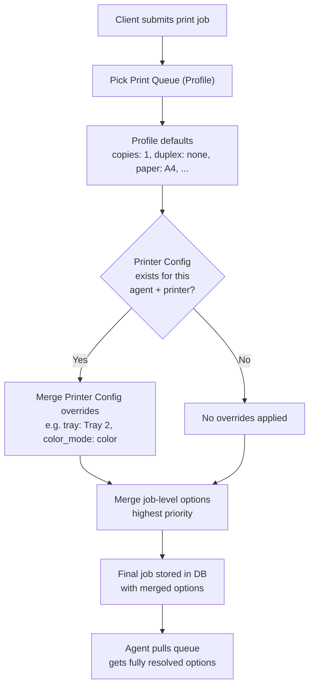

# Printer Configs — Example Walkthrough

## Scenario: Office with Two Printers on One Agent

Imagine you have a **TrayPrint agent** installed on a Windows workstation at the front desk. That workstation has **two physical printers** connected:

| Printer Name | Type | Location |
|---|---|---|
| `HP-LaserJet-M404` | Black & White laser | Front desk |
| `Epson-WF-7720` | Color inkjet | Manager's office (shared) |

The agent reports these printers via `POST /api/print-hub/status { "printers": ["HP-LaserJet-M404", "Epson-WF-7720"] }`, and they're stored in [`PrintAgent.printers`](app/Models/PrintAgent.php:25) as a JSON array.

---

## Step 1: Create a Print Queue (Profile)

You create a **Print Queue** called `"General-Receipts"` via the **Print Queues** menu. This profile defines:

```json
{
  "name": "General-Receipts",
  "print_agent_id": 1,
  "paper_size": "A4",
  "orientation": "portrait",
  "copies": 1,
  "duplex": "none",
  "color_mode": "grayscale",
  "default_printer": "HP-LaserJet-M404"
}
```

This means: all jobs sent to this queue print single-sided, grayscale, 1 copy, on the HP LaserJet by default.

---

## Step 2: Create Printer Configs (Per-Printer Overrides)

Now you want to **override defaults per printer**:

### Config 1: HP LaserJet — Use Tray 2 for plain paper

You open **Printer Configs** → **+ Add Config**:

| Field | Value |
|-------|-------|
| Agent | Front Desk Workstation (agent_id: 1) |
| Printer | `HP-LaserJet-M404` |
| Copies | *(leave empty — use profile default)* |
| Duplex | *(leave empty — use profile default)* |
| Paper Size | *(leave empty)* |
| Tray | `Tray 2` |
| Color Mode | *(leave empty)* |
| Advanced (JSON) | `{ "media_type": "plain" }` |

### Config 2: Epson WF-7720 — Always color, 2 copies

| Field | Value |
|-------|-------|
| Agent | Front Desk Workstation (agent_id: 1) |
| Printer | `Epson-WF-7720` |
| Copies | `2` |
| Duplex | `short-edge` |
| Paper Size | `A4` |
| Tray | `Tray 1` |
| Color Mode | `color` |
| Print Quality | `high` |

---

## Step 3: Submit a Print Job

A client app sends a print job via `POST /api/v1/print`:

```json
{
  "queue": "General-Receipts",
  "template": "receipt-template",
  "data": { "order_id": 12345 },
  "printer": "Epson-WF-7720",
  "options": { "copies": 3 }
}
```

---

## Step 4: How Override Resolution Works (After Fix)

The system resolves options using this priority chain:

```
1. Job-level options (from request)     → copies: 3       ← HIGHEST
2. Printer Config for Epson-WF-7720     → color_mode: color, duplex: short-edge, copies: 2 (overridden by #1)
3. Print Profile "General-Receipts"      → paper_size: A4, orientation: portrait, copies: 1 (overridden)  ← LOWEST
```

### Resolution Logic in Code

**Before** (when job is created in [`createJob()`](app/Services/PrintJobOrchestrator.php:90)):

```php
// Step 1: Start with profile defaults
$options = [
    'paper_size'  => 'A4',
    'orientation' => 'portrait',
    'copies'      => 1,
    'duplex'      => 'none',
    'color_mode'  => 'grayscale',
];

// Step 2: Apply printer config overrides (NEW)
// Looks up PrinterConfig where agent_id=1 AND printer_name='Epson-WF-7720' AND is_active=true
$printerConfig = PrinterConfig::where('print_agent_id', 1)
    ->where('printer_name', 'Epson-WF-7720')
    ->where('is_active', true)
    ->first();

// Merge config (lower priority than request options)
// $printerConfig->config = ['copies' => 2, 'duplex' => 'short-edge', 'color_mode' => 'color', ...]
$options = array_merge($options, $printerConfig->config);

// Step 3: Apply request options (highest priority)
$options = array_merge($options, ['copies' => 3]);

// Final result:
// copies: 3 (from request, overrides printer config's 2 and profile's 1)
// duplex: 'short-edge' (from printer config)
// color_mode: 'color' (from printer config, overrides profile's 'grayscale')
// paper_size: 'A4' (from profile, not overridden)
```

### What the Agent Receives

When the agent calls `GET /api/print-hub/queue`, it gets:

```json
{
  "jobs": [{
    "job_id": "abc-123",
    "printer": "Epson-WF-7720",
    "options": {
      "copies": 3,
      "duplex": "short-edge",
      "color_mode": "color",
      "print_quality": "high",
      "paper_size": "A4",
      "orientation": "portrait"
    }
  }]
}
```

The agent just uses these options directly — no extra logic needed on the agent side.

---

## What If You DON'T Use Printer Configs?

If you submit the same job to the **HP LaserJet** printer (which has no Printer Config in this example):

```json
{
  "queue": "General-Receipts",
  "printer": "HP-LaserJet-M404",
  "options": {}
}
```

The resolution is simpler — just profile defaults:

```json
{
  "copies": 1,
  "duplex": "none",
  "color_mode": "grayscale",
  "paper_size": "A4",
  "orientation": "portrait",
  "tray": "Tray 2"       // ← from Printer Config for HP-LaserJet-M404
}
```

Because Config 1 had set `tray: "Tray 2"` for HP-LaserJet-M404.

---

## Summary: When to Use Each Feature

| You want to... | Use this |
|---|---|
| Set default options for all printers in a queue | Print Queue (Profile) |
| Override specific printers on specific agents | Printer Config |
| Override options for a single job | `options` in the API request |


