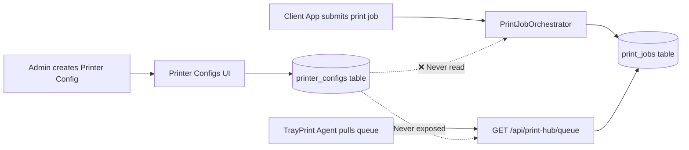
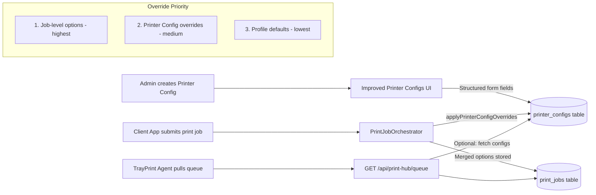

# Printer Configs — Improvement Plan

## Current State Summary

The **Printer Configs** feature at [`resources/views/admin/printer-configs/index.blade.php`](resources/views/admin/printer-configs/index.blade.php) is currently **scaffolding-only** — it has a database table, a model, CRUD controller, and admin UI, but the data is **never consumed** by the actual print workflow.

### Problems Identified

| # | Problem | Evidence |
|---|---------|----------|
| 1 | **No printer name dropdown** — must type manually | [`index.blade.php:139`](resources/views/admin/printer-configs/index.blade.php:139) — plain `<input>` instead of `<select>` |
| 2 | **Config is raw JSON textarea** — no structured form fields | [`index.blade.php:145`](resources/views/admin/printer-configs/index.blade.php:145) — `<textarea>` with placeholder JSON |
| 3 | **No API endpoint** — agents have no way to fetch configs | [`routes/api.php`](routes/api.php) — no `/printer-configs` route exists |
| 4 | **No merge/override logic** — configs never applied to jobs | [`PrintJobOrchestrator`](app/Services/PrintJobOrchestrator.php) — zero references to `PrinterConfig` |

---

## Proposed Changes

### Part A: UI/UX Improvements

#### A1. Printer Name Dropdown
- **File**: [`resources/views/admin/printer-configs/index.blade.php`](resources/views/admin/printer-configs/index.blade.php)
- **Change**: Replace the free-text `<input name="printer_name">` with a `<select>` dropdown
- **How**: When a user selects a **Print Agent** in the form, use JavaScript/Ajax to fetch that agent's registered printers from the `printers` JSON column on [`PrintAgent`](app/Models/PrintAgent.php:25) and populate the dropdown
- **Fallback**: Also include a "Custom..." option that reveals a text input for typing a printer name not yet registered by the agent

#### A2. Structured Configuration Form
- **File**: [`resources/views/admin/printer-configs/index.blade.php`](resources/views/admin/printer-configs/index.blade.php)
- **Change**: Replace the raw JSON `<textarea>` with individual form fields for common options:

| Field | Type | Options |
|-------|------|---------|
| Copies | `<input type="number" min="1">` | 1–999 |
| Duplex | `<select>` | None, Long Edge, Short Edge |
| Paper Size | `<select>` | A3, A4, A5, Letter, Legal, Custom |
| Tray / Paper Source | `<select>` or `<input>` | Tray 1, Tray 2, Manual Feed, etc. |
| Color Mode | `<select>` | Color, Grayscale, Monochrome |
| Print Quality | `<select>` | Draft, Normal, High |
| Orientation | `<select>` | Portrait, Landscape |
| Media Type | `<select>` | Plain, Glossy, Labels, Envelope, etc. |
| Collate | `<checkbox>` | Yes/No |
| Fit to Page | `<checkbox>` | Yes/No |
| **Advanced (JSON)** | `<textarea>` | For custom key/value pairs not covered above |

- **Data flow**: On form submit, the individual fields are serialized into a JSON object matching the current `config` column format. On edit load, the JSON is parsed back into individual field values.
- **Controller update**: Modify [`PrinterConfigController::store()`](app/Http/Controllers/Admin/PrinterConfigController.php:44) and [`update()`](app/Http/Controllers/Admin/PrinterConfigController.php:77) to accept individual fields instead of a raw JSON string (while keeping backward compat with JSON input).

#### A3. Dynamic Agent-Printer Linking
- When the user selects an **Agent**, immediately show that agent's registered printers in a panel below the dropdown (useful for reference even if they need to type a custom printer name)
- Consider adding a small **"Test Connection"** button next to the printer field

---

### Part B: Backend Override Mechanism

#### B1. Override Priority Chain

Establish a clear priority for print options (highest to lowest):

```
1. Job-level options (passed by client app at print time)
2. Printer Config overrides (per-agent, per-printer)
3. Print Profile defaults (per-queue)
```

#### B2. Apply Overrides at Job Creation Time

- **File**: [`app/Services/PrintJobOrchestrator.php`](app/Services/PrintJobOrchestrator.php)
- **New method** — add a public static method:

```php
public static function applyPrinterConfigOverrides(
    array $options, 
    int $agentId, 
    string $printerName
): array
```

- Logic: Query `PrinterConfig::where('print_agent_id', $agentId)->where('printer_name', $printerName)->where('is_active', true)->first()`, then merge its `config` array into `$options` using `array_merge` (so request-level options prevail).

- **Call site #1**: In [`PrintJobOrchestrator::createJob()`](app/Services/PrintJobOrchestrator.php:90), right before creating the PrintJob record (line 145), inject:

```php
$data['options'] = self::applyPrinterConfigOverrides(
    $data['options'], 
    $agent->id, 
    $data['printer_name']
);
```

This ensures the overridden options are **stored in the database** and reflected when agents pull the queue.

- **Call site #2**: In [`ClientAppController::unifiedPrint()`](app/Http/Controllers/Api/ClientAppController.php:730), after the printer is resolved (line 676), pass the printer config overrides into the `$options` before calling `createJob()`:

```php
$options = PrintJobOrchestrator::applyPrinterConfigOverrides(
    $options,
    $agent->id,
    $printer
);
```

#### B3. (Optional) Add Agent API Endpoint

- **File**: [`routes/api.php`](routes/api.php) + [`PrintHubController`](app/Http/Controllers/Api/PrintHubController.php)
- **New endpoint**: `GET /api/print-hub/printer-configs`
- Returns all active `PrinterConfig` records for the authenticated agent, so the TrayPrint client can apply overrides locally if needed
- This is optional — if we apply overrides at job creation time (B2), this is only needed for agents that want the full picture

---

### Part C: Data Flow Diagrams

#### C1. Current (Broken) Flow



#### C2. Improved Flow



---

## Actionable Todo List

### Phase 1: Backend Override Logic (core functionality)

- [ ] Add `applyPrinterConfigOverrides()` method to `PrintJobOrchestrator`
- [ ] Call it in `createJob()` to merge configs into job options before DB save
- [ ] Call it in `unifiedPrint()` after printer resolution for immediate override injection
- [ ] Add `GET /api/print-hub/printer-configs` endpoint (optional — only if agent-side override is needed)

### Phase 2: UI Improvements

- [ ] Fetch agent's registered printers via API and populate printer name dropdown
- [ ] Replace JSON textarea with structured form fields (copies, duplex, paper size, tray, color mode, quality, orientation, media type, collate, fit to page)
- [ ] Add "Advanced (JSON)" section for custom options not covered by form fields
- [ ] Update controller validation to accept individual fields alongside JSON input
- [ ] Add dynamic agent-printer linking display

### Phase 3: In-App Help & Documentation

- [ ] Add a help/guide section in the Printer Configs page (e.g., a collapsible "How Printer Configs Work" panel with the example walkthrough)
- [ ] Include the override priority chain explanation directly in the UI
- [ ] Reference the example document at [`plans/printer-config-example.md`](plans/printer-config-example.md) as developer reference

### Phase 4: Polish & Testing

- [ ] Test override priority chain end-to-end (profile defaults → printer config → request options)
- [ ] Test edge cases: inactive config, deleted config, non-existent printer
- [ ] Update export/import commands if schema changes
- [ ] Update SDK docs if new API endpoint added
