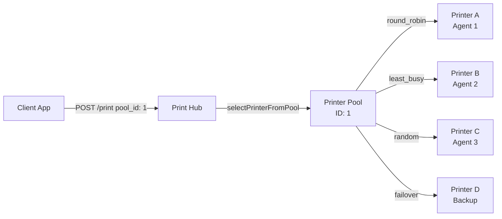

# SDK & Documentation Audit & Update Plan

## Overview

Audit all 3 SDK files (PHP, Python, Node.js), the OpenAPI spec, Postman collection, and SDK docs page against the full Print Hub API surface. Then update all files with missing features and add TrayPrint documentation into PrintHub docs.

---

## Part 1: Audit Results — Gap Analysis

### 1.1 PrintJobRequest Fields (API accepts, but SDKs/OpenAPI miss)

| Field | API | PHP SDK | Python SDK | Node SDK | OpenAPI | Docs Page |
|-------|:---:|:-------:|:----------:|:--------:|:-------:|:---------:|
| `template` | ✅ | ✅ | ✅ | ✅ | ✅ | ✅ |
| `data` | ✅ | ✅ | ✅ | ✅ | ✅ | ✅ |
| `document_base64` | ✅ | ✅ | ❌ (uses `base64_pdf`) | ❌ (uses `base64_pdf`) | ✅ | ✅ |
| `type` | ✅ | ❌ | ❌ | ❌ | ❌ | ✅ |
| `reference_id` | ✅ | ✅ | ✅ | ✅ | ✅ | ✅ |
| `branch_code` | ✅ | ✅ | ✅ | ✅ | ✅ | ✅ |
| `branch_id` | ✅ | ❌ | ❌ | ❌ | ❌ | ✅ |
| `printer` | ✅ | ❌ | ❌ | ❌ | ✅ | ✅ |
| `pool_id` | ✅ | ❌ | ❌ | ❌ | ❌ | ❌ |
| `queue` | ✅ | ✅ | ❌ | ❌ | ❌ | ✅ |
| `profile` | ✅ | ❌ | ❌ | ❌ | ❌ | ✅ |
| `agent_id` | ✅ | ❌ | ❌ | ❌ | ❌ | ✅ |
| `options` | ✅ | ✅ | ✅ | ✅ | ✅ | ✅ |
| `parameters` | ✅ | ✅ (printWithTemplate only) | ❌ | ❌ | ❌ | ❌ |
| `skip_validation` | ✅ | ❌ | ❌ | ❌ | ❌ | ✅ |
| `webhook_url` | ✅ | ❌ | ❌ | ❌ | ❌ | ✅ |
| `document_id` | ✅ | ❌ | ❌ | ❌ | ❌ | ❌ |
| `priority` | ✅ | ❌ | ❌ | ❌ | ❌ | ✅ |
| `scheduled_at` | ✅ | ❌ | ❌ | ❌ | ❌ | ❌ |
| `recurrence` | ✅ | ❌ | ❌ | ❌ | ❌ | ❌ |
| `recurrence_end_at` | ✅ | ❌ | ❌ | ❌ | ❌ | ❌ |
| `recurrence_count` | ✅ | ❌ | ❌ | ❌ | ❌ | ❌ |

### 1.2 Missing Endpoints

| Endpoint | API | PHP SDK | Python SDK | Node SDK | OpenAPI | Postman | Docs |
|----------|:---:|:-------:|:----------:|:--------:|:-------:|:-------:|:----:|
| `GET /test` | ✅ | ✅ | ✅ | ✅ | ✅ | ✅ | ✅ |
| `GET /health` | ✅ | ❌ | ✅ | ✅ | ✅ | ✅ | ✅ |
| `GET /agents/online` | ✅ | ✅ | ✅ | ✅ | ✅ | ✅ | ✅ |
| `GET /branches` | ✅ | ✅ | ✅ | ✅ | ✅ | ✅ | ✅ |
| `GET /queues` | ✅ | ✅ | ✅ | ✅ | ✅ | ✅ | ✅ |
| `GET /templates` | ✅ | ✅ | ✅ | ✅ | ✅ | ✅ | ✅ |
| `GET /templates/{name}` | ✅ | ✅ | ✅ | ✅ | ✅ | ✅ | ✅ |
| `GET /templates/{name}/schema` | ✅ | ✅ | ✅ | ✅ | ✅ | ✅ | ✅ |
| `POST /templates/{name}/validate` | ✅ | ✅ (validateData) | ❌ | ❌ | ❌ | ❌ | ✅ |
| `POST /schema` | ✅ | ✅ | ✅ | ✅ | ✅ | ✅ | ✅ |
| `GET /schemas` | ✅ | ❌ | ✅ | ✅ | ✅ | ✅ | ✅ |
| `GET /schema/{name}/versions` | ✅ | ❌ | ✅ | ✅ | ✅ | ✅ | ✅ |
| `GET /schemas/{name}/diff` | ✅ | ❌ | ❌ | ❌ | ❌ | ❌ | ❌ |
| `POST /print` | ✅ | ✅ | ✅ | ✅ | ✅ | ✅ | ✅ |
| `POST /print/batch` | ✅ | ✅ | ✅ | ✅ | ✅ | ✅ | ✅ |
| `POST /preview` | ✅ | ✅ | ✅ | ✅ | ✅ | ✅ | ✅ |
| `POST /jobs` (legacy) | ✅ | ❌ | ❌ | ❌ | ❌ | ❌ | ❌ |
| `GET /jobs/{job_id}` | ✅ | ✅ | ✅ | ✅ | ✅ | ✅ | ✅ |
| `DELETE /jobs/{job_id}` | ✅ | ✅ | ✅ | ✅ | ✅ | ✅ | ✅ |
| `GET /connectors` | ✅ | ✅ | ❌ | ✅ | ✅ | ❌ | ❌ |
| `POST /connectors` | ✅ | ✅ | ❌ | ✅ | ✅ | ❌ | ❌ |
| `PUT /connectors/{id}` | ✅ | ✅ | ❌ | ✅ | ✅ | ❌ | ❌ |
| `DELETE /connectors/{id}` | ✅ | ✅ | ❌ | ✅ | ✅ | ❌ | ❌ |
| `POST /connectors/{id}/test` | ✅ | ✅ | ❌ | ✅ | ✅ | ❌ | ❌ |
| `POST /connectors/{id}/fetch-preview` | ✅ | ✅ (handlePreviewRequest) | ❌ | ✅ (handlePreviewRequest) | ❌ | ❌ | ❌ |
| `POST /documents/upload` | ✅ | ❌ | ❌ | ❌ | ✅ | ✅ | ❌ |
| `GET /documents` | ✅ | ❌ | ❌ | ❌ | ✅ | ✅ | ❌ |
| `GET /documents/{id}` | ✅ | ❌ | ❌ | ❌ | ✅ | ✅ | ❌ |
| `GET /documents/{id}/preview` | ✅ | ❌ | ❌ | ❌ | ✅ | ✅ | ❌ |
| `GET /documents/{id}/download` | ✅ | ❌ | ❌ | ❌ | ✅ | ✅ | ❌ |
| `DELETE /documents/{id}` | ✅ | ❌ | ❌ | ❌ | ✅ | ✅ | ❌ |
| `GET /approvals/pending` | ✅ | ❌ | ❌ | ❌ | ❌ | ❌ | ❌ |
| `POST /approvals/{id}/approve` | ✅ | ❌ | ❌ | ❌ | ❌ | ❌ | ❌ |
| `POST /approvals/{id}/reject` | ✅ | ❌ | ❌ | ❌ | ❌ | ❌ | ❌ |
| `GET /v1/agents/version` | ✅ | ❌ | ❌ | ❌ | ❌ | ❌ | ❌ |
| `GET /v1/fonts` | ✅ | ❌ | ❌ | ❌ | ❌ | ❌ | ❌ |
| `GET /v1/formula/functions` | ✅ | ❌ | ❌ | ❌ | ❌ | ❌ | ❌ |
| `POST /v1/formula/validate` | ✅ | ❌ | ❌ | ❌ | ❌ | ❌ | ❌ |
| `POST /v1/formula/evaluate` | ✅ | ❌ | ❌ | ❌ | ❌ | ❌ | ❌ |

### 1.3 Bugs Found

1. **Python SDK** — `print_raw_pdf()` sends `base64_pdf` field name instead of `document_base64` (line ~208)
2. **Node.js SDK** — `printRawPdf()` sends `base64_pdf` field name instead of `document_base64` (line ~280)
3. **Python SDK** — `print_with_template()` missing `queue`, `parameters`, `webhook_url`, `skip_validation`, `pool_id`, `document_id`, `scheduled_at`, `recurrence` params
4. **Node.js SDK** — `printWithTemplate()` missing `queue`, `webhook_url`, `skip_validation`, `pool_id`, `document_id`, `scheduled_at`, `recurrence` params
5. **PHP SDK** — `printWithTemplate()` missing `pool_id`, `document_id`, `webhook_url`, `skip_validation`, `scheduled_at`, `recurrence` params
6. **PHP SDK** — `printRawPdf()` missing `pool_id`, `document_id`, `webhook_url`, `skip_validation`, `parameters`, `scheduled_at`, `recurrence` params
7. **PHP SDK** — `printAsync()` missing `pool_id`, `document_id`, `webhook_url`, `skip_validation`, `scheduled_at`, `recurrence` params

---

## Part 2: Implementation Plan

### Step 1: Update PHP SDK (`public/sdk/PrintHubClient.php`)

**Changes needed:**

1. **`printWithTemplate()`** — Add parameters:
   - `?string $poolId = null` — Printer pool ID for dispatcher scenario
   - `?int $documentId = null` — Reference an uploaded document
   - `?string $webhookUrl = null` — Webhook URL for async status
   - `?bool $skipValidation = null` — Skip schema validation
   - `?string $scheduledAt = null` — Schedule for future printing
   - `?string $recurrence = null` — Recurrence pattern (daily/weekly/monthly/none)
   - `?string $recurrenceEndAt = null` — Recurrence end date
   - `?int $recurrenceCount = null` — Max recurrence count
   - `?int $priority = null` — Job priority
   - `?string $profile = null` — Profile alias for queue
   - `?int $agentId = null` — Pin to specific agent
   - `?string $printer = null` — Override printer name
   - `?int $branchId = null` — Branch ID alternative

2. **`printRawPdf()`** — Add same parameters as above plus `?array $parameters = null`

3. **`printAsync()`** — Add same parameters as above

4. **Add new methods:**
   - `listSchemas(): array` — `GET /schemas`
   - `schemaVersions(string $name): array` — `GET /schema/{name}/versions`
   - `schemaVersionDiff(string $name, int $fromVersion, int $toVersion): array` — `GET /schemas/{name}/diff`
   - `health(): array` — `GET /health`
   - `uploadDocument(string $filePath, ?string $label = null): array` — `POST /documents/upload`
   - `listDocuments(): array` — `GET /documents`
   - `getDocument(int $id): array` — `GET /documents/{id}`
   - `previewDocument(int $id): string` — `GET /documents/{id}/preview`
   - `downloadDocument(int $id): string` — `GET /documents/{id}/download`
   - `deleteDocument(int $id): array` — `DELETE /documents/{id}`
   - `getPendingApprovals(): array` — `GET /approvals/pending`
   - `approveJob(string $id): array` — `POST /approvals/{id}/approve`
   - `rejectJob(string $id): array` — `POST /approvals/{id}/reject`
   - `getAgentVersion(): array` — `GET /v1/agents/version`
   - `getFonts(): array` — `GET /v1/fonts`
   - `getFormulaFunctions(): array` — `GET /v1/formula/functions`
   - `validateFormula(string $expression): array` — `POST /v1/formula/validate`
   - `evaluateFormula(string $expression, array $data): array` — `POST /v1/formula/evaluate`

### Step 2: Update Python SDK (`public/sdk/PrintHubClient.py`)

**Changes needed:**

1. **Fix bug:** In `print_raw_pdf()`, change `base64_pdf` → `document_base64` in the request body

2. **`print_with_template()`** — Add parameters:
   - `queue=""`, `pool_id=None`, `document_id=None`, `webhook_url=None`, `skip_validation=None`
   - `scheduled_at=None`, `recurrence=None`, `recurrence_end_at=None`, `recurrence_count=None`
   - `priority=None`, `profile=None`, `agent_id=None`, `printer=None`, `branch_id=None`
   - `parameters=None`

3. **`print_raw_pdf()`** — Add same parameters as above

4. **Add new methods:**
   - `validate_template_data(template_name, data)` — `POST /templates/{name}/validate`
   - `schema_version_diff(name, from_version, to_version)` — `GET /schemas/{name}/diff`
   - `upload_document(file_path, label=None)` — `POST /documents/upload`
   - `list_documents()` — `GET /documents`
   - `get_document(id)` — `GET /documents/{id}`
   - `preview_document(id)` — `GET /documents/{id}/preview`
   - `download_document(id)` — `GET /documents/{id}/download`
   - `delete_document(id)` — `DELETE /documents/{id}`
   - `get_pending_approvals()` — `GET /approvals/pending`
   - `approve_job(id)` — `POST /approvals/{id}/approve`
   - `reject_job(id)` — `POST /approvals/{id}/reject`
   - `register_connector(name, type, config, icon=None)` — `POST /connectors`
   - `list_connectors()` — `GET /connectors`
   - `update_connector(id, data)` — `PUT /connectors/{id}`
   - `test_connector(id)` — `POST /connectors/{id}/test`
   - `delete_connector(id)` — `DELETE /connectors/{id}`
   - `get_agent_version()` — `GET /v1/agents/version`
   - `get_fonts()` — `GET /v1/fonts`
   - `get_formula_functions()` — `GET /v1/formula/functions`
   - `validate_formula(expression)` — `POST /v1/formula/validate`
   - `evaluate_formula(expression, data)` — `POST /v1/formula/evaluate`

### Step 3: Update Node.js SDK (`public/sdk/PrintHubClient.mjs`)

**Changes needed:**

1. **Fix bug:** In `printRawPdf()`, change `base64_pdf` → `document_base64` in the request body

2. **`printWithTemplate()`** — Add parameters:
   - `queue`, `poolId`, `documentId`, `webhookUrl`, `skipValidation`
   - `scheduledAt`, `recurrence`, `recurrenceEndAt`, `recurrenceCount`
   - `priority`, `profile`, `agentId`, `printer`, `branchId`

3. **`printRawPdf()`** — Add same parameters as above plus `parameters`

4. **Add new methods:**
   - `validateTemplateData(templateName, data)` — `POST /templates/{name}/validate`
   - `schemaVersionDiff(name, fromVersion, toVersion)` — `GET /schemas/{name}/diff`
   - `uploadDocument(filePath, label?)` — `POST /documents/upload`
   - `listDocuments()` — `GET /documents`
   - `getDocument(id)` — `GET /documents/{id}`
   - `previewDocument(id)` — `GET /documents/{id}/preview`
   - `downloadDocument(id)` — `GET /documents/{id}/download`
   - `deleteDocument(id)` — `DELETE /documents/{id}`
   - `getPendingApprovals()` — `GET /approvals/pending`
   - `approveJob(id)` — `POST /approvals/{id}/approve`
   - `rejectJob(id)` — `POST /approvals/{id}/reject`
   - `getAgentVersion()` — `GET /v1/agents/version`
   - `getFonts()` — `GET /v1/fonts`
   - `getFormulaFunctions()` — `GET /v1/formula/functions`
   - `validateFormula(expression)` — `POST /v1/formula/validate`
   - `evaluateFormula(expression, data)` — `POST /v1/formula/evaluate`

### Step 4: Update OpenAPI Spec (`public/sdk/openapi.yaml`)

**Changes needed:**

1. **`PrintJobRequest` schema** (line ~1054) — Add missing fields:
   - `pool_id` (integer, nullable) — Printer pool ID for dispatcher
   - `queue` (string) — Queue/profile name
   - `profile` (string) — Alias for queue
   - `agent_id` (integer) — Pin to specific agent
   - `branch_id` (integer) — Branch ID alternative
   - `document_id` (integer) — Reference uploaded document
   - `webhook_url` (string, format: uri) — Webhook URL
   - `skip_validation` (boolean) — Skip schema validation
   - `parameters` (object) — Template parameters
   - `priority` (integer) — Job priority (0-255)
   - `scheduled_at` (string, format: date-time) — Schedule future print
   - `recurrence` (string, enum: daily/weekly/monthly/none) — Recurrence pattern
   - `recurrence_end_at` (string, format: date-time) — Recurrence end
   - `recurrence_count` (integer) — Max recurrence count

2. **Add missing endpoints:**
   - `POST /templates/{name}/validate` — Validate template data
   - `GET /schemas/{name}/diff` — Schema version diff
   - `GET /approvals/pending` — List pending approvals
   - `POST /approvals/{id}/approve` — Approve a job
   - `POST /approvals/{id}/reject` — Reject a job
   - `GET /v1/agents/version` — Get latest agent version
   - `GET /v1/fonts` — List available fonts
   - `GET /v1/formula/functions` — List formula functions
   - `POST /v1/formula/validate` — Validate formula expression
   - `POST /v1/formula/evaluate` — Evaluate formula expression
   - `POST /connectors/{id}/fetch-preview` — Fetch connector preview

3. **Add missing schemas:**
   - `ValidateDataRequest`
   - `ValidateDataResponse`
   - `SchemaDiffResponse`
   - `ApprovalListResponse`
   - `ApprovalActionResponse`
   - `AgentVersionResponse`
   - `FontListResponse`
   - `FormulaFunctionsResponse`
   - `FormulaValidateResponse`
   - `FormulaEvaluateResponse`

### Step 5: Update Postman Collection (`public/sdk/PrintHub-Postman.json`)

**Changes needed:**

1. **Add new variables:** `pool_id`, `agent_id`, `document_id`, `approval_id`

2. **Add missing endpoint folders:**
   - **Template Validation** — `POST /templates/{{template_name}}/validate`
   - **Schema Diff** — `GET /schemas/{{template_name}}/diff?from_version=1&to_version=2`
   - **Approvals** — `GET /approvals/pending`, `POST /approvals/{{approval_id}}/approve`, `POST /approvals/{{approval_id}}/reject`
   - **Agent Version** — `GET /v1/agents/version`
   - **Fonts** — `GET /v1/fonts`
   - **Formula** — `GET /v1/formula/functions`, `POST /v1/formula/validate`, `POST /v1/formula/evaluate`
   - **Connector Fetch Preview** — `POST /connectors/{{connector_id}}/fetch-preview`

3. **Update Print Request examples** — Add `pool_id`, `webhook_url`, `scheduled_at`, `document_id` fields to the example bodies

### Step 6: Update SDK Docs Page (`resources/views/admin/sdk-docs.blade.php`)

**Changes needed:**

1. **Print Request table** (line ~835) — Add missing fields:
   - `pool_id`, `queue`, `profile`, `agent_id`, `branch_id`, `document_id`
   - `parameters`, `priority`, `scheduled_at`, `recurrence`, `recurrence_end_at`, `recurrence_count`

2. **PHP SDK section** (line ~1496) — Add new methods documentation:
   - `listSchemas()`, `schemaVersions()`, `schemaVersionDiff()`
   - `health()`, `getAgentVersion()`, `getFonts()`
   - `uploadDocument()`, `listDocuments()`, `getDocument()`, `previewDocument()`, `downloadDocument()`, `deleteDocument()`
   - `getPendingApprovals()`, `approveJob()`, `rejectJob()`
   - `getFormulaFunctions()`, `validateFormula()`, `evaluateFormula()`
   - Update `printWithTemplate()` signature to show new params
   - Update `printRawPdf()` signature to show new params
   - Add `printAsync()` documentation

3. **Python SDK section** (line ~1829) — Add new methods documentation:
   - `validate_template_data()`, `schema_version_diff()`
   - `upload_document()`, `list_documents()`, `get_document()`, `preview_document()`, `download_document()`, `delete_document()`
   - `get_pending_approvals()`, `approve_job()`, `reject_job()`
   - `register_connector()`, `list_connectors()`, `update_connector()`, `test_connector()`, `delete_connector()`
   - `get_agent_version()`, `get_fonts()`
   - `get_formula_functions()`, `validate_formula()`, `evaluate_formula()`
   - Update `print_with_template()` and `print_raw_pdf()` signatures

4. **Node.js SDK section** (line ~2034) — Add new methods documentation:
   - `validateTemplateData()`, `schemaVersionDiff()`
   - `uploadDocument()`, `listDocuments()`, `getDocument()`, `previewDocument()`, `downloadDocument()`, `deleteDocument()`
   - `getPendingApprovals()`, `approveJob()`, `rejectJob()`
   - `getAgentVersion()`, `getFonts()`
   - `getFormulaFunctions()`, `validateFormula()`, `evaluateFormula()`
   - Update `printWithTemplate()` and `printRawPdf()` signatures

5. **Add TOC entries** for new sections

### Step 7: Add TrayPrint Documentation into PrintHub Docs

**New section in `sdk-docs.blade.php`** — Add a comprehensive "TrayPrint Agent" section:

1. **TOC entry:** `15. TrayPrint Agent`

2. **Section content:**
   - **Overview** — What TrayPrint is (cross-platform print agent)
   - **Architecture** — How TrayPrint connects to Print Hub
   - **Installation** — Windows MSI installer, Linux/macOS manual setup
   - **Configuration** — `config.json` structure, hub URL, agent key
   - **Windows Installer** — MSI with Scheduled Task for auto-start at boot
   - **CLI Commands**:
     - `--install-task` — Register Windows Scheduled Task
     - `--uninstall-task` — Remove Windows Scheduled Task
     - `--install-service` — Install as Windows service (nssm)
     - `--uninstall-service` — Remove Windows service
     - `--config` — Specify config path
     - `--silent` — Run without tray UI
   - **Agent API Endpoints** — Local Flask server endpoints:
     - `GET /status` — Agent status
     - `GET /printers` — List printers
     - `GET /profiles` — List profiles
     - `POST /print` — Local print submission
     - `GET /jobs` — List jobs
     - `GET /jobs/{job_id}` — Get job details
     - `POST /jobs/{job_id}/retry` — Retry failed job
     - `POST /jobs/{job_id}/cancel` — Cancel job
     - `GET /queue-status` — Queue status
     - `GET /api/capabilities` — Printer capabilities
     - `GET /api/capabilities/all` — All printers capabilities
     - `GET /api/diagnostics` — Full diagnostics
     - `GET /api/watchdog/log` — Watchdog log
   - **Hub Communication** — How TrayPrint syncs with Print Hub
   - **WebSocket** — Real-time updates via Laravel Reverb
   - **Watchdog** — Self-healing spooler monitor
   - **Auto-Update** — Version checking and update installation
   - **Diagnostics** — Built-in diagnostics dialog
   - **Troubleshooting** — Common issues and solutions

---

## Part 3: Execution Order

The steps should be executed in this order to avoid conflicts:

1. **OpenAPI spec** first — foundation for all SDKs
2. **PHP SDK** — most complete, add missing features
3. **Python SDK** — fix bug, add missing features
4. **Node.js SDK** — fix bug, add missing features
5. **Postman collection** — add missing endpoints
6. **SDK docs page** — update all sections + add TrayPrint docs

---

## Part 4: Printer Pool / Dispatcher Scenario

The `pool_id` field is the key enabler for the dispatcher scenario. Here's how it works:

The SDKs need to support `pool_id` so client apps can submit jobs to a printer pool instead of a specific printer. The pool resolution happens server-side via `PrintJobOrchestrator::selectPrinterFromPool()`.

---

## Part 5: File Change Summary

| File | Lines | Changes |
|------|-------|---------|
| `public/sdk/PrintHubClient.php` | 745 → ~950 | +~200 lines (new methods + updated signatures) |
| `public/sdk/PrintHubClient.py` | 432 → ~650 | +~220 lines (new methods + bug fix + updated signatures) |
| `public/sdk/PrintHubClient.mjs` | 506 → ~720 | +~210 lines (new methods + bug fix + updated signatures) |
| `public/sdk/openapi.yaml` | 1406 → ~1600 | +~200 lines (new fields + endpoints + schemas) |
| `public/sdk/PrintHub-Postman.json` | 264 → ~400 | +~140 lines (new endpoint folders + variables) |
| `resources/views/admin/sdk-docs.blade.php` | 3064 → ~3600 | +~540 lines (updated tables + new methods + TrayPrint section) |
